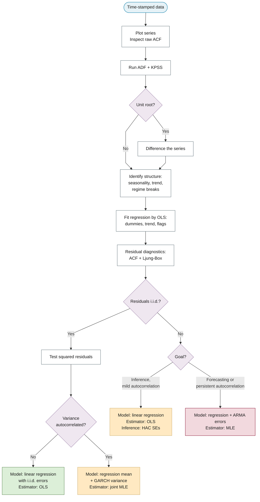

# Design System — Time Series Analysis Manual

**Version:** 1.1

This document is the single source of truth for the book's *appearance*: the brand tokens, typography, components, and composition patterns that every chapter shares.

## How to read this document

The design system is organized into four tiers, from the most abstract to the most operational:

- **Tier 0 — Principles.** What the design optimizes for.
- **Tier 1 — Foundations.** The design tokens: colour, typography, spacing, layout.
- **Tier 2 — Components & Patterns.** Reusable building blocks and how to compose them.
- **Tier 3 — Governance.** Versioning, naming, and the change process.

Read the tiers in order on a first pass. Later, use Tier 1 and Tier 2 as a reference catalog while authoring a chapter.

## Tier 0 — Principles

The design optimizes for four properties, in priority order.

**Academic gravitas.** Content-area headings use a serif display face (Source Serif 4) to evoke the typographic register of a printed monograph. The palette is a restrained academic set rather than a saturated web palette.

**Readability.** Prose uses a generous 1.75 line-height, and the body font-size has a floor (`max(0.8rem, 14px)`) so text never shrinks below a legible size under browser zoom. Tables and admonitions are sized to match the surrounding prose rather than the smaller Material defaults.

**Accessibility.** The design targets WCAG 2.1 AA. Every display equation is followed by a `(Read: …)` pronunciation guide. The site supports a dark mode (Material's `slate` scheme) and a print stylesheet. Colour is never the sole signal: semantic categories also carry text labels.

**Consistency.** Every chapter is a fill-in-the-blanks exercise against this catalog. The same concept is always expressed with the same token, component, and pattern.

### Catalog vs. implementation (read this first)

"Single source of truth" here has a deliberate asymmetry. This document is the authoritative **catalog/specification** of the design: what exists, when to use it, and the intended values. The files `docs/stylesheets/extra.css` and `docs/javascripts/*.js` are the authoritative **implementation**: what the browser actually renders. When the two diverge, the CSS/JS is the runtime truth and this document is corrected to match it, never the reverse. The doc is the map, not the territory.

## Tier 1 — Foundations (design tokens)

The foundations are the lowest-level design decisions. All values below are read verbatim from `docs/stylesheets/extra.css`; that file is the implementation, and this catalog mirrors it.

### Colour tokens

The brand palette is defined as custom properties in the `:root` block of `extra.css`. Five hue families — Cerulean (cool primary), Burgundy (accent), Thistle (soft violet tint), Navajo White (warm tint), and Sunset (warm rose-coral) — each carry light/dark/deep variants.

| Token | Hex | Semantic role | Light (`default`) / dark (`slate`) usage |
|---|---|---|---|
| `--color-cerulean` | `#007BA7` | Primary cool hue; body links | Link colour in light mode; note/remark admonition |
| `--color-cerulean-light` | `#4DA8C9` | Lighter cerulean | Link colour in dark mode |
| `--color-cerulean-dark` | `#005A7A` | Footer background | Footer background in light mode |
| `--color-cerulean-deep` | `#003D5C` | Deepest cerulean | Footer background in dark mode (and `--dark` footer in light) |
| `--color-burgundy` | `#800020` | Accent; theorem | Accent (light), theorem admonition, link hover (light) |
| `--color-burgundy-light` | `#A33548` | Lighter burgundy | Reserved variant |
| `--color-burgundy-dark` | `#5A0017` | Darker burgundy | Reserved variant |
| `--color-thistle` | `#D8BFD8` | Soft violet tint | Accent in dark mode; link hover (dark) |
| `--color-thistle-dark` | `#9B7FA7` | Definition; blockquote | Definition admonition border, blockquote accent (both schemes) |
| `--color-navajo` | `#FFDEAD` | Warm tint; selection | Text-selection highlight, abstract admonition fill |
| `--color-navajo-dark` | `#C9A55E` | Abstract accent | Abstract/summary admonition border (both schemes) |
| `--color-sunset` | `#B87D6C` | Header | Site header (Material primary) in both schemes |
| `--color-sunset-dark` | `#9E6657` | Darker sunset | Primary `--dark` variant |
| `--color-sunset-light` | `#D5A496` | Lighter sunset | Primary `--light` variant |
| `--color-good` | `#DCEFD8` | Outcome — sufficient | Decision-matrix `good` cell; flowchart `good` node |
| `--color-escalate` | `#FFE9C2` | Outcome — escalate | Decision-matrix `escalate` cell; flowchart `escalate` node |
| `--color-problem` | `#F2D9DE` | Outcome — problem | Decision-matrix `problem` cell; flowchart `problem` node |

Semantic role summary: header = Sunset; footer = Cerulean-dark (light) / Cerulean-deep (dark); body links = Cerulean; accent and theorem = Burgundy; definition and blockquote = Thistle-dark; abstract and text selection = Navajo.

The dark (`slate`) scheme keeps the same Sunset header and Cerulean footer but brightens interactive colours: links shift to Cerulean-light and the accent shifts from Burgundy to Thistle for sufficient contrast on a dark background.

!!! note "WCAG note on tinted component fills"
    The tinted component fills introduced in Tier 2 (the flowchart `terminator`, `decision`, `data`, `good`, `escalate`, and `problem` node fills, and the matching decision-matrix cells) all pass WCAG 2.1 AA body-text contrast when paired with dark text (verified ratios in the range 13–16:1). Dark text on those tints is therefore safe.

### Typography scale

Content-area headings H1–H3 use Source Serif 4 for academic gravitas; H4–H6 and all chrome (navigation, admonition titles, drawer) stay in Inter, the Material default, for navigability. The serif rule is scoped to `.md-typeset` so only body content is affected.

| Element | Font | Size | Weight | Notes |
|---|---|---|---|---|
| H1 | Source Serif 4 | `2.25em` | 700 | Chapter opener; `line-height: 1.2`, `letter-spacing: -0.015em` |
| H2 | Source Serif 4 | `1.625em` | 700 | Major section; `line-height: 1.3`; bottom underrule (`1px` border) |
| H3 | Source Serif 4 | `1.25em` | 600 | Subsection; `line-height: 1.35` |
| H4 | Inter | `1.05em` | 600 | Deepest labelled heading |
| H5–H6 | Inter | (Material default) | — | Chrome-register headings |
| Body prose (`p`, `li`) | Inter | `max(0.8rem, 14px)` | — | `line-height: 1.75` |

The H1–H3 serif rules apply the OpenType feature settings `"kern", "liga", "onum"` (kerning, standard ligatures, old-style figures). Body text and `.md-typeset` apply `"kern", "liga", "calt", "ss01"` (kerning, ligatures, contextual alternates, stylistic set 1) together with antialiased font smoothing and `text-rendering: optimizeLegibility`. Numeric table cells use `font-variant-numeric: tabular-nums` so columns of figures align.

### Spacing & utilities

A small set of utility classes is available for one-off spacing and alignment. They are applied via `attr_list` (`{ .class }`).

| Class | Effect |
|---|---|
| `.mt-1` | `margin-top: 0.5rem` |
| `.mt-2` | `margin-top: 1rem` |
| `.mt-3` | `margin-top: 1.5rem` |
| `.mb-1` | `margin-bottom: 0.5rem` |
| `.mb-2` | `margin-bottom: 1rem` |
| `.mb-3` | `margin-bottom: 1.5rem` |
| `.text-center` | `text-align: center` |
| `.text-right` | `text-align: right` |
| `.highlight-text` | Highlighter-pen background (a linear-gradient using the transparent accent colour) |

### Layout, responsive & print

Content uses Material's default centred column width; the responsive and print rules below adjust it for small screens and for paper.

**Mobile (`@media screen and (max-width: 768px)`).** Content padding is reduced to `1rem`. Unclassed tables become `display: block` with `overflow-x: auto` so wide tables scroll horizontally instead of overflowing. Mermaid diagrams also gain `overflow-x: auto` for the same reason.

**Print (`@media print`).** The header, sidebar, and footer are hidden (`display: none`). Content expands to full width (`max-width: none`). Page-break rules keep headings with their following content (`h1, h2, h3 { page-break-after: avoid }`) and keep code blocks, blockquotes, and tables from splitting across pages (`page-break-inside: avoid`). External link URLs are printed inline after the link text via `a[href^="http"]::after`, so a paper copy retains its references.

## Tier 2a — Components

Components are the reusable building blocks an author drops into a chapter. Each entry below records its purpose, when to use it, the copy-paste markup, a note on what renders, and a do/don't. All markup and class names are read from `docs/00-introduction/*.md`, `docs/stylesheets/extra.css`, and `docs/javascripts/glossary.js`; those files are the implementation, and this catalog mirrors them.

### Admonitions

The book uses four typed admonitions, each with a fixed colour and a fixed semantic role. The type word in the `!!! type "Title"` fence selects the styling.

| Type | Colour token | Semantic use |
|---|---|---|
| `theorem` | Burgundy (`--color-burgundy`, `#800020`) | Theorems, assumptions, propositions |
| `definition` | Thistle (`--color-thistle-dark`, `#9B7FA7`) | Key concept definitions |
| `note` | Cerulean (`--color-cerulean`, `#007BA7`) | Remarks and informational asides |
| `abstract` | Navajo (`--color-navajo-dark`, `#C9A55E`) | Chapter and section summaries |

**Purpose.** Mark a block as a theorem, definition, remark, or summary, and signal its kind by colour and a labelled title bar.

**When to use.** Choose the type by semantic role from the table, not by colour preference. Use `theorem` for any formal statement to be proved or assumed; `definition` for the first formal statement of a term; `note` for a remark; `abstract` for an overview block. Standard Material types (`warning`, `tip`, `example`) remain available for other purposes.

**Markup.**

```markdown
!!! theorem "Assumption 1: Zero Mean"
    $$\EE[\epsilon_t \mid \mathbf{X}] = 0$$

    (Read: the expected value of epsilon-sub-t given X equals zero.)

!!! definition "Estimator"
    An **estimator** is a procedure that maps observed data to parameter
    values within a chosen model class.
```

**Rendered note.** The title bar carries a tinted background (the colour at 8–32% opacity) and the left border takes the full token colour. The `theorem` type reuses the Material `note` icon mask; `definition` reuses the `abstract` icon mask. Body text is set to `0.8rem` to match surrounding prose rather than the smaller Material default.

**Do/don't.** Do select the type by meaning. Don't use `theorem` styling for a plain note because the colour is preferred, and don't omit the quoted title — the title bar is where the type reads.

### `.hypothesis-test` and `.decision-rule` boxes

These two boxes format the components of a hypothesis test. They are raw HTML, not admonition fences, because the labels are generated by CSS pseudo-elements that require a specific element structure.

**Purpose.** The `.hypothesis-test` box presents a null and an alternative hypothesis with automatic `H₀:` and `H₁:` labels. The `.decision-rule` box presents the reject/retain rule with an accent-coloured left border.

**When to use.** Use the pair when laying out a diagnostic or coefficient test (see the hypothesis-test pattern in Tier 2b). The auto-labels free the author from typing `H₀:`/`H₁:` and keep them consistent across chapters.

**Markup.** The container must be `<div class="hypothesis-test">` with an `<h4>` title and child `<div class="null-hypothesis">` / `<div class="alternative-hypothesis">` blocks. The `::before` pseudo-elements inject the labels, so the class names and nesting are load-bearing.

```html
<div class="hypothesis-test" markdown>
<h4>Augmented Dickey–Fuller Test</h4>

<div class="null-hypothesis" markdown>
The series has a unit root (non-stationary): \( \gamma = 0 \).
</div>

<div class="alternative-hypothesis" markdown>
The series is stationary: \( \gamma < 0 \).
</div>

<div class="decision-rule" markdown>
**Decision rule:** reject \( H_0 \) when the p-value falls below \( \alpha = 0.05 \).
</div>
</div>
```

**Rendered note.** The `.hypothesis-test` container has a `2px` solid border in the primary colour and rounded corners; its `<h4>` is primary-coloured with an underrule. The `.null-hypothesis::before` pseudo-element prints `H₀:` in the primary colour, and `.alternative-hypothesis::before` prints `H₁:` in the accent colour, both positioned in the left padding gutter. The `.decision-rule` box renders with the transparent accent fill and a `4px` accent left border; `<strong>` text inside it takes the accent colour.

**Do/don't.** Do keep the exact class names and the `<div>` nesting — the `H₀:`/`H₁:` labels exist only because of the `.null-hypothesis`/`.alternative-hypothesis` selectors. Don't type the `H₀:`/`H₁:` text yourself inside these blocks; it would duplicate the generated label.

### Annotations and "common alternative forms"

This pattern shows a primary notation in an admonition while parking equivalent forms in a numbered footnote, so the main statement stays uncluttered.

**Purpose.** Present one canonical form of an equation or assumption in the body, with alternative formulations available on demand below.

**When to use.** Use it whenever a definition or assumption has several standard expressions and the chapter commits to one (per `notation.md`, the conditional-expectation form). The intro uses it for the Gauss–Markov assumptions.

**Markup.** Wrap an admonition in `<div class="annotate" markdown>`, place a `(1)` marker at the point the note attaches, then write the numbered list item below the closing `</div>`.

```markdown
<div class="annotate" markdown>

!!! theorem "Assumption 0: No Perfect Multicollinearity (Rank Condition)"
    $$\text{rank}(\mathbf{X}) = K$$

    (Read: the rank of X equals K, the number of regressors.)

The design matrix \( \mathbf{X} \) has full column rank. (1)

</div>

1.  **Common alternative forms:**
    - \( \det(\mathbf{X}^T\mathbf{X}) \neq 0 \) — the determinant form
    - \( \mathbf{X}^T\mathbf{X} \) is positive definite — the spectral form
```

**Rendered note.** Material renders the `(1)` as an inline annotation marker; clicking or focusing it reveals the numbered content in a tooltip. The list item supplies the alternative forms.

**Do/don't.** Do label the note "Common alternative forms:" and list the equivalents. Don't restate the alternatives in the body; the annotation exists to keep them out of the main flow.

### `(Read: …)` pronunciation guide

**Purpose.** Give every display equation a plain-language reading so the notation is accessible to readers less fluent in it (a WCAG-supporting practice).

**When to use.** After every display equation, without exception. The guide is placed on the line immediately following the equation and is exempt from the sentence-completeness rule.

**Markup.**

```markdown
$$\hat{\boldsymbol{\beta}} = \arg\min_{\boldsymbol{\beta}} \sum_{t=1}^T \left( y_t - \mathbf{x}_t^T \boldsymbol{\beta} \right)^2.$$

(Read: beta-hat is the argmin over beta of the sum over $t$ of the squared residual.)
```

**Rendered note.** The guide renders as ordinary prose directly beneath the equation. Inside an admonition, indent it to the admonition body as shown in the admonition example above.

**Do/don't.** Do read the symbols aloud in order, naming each one. Don't merely restate the equation in symbols, and don't skip the guide on "obvious" equations.

### `## References` block

**Purpose.** List the chapter's sources in Chicago author-date style, set smaller than body prose because they are supporting material.

**When to use.** At the end of any chapter that cites work. The smaller styling is triggered by the heading's `id`, which MkDocs derives as `references` from the literal text "References".

**Markup.** Write the H2 as `## References` and follow it directly with a bulleted list; the CSS targets the list immediately after `h2#references`.

```markdown
## References

- Dickey, D. A., and W. A. Fuller. 1979. "Distribution of the Estimators for
  Autoregressive Time Series with a Unit Root." *Journal of the American
  Statistical Association* 74 (366): 427–431.
- Engle, R. F. 1982. "Autoregressive Conditional Heteroscedasticity with
  Estimates of the Variance of United Kingdom Inflation." *Econometrica*
  50 (4): 987–1007.
```

**Rendered note.** The list following `h2#references` renders at `0.7rem` with `line-height: 1.55`, distinguishing it from body prose. Both `ul` and `ol` are matched.

**Do/don't.** Do keep the heading text exactly "References" so the `id` resolves and the styling applies. Don't intersperse prose between the heading and the list; the selector targets the adjacent list.

### Interactive components

These components add behaviour at runtime. Each is described with its trigger and its motion or focus states.

**Glossary drawer.** A custom component (`docs/javascripts/glossary.js` plus `docs/stylesheets/glossary.css`) that highlights known glossary terms across all chapters (00–07) and appendices, and opens a right-slide drawer on click. The script wraps matched terms in `<span class="glossary-term">`; the span shows a `cursor: help` and a hover state. The `.glossary-drawer` slides in from the right via `transition: right 0.3s cubic-bezier(0.4, 0, 0.2, 1)` when the `.open` class is added, and the drawer body shows the term's definition, mathematical form, and historical context. Use it by authoring terms in `docs/glossary/NN-chapter.yml`; highlighting is automatic and requires no per-page markup.

**Tabbed sets.** Provided by `pymdownx.tabbed`. Use `=== "Tab Title"` blocks to group parallel content such as alternative approaches or reader tracks. Outer-level tab labels are enlarged (`0.8rem`, weight 700) so nested tab sets read hierarchically.

```markdown
=== "OLS"
    Closed-form, i.i.d. errors.

=== "MLE"
    Required for unobservable error components.
```

**`abbr` tooltips.** Material's abbreviation syntax produces `<abbr title="…">`. The CSS overrides the slow native tooltip: `abbr[title]` shows a dotted underline and `cursor: help`, and `abbr[title]:hover::after` renders an instant tooltip above the term using the default foreground colour as the background. Use it for first-mention acronym expansions.

**Material annotations.** The numbered-marker mechanism underlying the "common alternative forms" pattern above. Beyond alternative notation, use it for any short aside that would interrupt the sentence if inlined. A `(N)` marker in the text reveals the matching numbered list item on click or focus.

A shared motion note: body links transition colour on hover over `0.15s` (to Burgundy in light mode, Thistle in dark), and the glossary drawer and its close button animate rather than snap, so interactive state changes read as deliberate.

## Tier 2b — Patterns (composition)

Patterns compose the Tier 2a components into the recurring structures a chapter is built from. Where a component is reused, this tier cross-references it rather than restating its markup.

### Canonical chapter template

Every chapter follows one content flow, from concept to cross-reference. The order is fixed so that a reader meets the idea before its formalism, and the formalism before its failure modes.

1. **Conceptual introduction.** What the topic is and why it matters, in prose.
2. **Mathematical definition.** The formal statement in display math, each symbol defined at first use.
3. **Time-series context.** How the concept applies or differs in time series versus cross-section.
4. **Consequences.** What goes wrong if the concept is ignored.
5. **Diagnostic tests.** The tests that detect the problem, each with explicit H₀, H₁, and a decision rule.
6. **Python code.** A self-contained example placed immediately after the explanation it supports.
7. **Summary table.** A decision matrix or comparison table that condenses the section.
8. **Cross-references.** Links to related chapters and sections.

A chapter directory is `NN-kebab-case/` with `index.md` as its landing page; subpages are `NN-kebab-case.md`. The navigation entry is declared explicitly in `mkdocs.yml` under `nav:`.

### Equation → pronunciation-guide pairing

Every display equation is immediately followed by a `(Read: …)` pronunciation guide on the next line. This pairing is a pattern, not an option: the guide names each symbol in reading order and is exempt from the sentence-completeness rule. See the [`(Read: …)` pronunciation guide](#read--pronunciation-guide) component in Tier 2a for the markup and the do/don't.

### Hypothesis-test layout

A diagnostic test is laid out in a fixed five-part order: null hypothesis, alternative hypothesis, test statistic, decision rule, interpretation. The null and alternative go in the [`.hypothesis-test` box](#hypothesis-test-and-decision-rule-boxes), whose CSS injects the `H₀:` and `H₁:` labels; the reject/retain rule goes in the nested `.decision-rule` box. The test statistic and the plain-English interpretation are written as ordinary prose around the box. This layout keeps every test in the book recognisable at a glance and frees the author from typing the hypothesis labels by hand.

### Page-footer navigation

The book relies on Material's built-in `navigation.footer` feature for previous/next links. No per-page footer markup is authored. The order of those links is the `nav:` order in `mkdocs.yml`, so sequencing a chapter correctly in `nav:` is what produces correct footer navigation.

### Decision-flowchart notation

The book uses a controlled vocabulary that maps each node's **shape** and **colour** to a fixed **meaning**, applied through reusable Mermaid `classDef`s. Shape encodes the node's role first; colour reinforces it.

**Shapes by role.** The shapes follow ANSI/ISO flowchart semantics.

| Role | Shape | Mermaid syntax | `classDef` |
|---|---|---|---|
| Start / end | Stadium | `([ ])` | `terminator` |
| Process / action | Rectangle | `[ ]` | `process` |
| Decision / test | Diamond | `{ }` | `decision` |
| Data (input/output) | Parallelogram | `[/ /]` | `data` |
| Outcome — sufficient | Rectangle | `[ ]` | `good` |
| Outcome — escalate | Rectangle | `[ ]` | `escalate` |
| Outcome — problem / replace | Rectangle | `[ ]` | `problem` |
| Reference to another chapter | Subroutine | `[[ ]]` | `ref` |

**The `classDef` blocks.** Each diagram applies one of the two sets below. The brand-default set keeps structural nodes muted and saturates the outcome nodes. Paste it verbatim at the foot of the diagram.

```text
classDef terminator fill:#E6F2F7,stroke:#007BA7,color:#1A1A1A;
classDef process fill:#FFFFFF,stroke:#5A6B73,color:#1A1A1A;
classDef decision fill:#EFE7F0,stroke:#9B7FA7,color:#1A1A1A;
classDef data fill:#FFF4E0,stroke:#C9A55E,color:#1A1A1A;
classDef good fill:#DCEFD8,stroke:#4A7A3F,color:#1A1A1A;
classDef escalate fill:#FFE9C2,stroke:#C9A55E,color:#1A1A1A;
classDef problem fill:#F2D9DE,stroke:#800020,color:#1A1A1A;
classDef ref fill:#F7F7F7,stroke:#5A6B73,color:#1A1A1A,stroke-dasharray:4 3;
```

The colorblind-safe set draws from the Okabe–Ito palette and maps to the same roles. Use it for any diagram that must remain legible under colour-vision deficiency.

```text
classDef terminator fill:#56B4E9,stroke:#005A7A,color:#000000;
classDef process fill:#FFFFFF,stroke:#000000,color:#000000;
classDef decision fill:#0072B2,stroke:#003D5C,color:#FFFFFF;
classDef data fill:#F0E442,stroke:#7A6E00,color:#000000;
classDef good fill:#009E73,stroke:#005A41,color:#FFFFFF;
classDef escalate fill:#E69F00,stroke:#8A5F00,color:#000000;
classDef problem fill:#D55E00,stroke:#7A3500,color:#FFFFFF;
classDef ref fill:#FFFFFF,stroke:#999999,color:#000000,stroke-dasharray:4 3;
```

**Worked example.** The diagram below is the introduction's "plot to model choice" flowchart, rewritten in this notation. Method names that previously sat inside the diamonds (for example "ADF + KPSS") move onto the incoming process node or an edge, so the diamonds stay terse; the terminals carry the `good`, `escalate`, and `problem` outcome classes; and the brand `classDef` block colours them.



**Rules.**

- **Terse decision labels.** A decision diamond carries a single question of at most about three words. Method names (such as "ADF + KPSS") move onto the incoming process node or an edge label, and branch logic goes on edge labels. This is why the diamonds stay compact, and why the parallelogram is never repurposed as a decision shape — it conventionally means input/output.
- **Equal visual weight per rank.** Labels on the same rank are kept to similar length so the rank reads as a row of equals. Exact size equality is not guaranteed by Mermaid, and a CSS `min-width` does not reliably apply to SVG nodes; the rule is therefore "equal visual weight," achieved through label-length parity.
- **Edge curve by scenario.** Top-down decision charts use `linear` or `step` for crisp right angles; left-right pipelines use `basis` for smooth flow. Set the curve per diagram via `%%{init: {"flowchart": {"curve": "…"}}}%%`.
- **Edge-type semantics.** `-->` is primary flow; `-.->` is optional, secondary, or feedback flow; `==>` is the highlighted main route. Decision branches are always labelled, as in `-->|Yes|`.
- **Direction.** Use `TD` for decision workflows and `LR` for sequences.
- **Node IDs.** Use `SCREAMING_SNAKE_CASE`, semantic rather than `A`/`B`.
- **Text.** No emojis; use `<br/>` for line breaks; outcome terminals name **model → estimator → inference** in that order.
- **Accessibility.** Type is encoded by shape first, colour reinforces, and the outcome category is also stated in the node text, so colour is never the sole signal (WCAG 1.4.1).

### Table standard

Tables receive the same predetermined treatment as figures. The book uses five table patterns.

| # | Pattern | Columns |
|---|---|---|
| 1 | Notation table | Symbol · meaning · first-use |
| 2 | Comparison table | Items compared across shared attributes |
| 3 | Decision matrix | Combined test outcomes → verdict (may carry semantic colour) |
| 4 | Summary table | Condensed recap of a section |
| 5 | Results table | Estimate · standard error · p-value |

**Structural rules.**

- A header row is mandatory.
- Text is left-aligned; numerics are decimal- or right-aligned and set with `tabular-nums`.
- Decimal places are consistent within a column, and p-value formatting is uniform throughout.
- A non-applicable cell holds `—`, never a blank.
- Units go in the header, not in every row.
- The caption is self-contained and numbered `Table N.M`, using cross-reference labels rather than hardcoded numbers.
- A soft cap of about five to six columns applies before a table is transposed or split; wide tables scroll horizontally on mobile.

**Mechanism for coloured cells.** Markdown pipe tables cannot colour a single cell. The `attr_list` extension cannot target an individual `<td>`, and no enabled `pymdownx.*` extension styles table cells. A colour-coded decision matrix is therefore written as an HTML `<table class="decision-matrix" markdown>` using the already-enabled `md_in_html` extension, with the CSS classes `.good`, `.escalate`, and `.problem` defined in `extra.css` — not inline `style=` attributes, so the semantic hex values stay tokenized in one place. Ordinary tables remain Markdown pipe tables; only matrices needing cell colour use the HTML mechanism.

**Worked decision matrix.** Each coloured cell also states its verdict as text, so colour is never the sole signal (WCAG 1.4.1).

```html
<table class="decision-matrix" markdown>
<tr><th>ADF</th><th>KPSS</th><th>Verdict</th></tr>
<tr><td>Reject</td><td>Fail to reject</td><td class="good">Stationary</td></tr>
<tr><td>Fail to reject</td><td>Reject</td><td class="problem">Unit root — difference</td></tr>
<tr><td>Reject</td><td>Reject</td><td class="escalate">Inconclusive — inspect</td></tr>
</table>
```

### Data-visualization standard

Static figures share one palette and one matplotlib style so the book's charts are visually consistent.

**Default palette (brand-derived).** The categorical cycle is Cerulean `#007BA7`, Burgundy `#800020`, Thistle-dark `#9B7FA7`, Navajo-dark `#C9A55E`, and Sunset `#B87D6C`. Sequential data uses a single-hue Cerulean ramp. Semantic encoding uses sage, amber, and Burgundy — the same `good`, `escalate`, and `problem` fills used in flowcharts and decision matrices.

**Colorblind-safe categorical cycle (Okabe–Ito).** `#E69F00`, `#56B4E9`, `#009E73`, `#F0E442`, `#0072B2`, `#D55E00`, `#CC79A7`, `#000000`.

**Matplotlib style.** The full contents of `docs/assets/brand.mplstyle` are reproduced verbatim below as the readable source of truth; the shipped file is the runnable copy.

```ini
# Time Series Analysis Manual — brand matplotlib style
# Default colour cycle = brand-derived palette. Switch to colorblind-safe via brand.use_brand_style("cb").

figure.figsize: 7.0, 4.0
figure.dpi: 150
savefig.dpi: 150
savefig.bbox: tight
savefig.transparent: False

font.family: sans-serif
font.size: 11
axes.titlesize: 13
axes.titleweight: bold
axes.labelsize: 11

axes.spines.top: False
axes.spines.right: False
axes.grid: True
axes.axisbelow: True
grid.color: E0E0E0
grid.linewidth: 0.8

lines.linewidth: 1.8
legend.frameon: False

axes.prop_cycle: cycler('color', ['007BA7', '800020', '9B7FA7', 'C9A55E', 'B87D6C'])
```

**Usage.** The helper module `brand.py` (repo root) applies the style and palette in one call, from any working directory:

```python
import brand

brand.use_brand_style()        # default brand palette
brand.use_brand_style("cb")    # colorblind-safe (Okabe-Ito) palette
```

The helper drives the book's own figure-generation pipeline, which produces the committed PNG and SVG figures. Code copy-pasted by a reader is illustrative and is not expected to import this module.

**Mermaid.** Diagrams use the `classDef` sets from the decision-flowchart notation above, replacing any ad-hoc `fill:` styling.

## Tier 3 — Governance

Governance defines how this document stays correct and how the design evolves. The tiers above describe what the design is; this tier describes how it is maintained.

### Single source of truth

The relationship between this document and the code is asymmetric. Tokens and components are *defined* in `docs/stylesheets/extra.css` and `docs/javascripts/*.js`; this document is the authoritative *catalog* of them. The two must stay in sync. Where they diverge, the CSS/JS is the runtime truth and this document is corrected to match it, never the reverse.

### Naming conventions

Names follow fixed conventions so that files, anchors, and components are predictable.

- **Chapter directories.** `NN-kebab-case/`, with `index.md` as the landing page and `NN-kebab-case.md` for subpages.
- **Section anchors.** Derived by MkDocs from the heading text (lowercased, spaces to hyphens); reference them with cross-reference labels rather than hardcoded numbers.
- **CSS class names.** Semantic and kebab-case (`hypothesis-test`, `decision-rule`, `decision-matrix`, `glossary-term`), matching the selectors in `extra.css` and `glossary.css`.
- **Component IDs.** Semantic; the `references` block relies on the `id="references"` that MkDocs derives from the literal heading "References".
- **Glossary terms.** Placed in `docs/glossary/NN-chapter.yml`, in the file for the chapter where the term is first introduced.

### Brand assets (reserved)

The brand-asset specification is reserved. No logo, favicon, or social-card artwork exists yet; this section records the intended slots so the artwork can be dropped in without further design.

- **Favicon.** Standard sizes (`16×16`, `32×32`, `48×48` ICO; `180×180` Apple touch icon; a `512×512` PNG for PWA manifests).
- **Social card.** A template image at the Open Graph standard `1200×630`, carrying the book title and brand palette.
- **Location.** All artwork lives under `docs/assets/`, alongside `docs/assets/brand.mplstyle`.

Until that artwork exists, the site uses Material's default iconography: the admonition icons, the light/dark scheme-toggle icons, and the GitHub repository icon configured in `mkdocs.yml`.

### How to add or modify a component

Changing a component is a three-step procedure that keeps the catalog and the implementation aligned.

1. **Add or adjust the implementation.** Edit the CSS in `extra.css` (or the JavaScript in `docs/javascripts/`).
2. **Document it here.** Add or update the component's entry in this document with a copy-paste markup example, following the existing component format (purpose · when to use · markup · rendered note · do/don't).
3. **Verify.** Run `mkdocs build --strict` and confirm it passes.

### Versioning

The document carries a version number at the top (currently `1.0`) and a `## Changelog` at the bottom with dated entries. Each substantive change adds an entry. Deprecations are recorded in the changelog rather than deleted silently, so the history of the design is recoverable.

### Change process

Changes land via pull request, and the pull request must pass `mkdocs build --strict` before merge. The build check is the gate that prevents broken markup, dead internal links, or malformed configuration from reaching `main`.

### New-chapter checklist

To match the house style, every chapter satisfies the following. The list is derived from the canonical chapter template (Tier 2b) and the component catalog (Tier 2a).

- The chapter lives in an `NN-kebab-case/` directory with an `index.md` landing page, and its pages are declared in `mkdocs.yml` under `nav:`.
- The page opens with an H1 and a conceptual introduction before any formalism.
- Every display equation is immediately followed by a `(Read: …)` pronunciation guide.
- Definitions and theorems use the correct typed admonitions (`definition`, `theorem`, `note`, `abstract`).
- Each diagnostic test is laid out in the `.hypothesis-test` box with its H₀, H₁, and a `.decision-rule` box.
- Decision flowcharts use the decision-flowchart notation and apply one of the `classDef` sets.
- Tables follow the table standard (header row, aligned numerics, units in the header, self-contained caption).
- Figures are generated through `brand.py` so they share the book's palette and matplotlib style.
- The chapter ends with a `## References` block in Chicago author-date style.
- New glossary terms are added to the chapter's `docs/glossary/NN-chapter.yml` file.
- `mkdocs build --strict` passes.

### Relationship to `.claude/rules`

This document governs appearance; the `.claude/rules` files govern how Claude works. The two are kept distinct.

The `notation`, `writing`, `code`, and `glossary` rule files are referenced from here, not absorbed: their conventions (mathematical notation, prose voice, Python style, glossary-data standards) remain their own source of truth. The appearance content formerly in `chapters.md` and `figures.md` has moved into this document, and those two files are reduced to pointers.

Because `.claude/` is git-ignored, the `.claude/rules` pointers are visible only to Claude in a working tree and never to someone cloning the repository. The human-facing pointer to this design system therefore lives in tracked files — `CLAUDE.md` and `DESIGN-SYSTEM.md` itself. The `.claude/rules` pointers serve only Claude's in-tree context and are never relied on for human discoverability.

## Known gaps and future items

The following items are documented but deliberately not addressed in version 1.0.

- Existing Mermaid diagrams in the chapters still use ad-hoc `fill:` styling; migrating them to the `classDef` sets is a follow-up task.
- No logo, favicon, or social-card artwork exists yet; the specification is reserved above.
- A published, living "kitchen-sink" demo of every component, pattern, and figure style exists at `docs/design-system-showcase.md` (nav: *Design System Showcase*). Keep it in sync when components change.

## Changelog

### 1.1 — 2026-06-29

Add the published *Design System Showcase* page (`docs/design-system-showcase.md`) — a living demo of every component, pattern, and figure style — plus `scripts/generate_showcase_figures.py` for its sample figures.

### 1.0 — 2026-06-29

Initial design system: principles, foundations (tokens, typography, spacing, layout), components, composition patterns (decision-flowchart notation, table standard, data-visualization standard), and governance.
