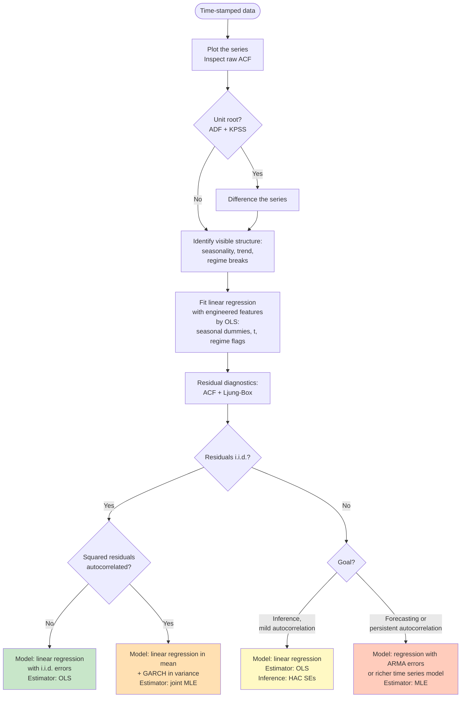

# Do You Need Time Series Analysis?

## When Time Orders the Observations

Not every dataset indexed by time requires time series methods. A time series is a sequence of observations indexed in time order — daily returns, monthly sales, hourly temperatures.

The distinction is whether **time orders the observations** or merely **labels them as a feature**. A customer-churn dataset may include signup date or account age as covariates while still treating each customer as exchangeable; shuffling the rows leaves the analysis unchanged. A daily stock price series, by contrast, falls apart under shuffling — each value's interpretation depends on what came immediately before.

## Feature Engineering vs Time Series Modelling

A dataset's temporal structure can take many forms. Some are **absorbable** — they can be encoded as features in a linear regression model with i.i.d. errors (estimated by OLS), leaving residuals i.i.d. Others are **structural** — they run through the dependence of $y$ on its own past, and no finite feature set can capture them. Distinguishing the two is what determines whether a linear regression model with i.i.d. errors suffices or a richer time series model is required.

The single question that decides the matter is whether the observations are **independent**.

Three situations admit a linear regression model — possibly with an inference adjustment — instead of a richer time series model:

- **Truly independent observations.** Some measurements are uncorrelated in time — repeated lab measurements with no carryover, for example. If the autocorrelation function is flat at all non-zero lags, treat the data as cross-sectional.
- **Panel data with $N \gg T$.** When the cross-section is wide and the time dimension short, panel models (fixed effects, dynamic panel GMM) typically dominate per-unit time series models.
- **Contemporaneous-only inference.** When only the relationship between variables at the same time matters, the linear regression model is retained and estimated by OLS; only the inference layer is swapped, replacing conventional standard errors with heteroskedasticity-and-autocorrelation-consistent (HAC) standard errors — Newey and West (1987), for instance. This salvages inference without committing to a model of the error process.

## The Core Question: Independence

The standard linear regression model — and the cross-sectional machine-learning algorithms that share its assumptions — requires that the observations are independent. When this assumption holds, the temporal labels carry no statistical information beyond their role as identifiers. The data can then be treated as cross-sectional.

In time series data, this assumption typically fails. Successive observations are correlated: today's value depends on yesterday's, last month's temperature on the month before. The operational test is whether

$$\text{Cov}(y_t, y_{t-k}) = 0 \quad \text{for all } k \geq 1.$$

(Read: the covariance between y at time t and y at time t minus k equals zero, for every positive lag k.)

If this condition holds, a linear regression model with i.i.d. errors (estimated by OLS) is valid. If it fails, the question becomes along which dimension the dependence runs:

| Dependence runs along… | Model family |
|---|---|
| Group or individual (many units, repeated) | Panel / mixed effects |
| Space | Spatial econometrics, Gaussian processes |
| Hierarchy (e.g., students within schools) | Multilevel models |
| Time (one unit, ordered observations) | Time series — ARIMA, GARCH, VAR, state-space |

## Workflow: From Plot to Model Choice

The decision distills into a sequence: identify the visible structure, fit a linear regression model with the engineered features by OLS, and let residual diagnostics decide whether the model itself needs to be replaced. The flowchart below traces the path from a [prepared series](../02-data-preparation/index.md) to a model class.

Each terminal names three things in order: the **model**, the **estimator**, and (where relevant) the **inference layer**. Reading the four branches from this perspective makes clear what is changing at each step.

- **Leftmost terminal.** Clean residual ACF and clean squared-residual ACF leave the linear-regression-with-i.i.d.-errors model intact. The estimator remains OLS; conventional standard errors are valid.
- **HAC branch.** Mild residual autocorrelation under an inference goal does not change the model or the estimator. Only the inference layer is swapped: HAC standard errors replace conventional ones.
- **GARCH branch.** Squared-residual autocorrelation indicates that the variance model is mis-specified. The mean equation is retained but a GARCH variance equation is added; the resulting joint model is estimated by MLE rather than OLS.
- **Time series branch.** Persistent residual autocorrelation indicates that the mean model is mis-specified. The linear regression with i.i.d. errors is *replaced* by a model that specifies an autocorrelated error process — most often regression with ARMA errors (ARIMAX). The estimator becomes MLE.

The flowchart implies a principled allocation of work. Feature engineering absorbs whatever exogenous structure — calendar, regimes, deterministic trend — explains the data within the i.i.d.-error model. A richer time series model is reserved for the dependence that remains. This is the operational form of the principle stated above: condition on features first; reach for a model that specifies the error process only when conditioning fails to recover independence.

## What "Time Series Analysis" Means in This Flowchart

Escalating from a linear regression model with i.i.d. errors to a time series specification does not mean fitting a separate model on the OLS residuals. It means **replacing the model**. The original linear regression in $y_t$ — which assumed i.i.d. errors — is superseded by a richer joint specification that combines the same engineered features with an autocorrelated error structure. The canonical form is **regression with ARMA errors**, more commonly called **ARIMAX** — an ARIMA (Autoregressive Integrated Moving-Average) model with **exogenous** regressors:

$$y_t = \mathbf{x}_t^T \boldsymbol{\beta} + u_t, \qquad u_t \text{ follows an ARMA process.}$$

(Read: y at time t equals a linear combination of features x-sub-t plus an error u-sub-t that follows an autoregressive moving-average process.)

Here $u_t$ is a *theoretical* error term — what remains in $y_t$ after the features are accounted for — not the observed residual from a prior OLS fit. The same $\mathbf{x}_t$ used in the OLS step is carried over into the ARIMAX specification, but $\boldsymbol{\beta}$ and the ARMA parameters are estimated together by **maximum likelihood (MLE)** on the original $y_t$ data, not in sequence. **ARMA** (autoregressive moving-average) is a class of models in which $u_t$ depends on its own past values and on past random shocks.

The OLS fit served only as a diagnostic step. The question it answered was whether the linear-regression-with-i.i.d.-errors model left i.i.d. residuals. When the answer is no, that model is rejected and replaced by ARIMAX, which is estimated by MLE on the original $y_t$. The estimator changes because the model changed — not the other way around.

A two-step estimator for ARIMAX does exist historically: fit the linear regression model by OLS, take the residuals $\hat{\varepsilon}_t$, then fit ARIMA on $\hat{\varepsilon}_t$. This is the **Cochrane–Orcutt (1949)** estimator, and it is precisely what joint MLE replaces. As an estimator of the ARIMAX model, Cochrane–Orcutt is consistent but inefficient: OLS coefficients estimated under i.i.d. errors are noisier than necessary when errors are actually autocorrelated, and modelling the residuals afterwards cannot recover the lost efficiency. Joint MLE on the ARIMAX model is the modern standard.

**ARIMAX is the canonical, not the only, escalation.** The discussion above describes how the linear regression model with i.i.d. errors extends to ARIMAX when the dependence is in the conditional **mean**. The flowchart already shows two other escalations from the same baseline:

- **GARCH** addresses dependence in the conditional **variance** — volatility clustering. The mean model is retained, a GARCH variance equation is added, and the joint specification is estimated by MLE.
- **HAC standard errors** address mild mean autocorrelation when inference, not forecasting, is the goal. Neither the model nor the point estimator changes; only the variance estimator used for standard errors is swapped.

Beyond these, the time series literature contains many specialised model families, each targeting a kind of dependence the flowchart does not resolve directly:

- **State-space models** (Kalman filter, structural time series, BSTS) — for time-varying level, trend, or coefficients; multiple overlapping seasonalities; missing observations; online updating. Estimated by MLE or Bayesian methods.
- **VAR and VECM** — for multivariate series in which each component depends on lagged values of the others; VECM specifically for cointegrated non-stationary series. Estimated equation-by-equation by OLS (under exogeneity of lags) or by MLE.
- **Frequency-domain methods** (spectral analysis, wavelets) — when cycles do not align with integer divisors of the sampling rate, or when the question concerns energy distribution across frequencies rather than predicting individual values.
- **Long-memory models** (ARFIMA) — when the ACF decays too slowly for any finite ARMA to capture.
- **Regime-switching models** (Markov-switching) — when parameters shift between unobserved discrete states. Estimated by MLE via the Hamilton (1989) filter or by Bayesian methods.
- **Nonlinear and ML sequence models** (LSTM, transformers, N-BEATS) — for nonlinear dependence and high-dimensional inputs, given sufficient data. Trained by gradient-based optimization of a loss function.

These are catalogued and developed in **Chapter 05**. The flowchart in this introduction is a gateway: it tells you whether the linear regression model with i.i.d. errors suffices, and if not, which broad axis of dependence — mean, variance, or inference-only — the residuals point to. Choosing the specific time series model family within that branch, and the estimator that fits it, is a separate decision, treated downstream.
