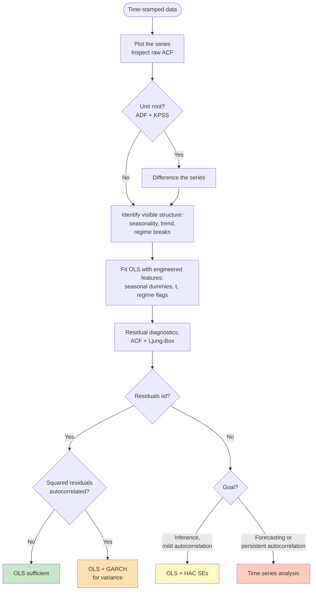

# Introduction

---
## **When Do You Need a Time Series Model?**

Not every dataset indexed by time requires a time series model. A time series is a sequence of observations indexed in time order — daily returns, monthly sales, hourly temperatures.

The distinction is whether **time orders the observations** or merely **labels them as a feature**. A customer-churn dataset may include signup date or account age as covariates while still treating each customer as exchangeable; shuffling the rows leaves the model unchanged. A daily revenue series, by contrast, falls apart under shuffling — each value's interpretation depends on what came immediately before. Time series methods are required only when shuffling destroys meaning.

### Feature Engineering vs Time Series Modeling

A dataset's temporal structure can take many forms. Some are **absorbable** — they can be encoded as features in an ordinary least squares (OLS) specification, leaving residuals iid. Others are **structural** — they run through the dependence of $y$ on its own past, and no finite feature set can capture them. Distinguishing the two is what determines whether ordinary regression suffices or a time series model is required.

The single question that decides the matter is whether the observations are **independent**.

Three situations call for ordinary tools instead:

- **Truly independent observations.** Some measurements are uncorrelated in time — repeated lab measurements with no carryover, for example. If the autocorrelation function is flat at all non-zero lags, treat the data as cross-sectional.
- **Panel data with $N \gg T$.** When the cross-section is wide and the time dimension short, panel methods (fixed effects, GMM) typically dominate per-unit time series models.
- **Contemporaneous-only inference.** When only the relationship between variables at the same time matters, OLS with heteroskedasticity-and-autocorrelation-consistent (HAC) standard errors — for instance, Newey and West (1987) — corrects the inference without committing to a full time series specification.

### The Core Question: Independence

Standard statistical methods — OLS, generalized linear models, most cross-sectional machine-learning algorithms — assume that the observations are independent. When this assumption holds, the temporal labels carry no statistical information beyond their role as identifiers. The data can then be treated as cross-sectional.

In time series data, this assumption typically fails. Successive observations are correlated: today's value depends on yesterday's, last month's temperature on the month before. The operational test is whether

$$\text{Cov}(y_t, y_{t-k}) = 0 \quad \text{for all } k \geq 1.$$

(Read: the covariance between y at time t and y at time t minus k equals zero, for every positive lag k.)

If this condition holds, ordinary methods are valid. If it fails, along which dimension does the dependence run: 

| Dependence runs along… | Tool family |
|---|---|
| Group or individual (many units, repeated) | Panel / mixed effects |
| Space | Spatial econometrics, Gaussian processes |
| Hierarchy (e.g., students within schools) | Multilevel models |
| Time (one unit, ordered observations) | Time series — ARIMA, GARCH, VAR, state-space |

### Workflow: From Plot to Model Choice

The decision distills into a sequence: identify the visible structure, capture what features can absorb, and let residual diagnostics decide whether more is needed. The flowchart below traces the path from a [prepared series](../02-data-preparation/index.md) to model class.

The leftmost terminal — clean residual ACF and clean squared-residual ACF — leaves OLS sufficient. The other branches escalate: mild autocorrelation with inference goals warrants HAC standard errors; forecasting goals or persistent residual autocorrelation push to a time series specification; lingering autocorrelation in *squared* residuals adds a GARCH layer for variance.

The flowchart implies a principled allocation of work. Feature engineering absorbs whatever exogenous structure — calendar, regimes, deterministic trend — explains the data. A time series model is reserved for the dependence that remains. This is the operational form of the principle stated above: condition on features first; reach for a time series specification only when conditioning fails to recover independence.

**What "time series analysis" means in this flowchart.** Escalating from OLS to a time series specification does not mean fitting a separate model on the OLS residuals. It means **refitting the original series** under a richer joint specification that combines the same engineered features with an autocorrelated error structure. The canonical form is **regression with ARMA errors**, more commonly called **ARIMAX** — an ARIMA (Autoregressive Integrated Moving-Average) model with **exogenous** regressors:

$$y_t = \mathbf{x}_t^T \boldsymbol{\beta} + u_t, \qquad u_t \text{ follows an ARMA process}$$

(Read: y at time t equals a linear combination of features x-sub-t plus an error u-sub-t that follows an autoregressive moving-average process.)

Here $u_t$ is a *theoretical* error term — what remains in $y_t$ after the features are accounted for — not the observed residual from a prior OLS fit. The same $\mathbf{x}_t$ used in the OLS step is carried over into the ARIMAX specification, but $\boldsymbol{\beta}$ and the ARMA parameters are estimated together on the original $y_t$ data, not in sequence. **ARMA** (autoregressive moving-average) is a class of models in which $u_t$ depends on its own past values and on past random shocks.

The OLS fit served only as a diagnostic step. The question it answered was whether feature engineering alone left iid residuals. When the answer is no, the OLS results are replaced — not supplemented — by a joint ARIMAX estimate, computed by **maximum likelihood (MLE)** from the original $y_t$.

A two-step procedure does exist historically: fit OLS, take the residuals $\hat{\varepsilon}_t$, then fit ARIMA on $\hat{\varepsilon}_t$. This is **Cochrane–Orcutt (1949)**, and it is precisely what joint MLE replaces. It is consistent but inefficient: OLS coefficients estimated under iid errors are noisier than necessary when errors are actually autocorrelated, and modeling the residuals afterwards cannot recover the lost efficiency. Joint estimation on the original data is the modern standard.

**ARIMAX is the canonical, not the only, escalation.** The discussion above describes how OLS-plus-features extends to ARIMAX when the dependence is in the conditional **mean**. The flowchart already shows two other escalations from the same OLS baseline. **GARCH** addresses dependence in the conditional **variance** — volatility clustering. **HAC standard errors** address mild mean autocorrelation when inference, not forecasting, is the goal.

Beyond these, the time series literature contains many specialised families, each targeting a kind of dependence the flowchart does not resolve directly:

- **State-space models** (Kalman filter, structural time series, BSTS) — for time-varying level, trend, or coefficients; multiple overlapping seasonalities; missing observations; online updating.
- **VAR and VECM** — for multivariate series in which each component depends on lagged values of the others; VECM specifically for cointegrated non-stationary series.
- **Frequency-domain methods** (spectral analysis, wavelets) — when cycles do not align with integer divisors of the sampling rate, or when the question concerns energy distribution across frequencies rather than predicting individual values.
- **Long-memory models** (ARFIMA) — when the ACF decays too slowly for any finite ARMA to capture.
- **Regime-switching models** (Markov-switching) — when parameters shift between unobserved discrete states.
- **Nonlinear and ML sequence models** (LSTM, transformers, N-BEATS) — for nonlinear dependence and high-dimensional inputs, given sufficient data.

These are catalogued and developed in **Chapter 05**. The flowchart in this introduction is a gateway: it tells you whether ordinary regression suffices, and if not, which broad axis of dependence — mean, variance, or inference-only — the residuals point to. Choosing the specific time series family within that branch is a separate decision, treated downstream.

---
## **What is Time Series Analysis?**

Time series analysis is the study of data points collected or recorded at successive time intervals. Unlike cross-sectional data, which represents a snapshot at a single point in time, time series data has inherent temporal structure that must be respected in modeling.

A time series is a sequence of observations indexed in time order. The defining characteristic that separates it from cross-sectional data is **temporal dependence** — observations are not independent of each other. Yesterday's stock price influences today's price. Last month's temperature influences this month's reading. This dependence invalidates the independence assumption that underlies standard statistical inference.

**Common examples of time series data:**

- Stock prices recorded every second
- Monthly unemployment rates
- Daily temperature measurements
- Quarterly GDP figures
- Sensor readings from industrial equipment

## **Time Domain vs Frequency Domain**

Time series analysis operates in two complementary domains.

### Time Domain

- Values are examined as they evolve over time, observation by observation.
- Models describe how current values depend on past values.
- **Use when** questions concern predictability, causality, or forecasting.
- **Common methods:** ARIMA, VAR, GARCH, and state-space models.

### Frequency Domain

- Signals decompose into sine and cosine waves of varying amplitude and phase.
- The decomposition reveals the energy distribution across frequencies.
- **Use when** questions involve periodicity, cycles, or spectral content.
- **Common methods:** Fourier transform, power spectral density, filtering, and wavelets.

**In practice**, skilled analysts move between domains:

1. Begin in the time domain to examine trends and autocorrelation.
2. Move to the frequency domain to identify hidden cycles.
3. Return to the time domain to build a forecasting model that incorporates periodic components.

---

## **The 5 Classical OLS Assumptions and How Time Series Violates Them**

The linear regression model takes the form:

$$y_i = \mathbf{x}_i^T \boldsymbol{\beta} + \epsilon_i, \quad i = 1, \dots, N$$

(Read: y-sub-i equals x-sub-i-transpose times beta plus epsilon-sub-i, for i from 1 to N.)

where $y_i$ is the scalar outcome for observation $i$, $\mathbf{x}_i$ is a $K \times 1$ vector of regressors, $\boldsymbol{\beta}$ is the $K \times 1$ coefficient vector, and $\epsilon_i$ is the error term. OLS estimates $\boldsymbol{\beta}$ by minimizing the sum of squared residuals:

$$\min_{\boldsymbol{\beta}} \sum_{i=1}^N \left(y_i - \mathbf{x}_i^T \boldsymbol{\beta}\right)^2$$

(Read: minimize over beta the sum of y-sub-i minus x-sub-i-transpose-beta, squared, for i from 1 to N.)

When $\mathbf{X}$ has full column rank ([Assumption 0](#assumption-0) below) — so that $\mathbf{X}^T\mathbf{X}$ is invertible — this minimization has a unique closed-form solution (also called the OLS estimator):

$$\hat{\boldsymbol{\beta}} = (\mathbf{X}^T\mathbf{X})^{-1}\mathbf{X}^T\mathbf{y}$$

(Read: beta-hat equals X-transpose-X-inverse times X-transpose-y.)

The entire edifice of OLS estimation rests on a set of assumptions collectively known as the Gauss-Markov conditions. OLS achieves the **BLUE** property — Best Linear Unbiased Estimator — only when those assumptions hold. Assumptions 1–4 constitute the **Gauss-Markov assumptions**; under these, the model is called the **Classical Regression Model** (CRM). Adding Assumption 5 (normality) yields the **Classical Normal Regression Model** (CNRM). Preceding all five is **Assumption 0** (the rank condition), which determines whether the OLS estimator exists at all — a separate tier from A1–A5, treated below.

The matrix calculus derivation of $\hat{\boldsymbol{\beta}}$, the fundamental decomposition, and the conditions under which t-statistics are valid are developed in full in [Appendix A](../appendices/A-ols-derivation.md).

For the remainder of this section we adopt the time-series convention: observations are indexed by $t = 1, \ldots, T$ rather than $i = 1, \ldots, N$, and $\epsilon_t$ denotes the error at time $t$. The model becomes $y_t = \mathbf{x}_t^T \boldsymbol{\beta} + \epsilon_t$ with the same OLS estimator $\hat{\boldsymbol{\beta}}$.

!!! note "Remark: Assumptions 1 and 4 are not independent"
    Modern treatments often collapse Assumption 1 (zero mean) and Assumption 4 (strict exogeneity) into the single conditional zero-mean assumption $\mathbb{E}[\epsilon_t \mid \mathbf{X}] = 0$, since this implies $\mathbb{E}[\epsilon_t] = 0$ by the law of iterated expectations whenever the model includes an intercept. Listing them separately is therefore mildly redundant.

    We retain the split because each fails through a distinct time-series mechanism: A1 fails through omitted *deterministic* structure (trends, seasonal terms), while A4 fails through *stochastic* dependence between errors and regressors (lagged dependent variables, simultaneity). The diagnostic and remediation strategies differ, so the pedagogical separation is worth the formal redundancy.

---

!!! theorem "Assumption 0: No Perfect Multicollinearity (Rank Condition)"
    $$\text{rank}(\mathbf{X}) = K$$

    (Read: the rank of X equals K, the number of regressors.)

The design matrix $\mathbf{X}$ has full column rank: no regressor is an exact linear combination of the others. Equivalently, $\mathbf{X}^T\mathbf{X}$ is invertible, which is what makes the OLS estimator $\hat{\boldsymbol{\beta}} = (\mathbf{X}^T\mathbf{X})^{-1}\mathbf{X}^T\mathbf{y}$ well-defined. (1)

1.  **Common alternative forms:**
    - $\det(\mathbf{X}^T\mathbf{X}) \neq 0$ — the determinant form
    - $\mathbf{X}^T\mathbf{X}$ is positive definite — the spectral form
    - For a single restriction: no $\mathbf{x}_j$ can be written as $\sum_{k \neq j} c_k \mathbf{x}_k$ for constants $c_k$
    - Sometimes called the **identification condition**, because it ensures $\boldsymbol{\beta}$ is uniquely determined by the data

#### Existence vs quality

Assumption 0 differs from A1–A5 in kind. The five Gauss-Markov assumptions concern the *quality* of the estimator — bias, efficiency, valid inference. Assumption 0 concerns whether the estimator *exists at all*. If A0 fails, $\mathbf{X}^T\mathbf{X}$ is singular, the inverse does not exist, and OLS produces no estimate. There is no notion of "biased" or "inefficient" because there is no number to begin with.

This distinction also affects how problems are detected. A failure of A0 is a structural failure of the design matrix and surfaces at computation time — software returns a singular-matrix error or silently drops a redundant column. Failures of A1–A5 surface only after estimation, by examining residuals.

#### Perfect vs imperfect multicollinearity

Two cases are commonly conflated under the label "multicollinearity":

- **Perfect multicollinearity** — exact linear dependence among regressors. Violates A0. OLS cannot be computed. The textbook example is the **dummy variable trap**: including dummies for all categories alongside an intercept makes the dummy columns sum to the intercept column.

- **Imperfect (high) multicollinearity** — strong but not exact correlation among regressors. **No assumption is violated.** The estimator $\hat{\boldsymbol{\beta}}$ remains BLUE under the Gauss-Markov conditions. The only consequence is that $\text{Var}(\hat{\boldsymbol{\beta}})$ is inflated, producing wide confidence intervals and coefficients that swing under small data perturbations. Diagnose with the variance inflation factor (VIF); remedy by dropping redundant regressors, combining them, or using regularized methods such as ridge regression (Hoerl and Kennard 1970).

Imperfect multicollinearity is a **modelling nuisance, not an assumption violation**. It changes nothing about the validity of the OLS framework; it only affects the precision of individual coefficient estimates.

#### In time series

Two contexts produce multicollinearity in time series. **Including many lags** of the same persistent variable yields a near-singular $\mathbf{X}^T\mathbf{X}$ when the series is highly autocorrelated, since successive lags carry redundant information. **Including a deterministic trend $t$ alongside a near-unit-root regressor** also produces high collinearity, because both are nearly linear in time. Both are imperfect-multicollinearity cases — they inflate standard errors but do not invalidate OLS itself. The remedy is parsimony in lag selection (informed by AIC, BIC, and the PACF) and care when combining trends with persistent regressors.

---

!!! theorem "Assumption 1: Zero Mean"
    $$\mathbb{E}[\epsilon_t] = 0$$

    (Read: the expected value of epsilon-sub-t equals zero.)

The errors have zero mean — the model has no systematic bias. On average, it neither over-predicts nor under-predicts. (1)

1.  **Common alternative forms:**
    - $\mathbb{E}[\epsilon_t \mid \mathbf{X}] = 0$ — the conditional form, which is stronger and subsumes exogeneity (Assumption 4). Some texts (e.g., Wooldridge 2020) combine A1 and A4 into this single condition
    - $\mu_\epsilon = 0$ — compact scalar notation in introductory texts
    - Note: A1 follows automatically from A4 (strict exogeneity) when the model includes an intercept $\beta_1$, by the law of iterated expectations: $\mathbb{E}[\epsilon_t] = \mathbb{E}[\mathbb{E}[\epsilon_t \mid \mathbf{X}]] = 0$

#### Violation in time series

When $y_t$ contains a **deterministic trend** — for example, GDP growing over time — and time $t$ is omitted as a regressor, the marginal mean of the error varies systematically across $t$ rather than being a single constant. Concretely, if the data-generating process is $y_t = \alpha + \delta t + u_t$ with $\mathbb{E}[u_t] = 0$ but the fitted model is $y_t = \alpha + \epsilon_t$, then $\epsilon_t = \delta t + u_t$ has

$$\mathbb{E}[\epsilon_t] = \delta t,$$

(Read: the expected value of epsilon-sub-t equals delta times t.)

so the unconditional error mean is non-zero and grows with $t$. Equivalently, if $t$ is treated as a covariate, the conditional mean $\mathbb{E}[\epsilon_t \mid t]$ is a non-constant function of time. The errors carry a systematic upward or downward drift that varies with position in the sample. The model has not accounted for this time-varying mean.

A subtler violation arises with **seasonal data** (monthly sales, quarterly earnings): the mean of $\epsilon_t$ shifts predictably every cycle. An OLS model that omits seasonal terms produces errors whose conditional mean oscillates, violating this assumption on a regular schedule.

---

!!! theorem "Assumption 2: Homoskedasticity"
    $$\text{Var}(\epsilon_t \mid \mathbf{X}) = \sigma^2 \quad \forall \ t$$

    (Read: the variance of epsilon-sub-t, given X, equals sigma-squared, for all t.)

The variance of the error is constant across all observations and does not depend on the regressors or on time. (1)

1.  **Common alternative forms:**
    - $\mathbb{E}[\epsilon_t^2 \mid \mathbf{X}] = \sigma^2$ — equals $\text{Var}(\epsilon_t \mid \mathbf{X})$ only when $\mathbb{E}[\epsilon_t \mid \mathbf{X}] = 0$ (i.e., A4 holds). Many treatments fold A4 in by default and write A2 in this form
    - $\text{Var}(\epsilon_t) = \sigma^2$ — unconditional form, common in introductory texts
    - $\mathbb{E}[\boldsymbol{\epsilon}\boldsymbol{\epsilon}^T \mid \mathbf{X}] = \sigma^2 \mathbf{I}$ — the matrix form, seen in Greene (2018) and Wooldridge (2010), which packages both Assumption 2 and 3 together

#### Violation in time series

The variance of many time series changes over time rather than remaining constant. In financial data, large price moves cluster together — this is **volatility clustering**, formalized by Engle (1982) as ARCH:

$$\text{Var}(\epsilon_t \mid \mathcal{F}_{t-1}) = \alpha_0 + \alpha_1 \epsilon_{t-1}^2$$

(Read: the variance of epsilon-sub-t, given the information set F-sub-t-minus-1, equals alpha-zero plus alpha-one times epsilon-sub-t-minus-1-squared.)

where $\mathcal{F}_{t-1}$ denotes all information available up to $t-1$ (Engle 1982). The variance now depends on the past error, so $\text{Var}(\epsilon_t \mid \mathbf{X}) \neq \sigma^2$. OLS ignores this structure and estimates a single pooled $\hat{\sigma}^2$ across the entire sample. The consequence is **inefficient estimation**: OLS is no longer BLUE because a GLS estimator that accounts for the error covariance structure $\boldsymbol{\Omega}$ — formally introduced under Assumption 3 below; for pure heteroskedasticity, $\boldsymbol{\Omega}$ is diagonal with non-constant entries reflecting the time-varying variance — would down-weight high-variance periods and up-weight low-variance periods.

Furthermore, the conventional OLS variance estimator

$$\widehat{\text{Var}}(\hat{\boldsymbol{\beta}}) = \hat{\sigma}^2 (\mathbf{X}^T\mathbf{X})^{-1}$$

(Read: the estimated variance of beta-hat equals sigma-hat-squared times X-transpose-X-inverse.)

is **biased and inconsistent** for the true variance of $\hat{\boldsymbol{\beta}}$ under heteroskedasticity — it converges to the wrong quantity as $T \rightarrow \infty$ (White 1980). The standard errors derived from it (the square roots of its diagonal entries) are therefore not valid measures of estimator uncertainty.

---

!!! theorem "Assumption 3: No Serial Correlation"
    $$\mathbb{E}[\epsilon_t \epsilon_s \mid \mathbf{X}] = 0 \quad \forall \ t \neq s$$

    (Read: the expected value of epsilon-sub-t times epsilon-sub-s, given X, equals zero, for all t not equal to s.)

The error at time $t$ carries no information about the error at any other time $s$. Knowing that the model over-predicted yesterday provides no information about today's prediction error. (1)

1.  **Common alternative forms:**
    - $\text{Cov}(\epsilon_t, \epsilon_s) = 0$ — unconditional covariance form, seen widely in introductory econometrics
    - $\rho = 0$ where $\epsilon_t = \rho \epsilon_{t-1} + u_t$ — the AR(1) parameterization, common in applied papers testing for autocorrelation
    - The matrix form packaging Assumptions 2 and 3 together: $\mathbb{E}[\boldsymbol{\epsilon}\boldsymbol{\epsilon}^T \mid \mathbf{X}] = \sigma^2\mathbf{I}$

#### Violation in time series — the most consequential failure

Time series observations are collected sequentially, so each observation is structurally linked to those that precede it. Yesterday's GDP affects today's GDP. Last month's temperature affects this month's temperature. This sequential dependence produces **autocorrelation**: errors are correlated across time.

Define the autocovariance at lag $k$ (using the zero-mean property from Assumption 1):

$$\gamma(k) = \text{Cov}(\epsilon_t, \epsilon_{t-k}) = \mathbb{E}[\epsilon_t \epsilon_{t-k}]$$

(Read: gamma-of-k equals the covariance between epsilon-sub-t and epsilon-sub-t-minus-k, which equals the expected value of their product when the errors have zero mean.)

Assumption 3 requires $\gamma(k) = 0$ for all $k \neq 0$. In practice, $\gamma(1)$ is almost never zero in raw time series data.

When this assumption fails, the true error covariance matrix is no longer $\sigma^2 \mathbf{I}$; it becomes:

$$\mathbb{E}[\boldsymbol{\epsilon}\boldsymbol{\epsilon}^T \mid \mathbf{X}] = \sigma^2 \boldsymbol{\Omega}, \quad \boldsymbol{\Omega} \neq \mathbf{I}$$

(Read: the expected value of epsilon-epsilon-transpose, given X, equals sigma-squared times Omega, where Omega is not the identity matrix.)

Here:

- $\mathbf{I}$ is the $T \times T$ **identity matrix** — a square matrix with ones on the main diagonal and zeros everywhere else. In the error covariance context, the diagonal ones mean every error has the same variance $\sigma^2$, and the off-diagonal zeros mean no two errors are correlated. For $T = 3$:

$$\mathbf{I}_3 = \begin{pmatrix} 1 & 0 & 0 \\ 0 & 1 & 0 \\ 0 & 0 & 1 \end{pmatrix}$$

- $\boldsymbol{\Omega}$ is a $T \times T$ **symmetric positive-definite matrix**. Symmetric means the matrix equals its own transpose ($\boldsymbol{\Omega} = \boldsymbol{\Omega}^T$), which reflects the fact that $\text{Cov}(\epsilon_t, \epsilon_s) = \text{Cov}(\epsilon_s, \epsilon_t)$. Positive-definite ensures all variances are strictly positive and the matrix is invertible. The diagonal entries encode heteroskedasticity (time-varying variance); the off-diagonal entries encode serial correlation.

For concreteness, take $T = 3$ errors following a stationary AR(1) process $\epsilon_t = \rho \epsilon_{t-1} + u_t$ with white-noise innovations $u_t$ of variance $\sigma_u^2$. Then $\sigma^2$ in the decomposition $\mathbb{E}[\boldsymbol{\epsilon}\boldsymbol{\epsilon}^T] = \sigma^2 \boldsymbol{\Omega}$ is the **marginal (stationary) variance** of $\epsilon_t$,

$$\sigma^2 = \text{Var}(\epsilon_t) = \frac{\sigma_u^2}{1 - \rho^2},$$

(Read: sigma-squared equals sigma-u-squared divided by one minus rho-squared.)

and $\boldsymbol{\Omega}$ is the resulting **autocorrelation matrix**, with ones on the diagonal and $\rho^{|t-s|}$ off-diagonal:

$$\boldsymbol{\Omega} = \begin{pmatrix} 1 & \rho & \rho^2 \\ \rho & 1 & \rho \\ \rho^2 & \rho & 1 \end{pmatrix}$$

When $\rho = 0$, $\boldsymbol{\Omega}$ collapses to $\mathbf{I}$, recovering Assumption 3.

The true variance of $\hat{\boldsymbol{\beta}}$ is then:

$$\text{Var}(\hat{\boldsymbol{\beta}} \mid \mathbf{X}) = \sigma^2 (\mathbf{X}^T\mathbf{X})^{-1} \mathbf{X}^T \boldsymbol{\Omega} \mathbf{X} (\mathbf{X}^T\mathbf{X})^{-1}$$

(Read: the variance of beta-hat, given X, equals sigma-squared times X-transpose-X-inverse, times X-transpose-Omega-X, times X-transpose-X-inverse.)

OLS, however, reports the conventional variance estimator $\widehat{\text{Var}}(\hat{\boldsymbol{\beta}}) = \hat{\sigma}^2 (\mathbf{X}^T\mathbf{X})^{-1}$ introduced under Assumption 2. The two expressions — the true sandwich form above and the OLS-reported form — are different objects. The reported standard errors are **wrong**. With positive autocorrelation — the common case — OLS **understates** the true standard errors, so t-statistics are inflated and null hypotheses are rejected too often (Wooldridge 2020, chap. 12).

The point estimate $\hat{\boldsymbol{\beta}}$ remains **unbiased** — the estimate is correct on average — but the standard errors used to assess its reliability are not.

---

!!! theorem "Assumption 4: Strict Exogeneity"
    $$\mathbb{E}[\epsilon_t \mid \mathbf{X}] = 0$$

    (Read: the expected value of epsilon-sub-t, given X, equals zero.)

The error at any time $t$ is uncorrelated with the regressors at *all* time periods — past, present, and future. No regressor in the entire design matrix $\mathbf{X}$ carries information about $\epsilon_t$. (1)

1.  **Common alternative forms:**
    - **Contemporaneous exogeneity**: $\mathbb{E}[\epsilon_t \mid \mathbf{x}_t] = 0$ — the error is uncorrelated with regressors at time $t$ only. Weaker than strict exogeneity; sufficient for consistency in the cross-sectional case and in stationary time series under standard regularity conditions (law of large numbers, bounded moments), but not for finite-sample unbiasedness. In time series with serially correlated regressors, the law of large numbers requires that the dependence between observations decay fast enough as the time gap grows — formally, the process must be *weakly dependent* (sometimes called *mixing*): the influence of $\mathbf{x}_t$ on $\mathbf{x}_{t+k}$ must shrink to zero as $k \to \infty$. Without this decay, sample averages may not converge to population means, and the OLS estimator $\hat{\boldsymbol{\beta}}$ may fail to be *consistent* — meaning it does not converge to the true $\boldsymbol{\beta}$ as the sample size $T \to \infty$ — even when $\mathbb{E}[\epsilon_t \mid \mathbf{x}_t] = 0$ holds
    - **Predetermined regressors** (Hamilton 1994, ch. 8): $\mathbb{E}[\epsilon_t \mid \mathbf{x}_1, \ldots, \mathbf{x}_t] = 0$ — the error is uncorrelated with current and past regressors but future regressors may be correlated with it. This is the standard moment condition for dynamic time-series models with lagged dependent variables. It is sufficient for *consistency* of OLS under stationarity and weak dependence, even though strict exogeneity fails
    - **Weak exogeneity** (Engle, Hendry, and Richard 1983): a *parametric* concept distinct from predeterminedness. Formally, the joint density of $(\epsilon_t, \mathbf{x}_t)$ admits a *cut* — i.e., factorizes into a conditional density $f(\epsilon_t \mid \mathbf{x}_t)$ depending only on the parameters of interest and a marginal density $f(\mathbf{x}_t)$ depending only on nuisance parameters — so that conditioning on $\mathbf{x}_t$ entails no loss of information for inference on $\boldsymbol{\beta}$. Weak exogeneity is about *what to condition on* for inference; predeterminedness is about *moment conditions on the error*. The two often coincide in applied work but are not equivalent. This text uses "predetermined" for the conditional-mean condition above
    - $\text{Cov}(\mathbf{x}_t, \epsilon_t) = 0$ — the covariance form, common in older literature. Note this is weaker than the conditional mean form
    - Note: A4 holds automatically when $\mathbf{x}_t$ is deterministic (non-random) — hence sometimes called the **nonstochastic regressor assumption**

#### Violation in time series — structural and unavoidable with lagged regressors

In time series, **strict exogeneity is violated by construction** whenever a lagged dependent variable appears as a regressor. Consider the AR(1) model:

$$y_t = \beta y_{t-1} + \epsilon_t$$

(Read: y-sub-t equals beta times y-sub-t-minus-1 plus epsilon-sub-t.)

Here $\mathbf{x}_t = y_{t-1}$, so for a sample of $T$ observations the design matrix consists of $y_0, y_1, \ldots, y_{T-1}$. The condition $\mathbb{E}[\epsilon_t \mid y_0, y_1, \ldots, y_{T-1}] = 0$ fails because $\epsilon_t$ affects $y_t$, and $y_t$ itself enters the design matrix as the regressor at time $t+1$ (i.e., $y_t = \mathbf{x}_{t+1}$). Therefore $\text{Cov}(\mathbf{x}_{t+1}, \epsilon_t) = \text{Cov}(y_t, \epsilon_t) \neq 0$, and strict exogeneity fails.

The predetermined-regressor condition $\mathbb{E}[\epsilon_t \mid y_{t-1}, y_{t-2}, \ldots] = 0$ holds as long as $\epsilon_t$ is not autocorrelated. Critically, although strict exogeneity fails for AR(1), OLS in this model with white-noise errors is **biased in finite samples but consistent**: $\hat{\beta} \xrightarrow{p} \beta$ as $T \to \infty$. This is the classical Hurwicz (1950) bias result — the bias is of order $1/T$ and vanishes asymptotically. Time-series econometrics therefore **replaces strict exogeneity with predetermined regressors** and relies on this combination together with large-sample ($T \rightarrow \infty$) asymptotics, rather than finite-sample Gauss-Markov results (Hamilton 1994, chap. 8).

A more severe violation arises from **simultaneity** — when $y_t$ and $\mathbf{x}_t$ jointly determine each other, as in the simultaneous determination of supply and price in a market equilibrium model. Unlike the AR(1) case, where bias vanishes asymptotically, OLS under simultaneity is **biased *and* inconsistent**: the bias does not shrink with sample size, and consistent estimation requires instrumental variables or system methods (Hamilton 1994, chap. 9).

---

!!! theorem "Assumption 5: Normality"
    $$\epsilon_t \mid \mathbf{X} \sim \mathcal{N}(0, \sigma^2)$$

    (Read: epsilon-sub-t given X is distributed as Normal with mean zero and variance sigma-squared.)

The errors follow a normal distribution with mean zero and constant variance. Normality is what allows exact t-distributions and F-distributions for hypothesis tests in finite samples. (1)

1.  **Common alternative forms:**
    - $\boldsymbol{\epsilon} \mid \mathbf{X} \sim \mathcal{N}(\mathbf{0}, \sigma^2 \mathbf{I})$ — the full vector form
    - Assumptions 1, 2, 3 and 5 together can be compactly expressed as $\epsilon_t \sim \text{i.i.d.} \ \mathcal{N}(0, \sigma^2)$ or $\text{n.i.d.}(0, \sigma^2)$ — the errors are independently and identically (normally) distributed with zero mean and constant variance
    - In large-sample work, normality is often dropped entirely and replaced by: $\sqrt{T}(\hat{\boldsymbol{\beta}} - \boldsymbol{\beta}) \xrightarrow{d} \mathcal{N}(\mathbf{0}, \sigma^2 \mathbf{Q}^{-1})$ where $\mathbf{Q} = \text{plim}\frac{1}{T}\mathbf{X}^T\mathbf{X}$ — the asymptotic normality result. This form assumes homoskedasticity (A2) and no serial correlation (A3); under violations of A2 or A3 the asymptotic variance takes the **sandwich form** $\mathbf{Q}^{-1} \mathbf{S} \mathbf{Q}^{-1}$, where $\mathbf{S} = \text{plim}\frac{1}{T}\mathbf{X}^T \boldsymbol{\Sigma} \mathbf{X}$ and $\boldsymbol{\Sigma}$ is the conditional error covariance matrix. This is what heteroskedasticity-and-autocorrelation-consistent (HAC) estimators (e.g., Newey-West 1987) target

#### When and how this fails in time series

Unlike the previous four assumptions, normality is not structurally tied to temporal ordering — many time series have approximately normal errors. The common failures arise in specific domains. High-frequency financial data and volatile processes exhibit **fat tails** (leptokurtosis) and **asymmetry** (skewness): the normal distribution assigns near-zero probability to extreme deviations, yet in daily stock returns such deviations occur far more often than a Gaussian model predicts.

Define excess kurtosis (with $\mathbb{E}[\epsilon_t] = 0$ from Assumption 1):

$$\kappa = \frac{\mathbb{E}[\epsilon_t^4]}{\sigma^4} - 3$$

(Read: kappa equals the expected value of epsilon-sub-t-to-the-fourth, divided by sigma-to-the-fourth, minus three.)

For a normal distribution, $\kappa = 0$. For daily stock returns, $\kappa$ typically lies between 4 and 20 (Cont 2001).

The skewness $\gamma_1 = \mathbb{E}[\epsilon_t^3]/\sigma^3$ is also often non-zero. Financial returns tend to be **left-skewed** — large losses occur more often than large gains — while certain macroeconomic series are right-skewed during expansions.

The practical consequences depend on sample size. By the Central Limit Theorem — under standard regularity conditions, particularly **finite second moments** of the errors and **weak dependence** of the time-series process — the distribution of $\hat{\boldsymbol{\beta}}$ converges to normal asymptotically regardless of the error distribution. Normality therefore matters most in **small samples**, where finite-sample t and F tests require it for validity. Convergence is slow when tails are heavy, which is the time series setting where this matters most.

When the regularity conditions themselves fail, asymptotic normality breaks down. If the errors have **infinite variance** — for example, $\alpha$-stable distributions with index $\alpha < 2$, occasionally entertained for extreme financial returns or high-frequency tick data — the CLT does not apply, and $\hat{\boldsymbol{\beta}}$ has a non-Gaussian limiting distribution. Likewise, processes with long memory or unit roots violate the weak-dependence requirement and require separate asymptotic theory. For problems such as volatility modeling, non-normality is the phenomenon of interest, not merely an inconvenient property to work around.

---

### How Each Violation Propagates

OLS produces three distinct outputs — the point estimate $\hat{\boldsymbol{\beta}}$, the standard errors $\hat{\text{se}}(\hat{\boldsymbol{\beta}})$, and the test statistics — and each is vulnerable to different assumptions. The table below maps each violation to the specific component it corrupts.

| Assumption | Violation | Point estimate $\hat{\boldsymbol{\beta}}$ | Standard errors | t / F tests |
|---|---|---|---|---|
| [A1 Zero mean](#assumption-1) | Omitted trend, seasonality | Biased | Wrong | Invalid |
| [A2 Homoskedasticity](#assumption-2) | Volatility clustering (ARCH) | Unbiased | Inconsistent | Invalid |
| [A3 No serial correlation](#assumption-3) | Autocorrelated errors | Unbiased | Inconsistent | Invalid |
| [A4 Exogeneity](#assumption-4) | Lagged DVs, simultaneity | Biased and inconsistent | Wrong | Invalid |
| [A5 Normality](#assumption-5) | Fat tails, skewness | Unbiased | Correct asymptotically | Exact only in large samples |

Three patterns emerge. Violations of A2 and A3 leave $\hat{\boldsymbol{\beta}}$ unbiased but corrupt the standard errors and all downstream tests — a deceptive situation in which point estimates look reasonable while inference is invalid. Violations of A1 and A4 corrupt $\hat{\boldsymbol{\beta}}$ itself; no correction to standard errors can fix a biased or inconsistent estimator. A5 is the only violation that leaves both $\hat{\boldsymbol{\beta}}$ and standard errors asymptotically correct; it affects only the finite-sample distributional claim that makes exact t and F critical values valid.

**A note on the A1 row.** The "Biased" entry under A1 reflects the standard *omitted-variable* mechanism: when a deterministic regressor (a trend, a seasonal dummy) that is correlated with included regressors is omitted, the omitted-variable bias is transmitted to $\hat{\boldsymbol{\beta}}$. If the omitted regressor happens to be uncorrelated with all included regressors, only the intercept is biased while the slope coefficients remain unbiased. The table reports the typical case in time-series settings, where included regressors usually share trend or seasonal structure with the omitted term; the precise incidence depends on the correlation between included and omitted variables.

---

### Summary: What Breaks and What Doesn't

| Assumption | Requirement | Time Series Violation | What Breaks in OLS |
|---|---|---|---|
| [**Zero Mean**](#assumption-1) | $\mathbb{E}[\epsilon_t] = 0$ | Trends, seasonality | Biased $\hat{\boldsymbol{\beta}}$ |
| [**Homoskedasticity**](#assumption-2) | $\mathbb{E}[\epsilon_t^2 \mid \mathbf{X}] = \sigma^2$ | Volatility clustering (ARCH) | Inefficient $\hat{\boldsymbol{\beta}}$, biased $\hat{\sigma}^2$ |
| [**No Serial Correlation**](#assumption-3) | $\mathbb{E}[\epsilon_t\epsilon_s \mid \mathbf{X}] = 0$ | Autocorrelation | Wrong standard errors, invalid inference |
| [**Exogeneity**](#assumption-4) | $\mathbb{E}[\epsilon_t \mid \mathbf{X}] = 0$ | Lagged DVs, simultaneity | Biased and inconsistent $\hat{\boldsymbol{\beta}}$ |
| [**Normality**](#assumption-5) | $\epsilon_t \mid \mathbf{X} \sim \mathcal{N}(0,\sigma^2)$ | Fat tails, skewness (domain-specific, not structural) | Invalid finite-sample t and F tests |

The table reveals a critical hierarchy. Violations of Assumptions 2 and 3 leave $\hat{\boldsymbol{\beta}}$ **unbiased but unreliable**: the estimate is correct on average, but the standard errors and test statistics are not. Violations of Assumptions 1 and 4 render $\hat{\boldsymbol{\beta}}$ **biased or inconsistent** — the estimate itself is wrong. This hierarchy determines which violations to address first.

**[Next: General Flowchart →](../01-master-flowchart/01-general-flowchart.md)**
