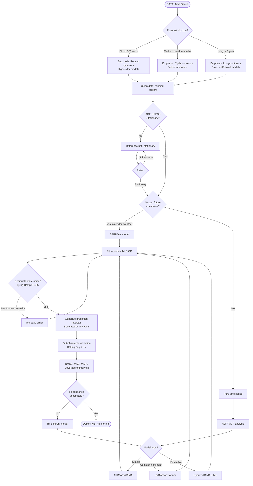
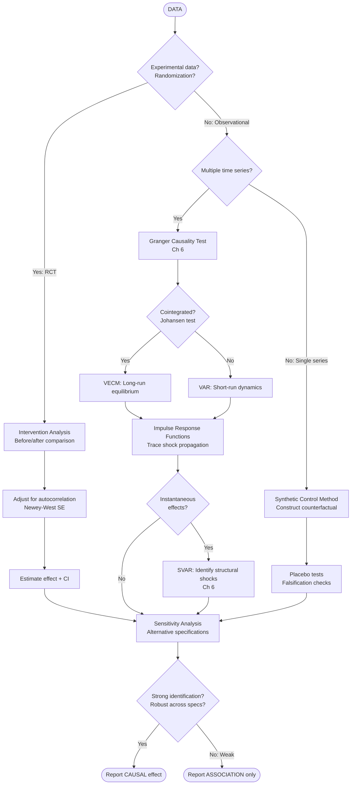
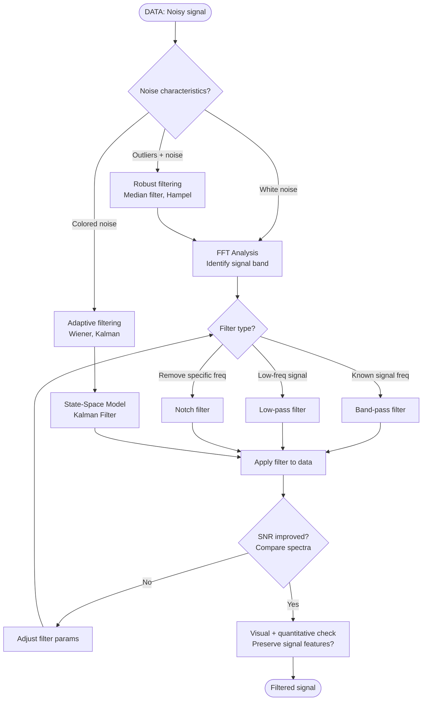
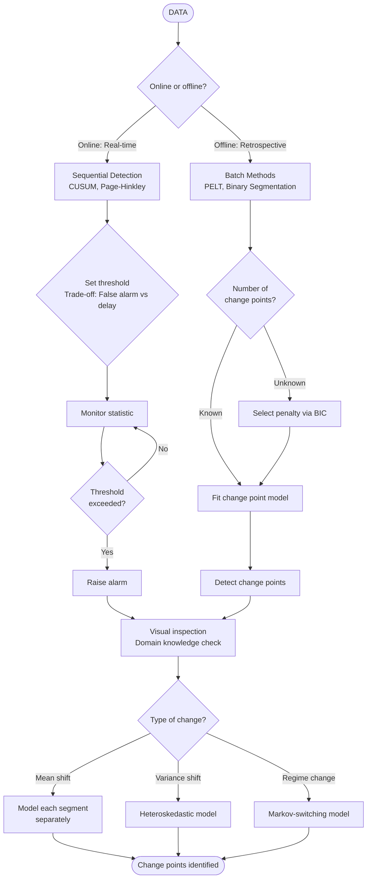
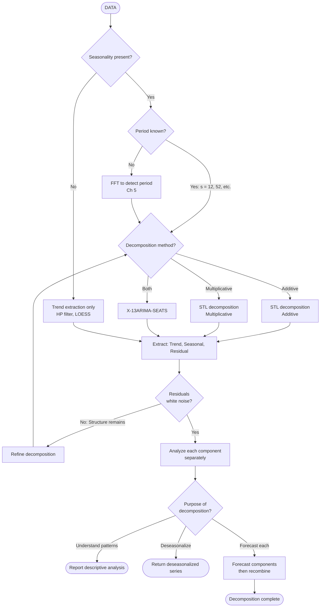
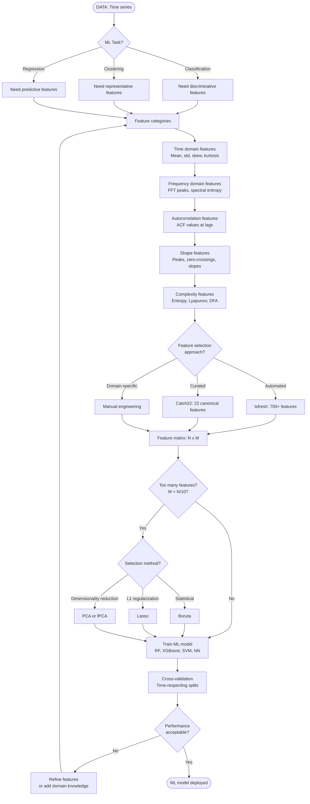

# Purpose-Based Workflow

This flowchart helps you navigate time series analysis based on your **analytical purpose**. Different objectives require different emphasis in the methodology.

---

## Quick Navigation


---


## 1. Forecasting Workflow

**Goal**: Predict future values with quantified uncertainty

### Workflow Diagram



### Key Emphasis
- **Residual diagnostics**: Critical for valid prediction intervals
- **Out-of-sample testing**: In-sample fit is misleading
- **Interval coverage**: 95% CI should cover 95% of actuals
- **Parsimony**: Simpler models often forecast better

### Model Recommendations by Horizon
| Horizon | Recommended Approach |
|---------|---------------------|
| 1-7 steps | ARIMA, ETS, TBATS |
| 1-3 months | SARIMA, Prophet |
| 3-12 months | SARIMAX with exogenous |
| > 1 year | Structural models, causal |

---

## 2. Causal Analysis / Structural Inference

**Goal**: Determine if X causes Y, quantify effect size

### Workflow Diagram



### Critical Requirements
1. **Identification**: Exogeneity assumption must hold
2. **Stationarity**: Test cointegration for multivariate
3. **Robustness**: Results must hold across specifications
4. **Falsification**: Placebo tests, pre-trends parallel

### Common Pitfalls
- **Granger ≠ causation**: Prediction doesn't imply causation
- **Omitted variables**: Confounders bias estimates
- **Spurious regression**: Non-stationary series can show false correlations

---

## 3. Signal Extraction / Denoising

**Goal**: Separate true signal from noise

### Workflow Diagram



### Filter Selection Guide
| Noise Type | Recommended Method |
|------------|-------------------|
| White noise, known signal freq | Butterworth band-pass |
| Unknown signal freq | Wiener filter |
| Non-stationary noise | Kalman filter |
| Outliers + noise | Median → Band-pass |
| 1/f noise | Wavelet denoising |

---

## 4. Change-Point Detection

**Goal**: Identify times when statistical properties change

### Workflow Diagram



### Method Selection
| Context | Method |
|---------|--------|
| Online detection | CUSUM, EWMA charts |
| Offline, single change | CUSUM on full data |
| Offline, multiple changes | PELT, Binary Segmentation |
| Multivariate | E-divisive, Bayesian |

---

## 5. Anomaly / Regime Detection

**Goal**: Identify unusual patterns or state switches

### Workflow Diagram

```mermaid
graph TD
    START([DATA]) --> ANOMALY_TYPE

    ANOMALY_TYPE{Type of anomaly?}
    ANOMALY_TYPE -->|Point: Single outlier| POINT_METHOD
    ANOMALY_TYPE -->|Contextual: Unusual in context| CONTEXTUAL_METHOD
    ANOMALY_TYPE -->|Collective: Unusual pattern| COLLECTIVE_METHOD

    POINT_METHOD[Statistical outlier detection<br/>Modified z-score]
    POINT_METHOD --> THRESHOLD_POINT

    THRESHOLD_POINT[Set threshold: |z| > 3 or 4]
    THRESHOLD_POINT --> DETECT_POINT

    DETECT_POINT[Flag outliers]
    DETECT_POINT --> VALIDATE_ANOM

    CONTEXTUAL_METHOD[Model normal behavior]
    CONTEXTUAL_METHOD --> FIT_MODEL_CONTEXT

    FIT_MODEL_CONTEXT{Model type?}
    FIT_MODEL_CONTEXT -->|Statistical| ARIMA_RESID[ARIMA residuals]
    FIT_MODEL_CONTEXT -->|ML| AUTOENCODER[LSTM Autoencoder]

    ARIMA_RESID --> RESID_THRESHOLD
    AUTOENCODER --> RESID_THRESHOLD

    RESID_THRESHOLD[Set threshold on reconstruction error]
    RESID_THRESHOLD --> DETECT_CONTEXT

    DETECT_CONTEXT[Flag deviations]
    DETECT_CONTEXT --> VALIDATE_ANOM

    COLLECTIVE_METHOD[Pattern-based detection<br/>Matrix Profile]
    COLLECTIVE_METHOD --> DISCORD

    DISCORD[Find discords<br/>Most unusual subsequences]
    DISCORD --> VALIDATE_ANOM

    VALIDATE_ANOM{Labeled data<br/>available?}
    VALIDATE_ANOM -->|Yes| SUPERVISED[Supervised learning<br/>Improve detection]
    VALIDATE_ANOM -->|No| UNSUPERVISED[Unsupervised<br/>Monitor false positives]

    SUPERVISED --> RETRAIN
    UNSUPERVISED --> RETRAIN

    RETRAIN[Periodic retraining<br/>Concept drift]
    RETRAIN --> DEPLOY_AD

    DEPLOY_AD([Anomaly detection deployed])
```

### Threshold Selection
Balance false positives vs false negatives based on cost:
- **High cost of missing anomaly** → Lower threshold (more sensitive)
- **High cost of false alarm** → Higher threshold (more specific)

---

## 6. Decomposition (Trend-Cycle-Seasonality)

**Goal**: Separate time series into interpretable components

### Workflow Diagram



### Method Selection
| Characteristic | Method |
|----------------|--------|
| Additive (constant seasonal amplitude) | STL additive |
| Multiplicative (seasonal amp ∝ level) | STL multiplicative or log + additive |
| Multiple seasonalities | TBATS, Prophet |
| Non-stationary trend | STL (robust) |
| Official statistics | X-13ARIMA-SEATS |

---

## 7. Feature Extraction for ML

**Goal**: Transform time series into feature vectors for classification/clustering

### Workflow Diagram



### Feature Libraries
- **tsfresh**: 700+ features, automated extraction
- **Catch22**: 22 canonical features, computationally efficient
- **tsfeatures** (R): Interpretable summary features

---

## 8. Spectral Analysis and System Identification

**Goal**: Characterize frequency content and identify system dynamics

### Workflow Diagram

```mermaid
graph TD
    START([DATA: Signal]) --> DETREND_FIRST

    DETREND_FIRST[Remove trend<br/>Trends obscure spectrum]
    DETREND_FIRST --> WINDOWING

    WINDOWING[Apply window function<br/>Hanning, Hamming]
    WINDOWING --> FFT_COMPUTE

    FFT_COMPUTE[Compute FFT + PSD]
    FFT_COMPUTE --> SPECTRUM_TYPE

    SPECTRUM_TYPE{Spectrum type?}
    SPECTRUM_TYPE -->|Single series| UNIVAR_SPEC
    SPECTRUM_TYPE -->|Two series| BIVAR_SPEC

    UNIVAR_SPEC[Power Spectral Density]
    UNIVAR_SPEC --> INTERPRET_PSD

    INTERPRET_PSD{Spectral shape?}
    INTERPRET_PSD -->|Flat| WHITE_NOISE_SPEC[White noise]
    INTERPRET_PSD -->|1/f decay| PINK_NOISE[Pink/red noise]
    INTERPRET_PSD -->|Peaks| PERIODIC[Periodic components]
    INTERPRET_PSD -->|Band-limited| RESONANCE[Resonance/filtering]

    WHITE_NOISE_SPEC --> REPORT_SPEC
    PINK_NOISE --> REPORT_SPEC
    PERIODIC --> PEAK_ANALYSIS
    RESONANCE --> REPORT_SPEC

    PEAK_ANALYSIS[Peak detection<br/>Fisher's g-test]
    PEAK_ANALYSIS --> SIGNIFICANT_PEAKS

    SIGNIFICANT_PEAKS{Peaks<br/>significant?}
    SIGNIFICANT_PEAKS -->|Yes| RECORD_FREQS[Record frequencies<br/>Convert to periods]
    SIGNIFICANT_PEAKS -->|No| REPORT_SPEC

    RECORD_FREQS --> HARMONIC[Add harmonic regressors<br/>to time-domain model]
    HARMONIC --> REPORT_SPEC

    BIVAR_SPEC[Cross-spectrum analysis]
    BIVAR_SPEC --> COHERENCE

    COHERENCE[Coherence function<br/>Frequency-domain correlation]
    COHERENCE --> PHASE

    PHASE[Phase spectrum<br/>Lead-lag relationships]
    PHASE --> GRANGER_FREQ[Frequency-domain<br/>Granger causality]

    GRANGER_FREQ --> SYSTEM_ID

    SYSTEM_ID{System identification<br/>needed?}
    SYSTEM_ID -->|Yes| TRANSFER_FUNC[Estimate transfer function<br/>H(f) = Y(f)/X(f)]
    SYSTEM_ID -->|No| REPORT_SPEC

    TRANSFER_FUNC --> POLES_ZEROS[Poles and zeros<br/>Stability analysis]
    POLES_ZEROS --> REPORT_SPEC

    REPORT_SPEC([Spectral analysis complete])
```

### Applications
- **Signal processing**: Filter design, noise characterization
- **Control systems**: Stability analysis, transfer functions
- **Economics**: Business cycle frequencies, co-movements
- **Geophysics**: Seismic analysis, tidal harmonics

---

## Summary: Purpose-Based Decision Matrix

| Purpose | Primary Domain | Key Test | Model Family |
|---------|---------------|----------|-------------|
| **Forecasting** | Time | Ljung-Box, AIC/BIC | ARIMA, SARIMA, ML |
| **Causal inference** | Time | Granger, Johansen | VAR, VECM, SVAR |
| **Signal extraction** | Frequency | SNR, spectral comparison | Filters, Kalman |
| **Change detection** | Time | CUSUM, BIC | PELT, CUSUM |
| **Anomaly detection** | Both | Threshold tuning | Residuals, autoencoders |
| **Decomposition** | Time | White noise test | STL, X-13 |
| **Feature extraction** | Both | CV accuracy | tsfresh, Catch22 |
| **Spectral analysis** | Frequency | Fisher's g-test | FFT, coherence |

---

**[Previous: General Flowchart →](01-general-flowchart.md)** | **[Next: Representation-Based Workflow →](03-representation-workflow.md)** | **[Contents](../README.md)**
