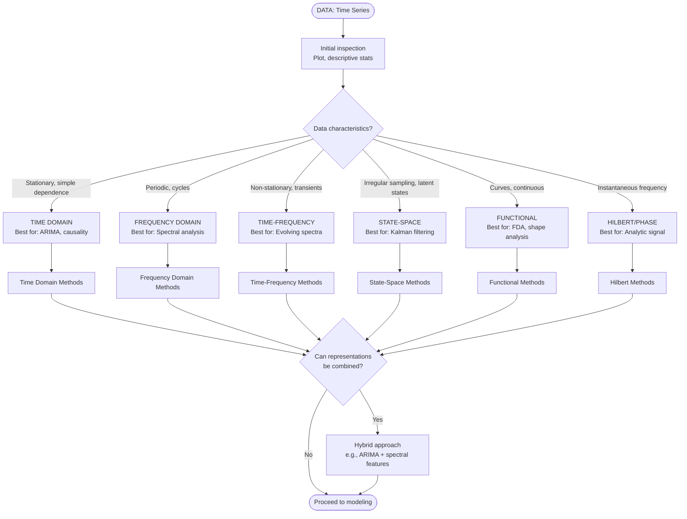
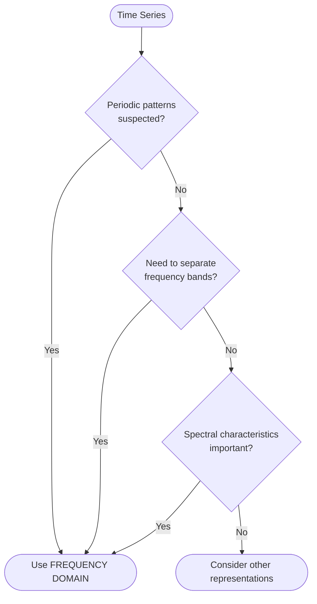
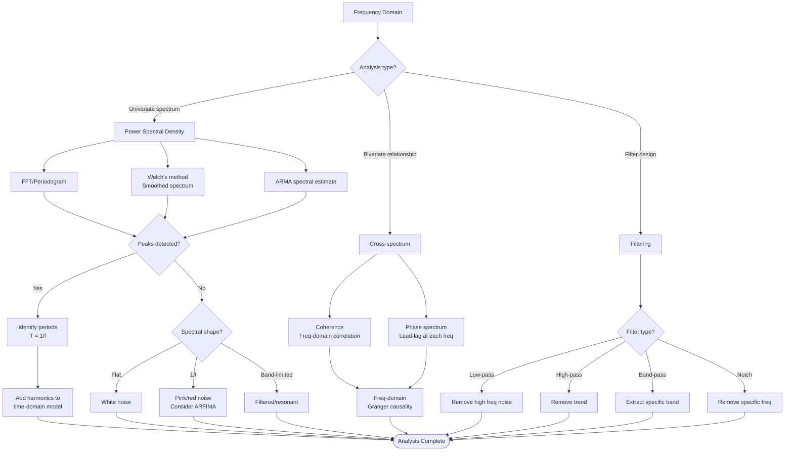
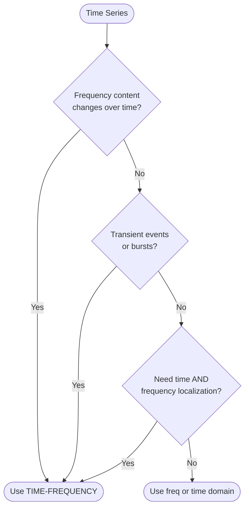
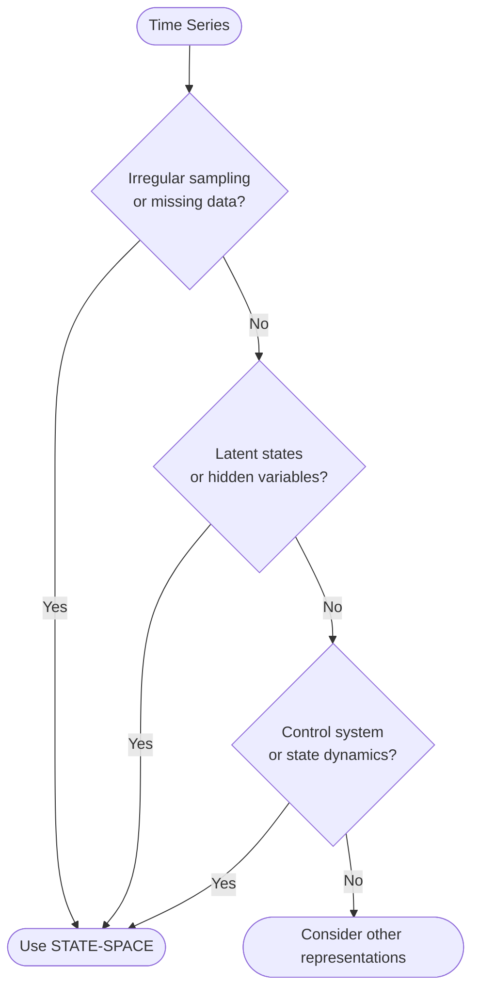
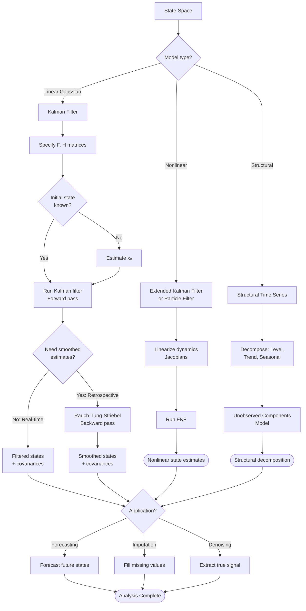
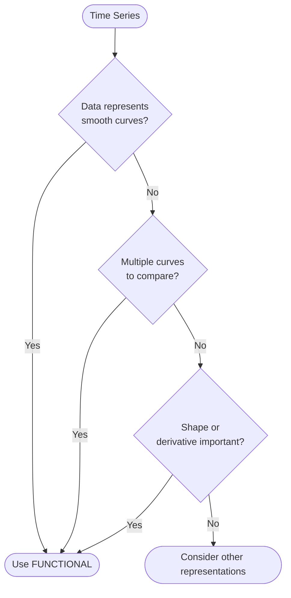
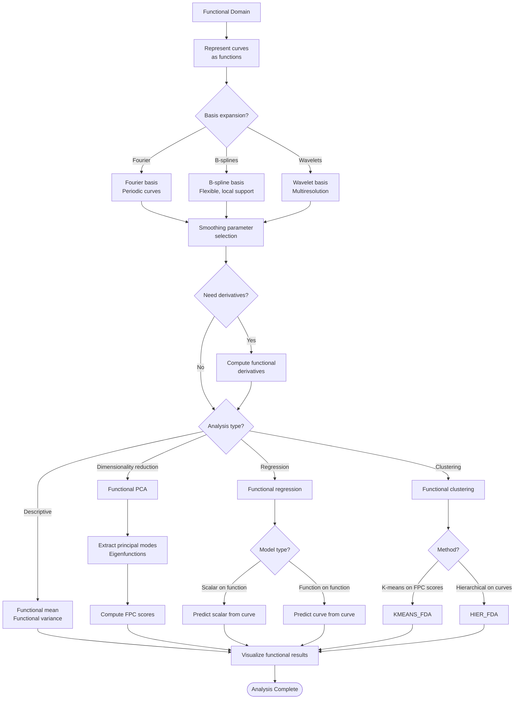
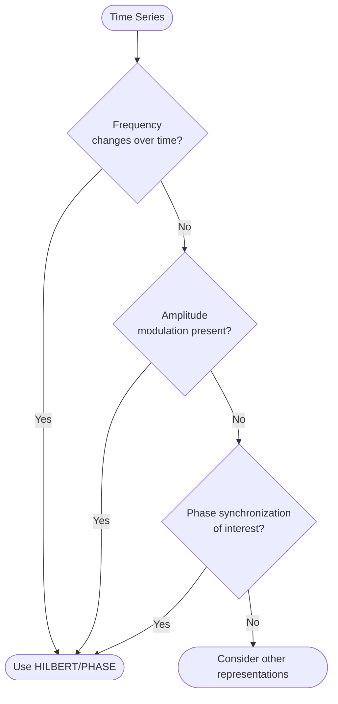

# Representation-Based Workflow

This flowchart guides you through choosing the optimal **mathematical representation** for your time series based on its characteristics and your analytical needs.

---

## Quick Representation Navigator

Different representations reveal different aspects of your data:

1. [Time Domain](#1-time-domain-representation)
2. [Frequency Domain](#2-frequency-domain-representation)
3. [Time-Frequency Domain](#3-time-frequency-domain-representation)
4. [State-Space Representation](#4-state-space-representation)
5. [Functional Domain](#5-functional-domain-representation)
6. [Hilbert/Phase Domain](#6-hilbertphase-domain-representation)

---

## Master Decision Flowchart



---

## 1. Time Domain Representation

**Best for**: Prediction, causal inference, sequential dependence

### When to Use

```mermaid
graph TD
    START([Time Series]) --> QUESTION1

    QUESTION1{Question involves<br/>"what happens next"?}
    QUESTION1 -->|Yes| TIME_GOOD
    QUESTION1 -->|No| QUESTION2

    QUESTION2{Causal relationships<br/>between variables?}
    QUESTION2 -->|Yes| TIME_GOOD
    QUESTION2 -->|No| QUESTION3

    QUESTION3{Sequential dependence<br/>structure important?}
    QUESTION3 -->|Yes| TIME_GOOD
    QUESTION3 -->|No| CONSIDER_OTHER

    TIME_GOOD([Use TIME DOMAIN])
    CONSIDER_OTHER([Consider other representations])
```

### Time Domain Methods

#### Univariate Models
```mermaid
graph LR
    START[Time Domain] --> UNI{Univariate?}
    UNI -->|Yes| ARIMA_FAM[ARIMA Family]

    ARIMA_FAM --> ARIMA[ARIMA(p,d,q)]
    ARIMA_FAM --> SARIMA[SARIMA(p,d,q)(P,D,Q)s]
    ARIMA_FAM --> ARIMAX[ARIMAX with exogenous]

    ARIMA_FAM --> ARCH_CHECK{Volatility<br/>clustering?}
    ARCH_CHECK -->|Yes| GARCH[GARCH family]
    ARCH_CHECK -->|No| DONE_UNI

    GARCH --> GARCH_MODELS[GARCH, EGARCH, GJR-GARCH]

    ARIMA --> DONE_UNI
    SARIMA --> DONE_UNI
    ARIMAX --> DONE_UNI
    GARCH_MODELS --> DONE_UNI

    DONE_UNI([Model Selected])
```

#### Multivariate Models
```mermaid
graph LR
    START[Time Domain] --> MULTI{Multivariate?}
    MULTI -->|Yes| COINTEGRATION{Cointegrated?<br/>Johansen test}

    COINTEGRATION -->|Yes| VECM[VECM<br/>Long-run equilibrium]
    COINTEGRATION -->|No| VAR[VAR(k)<br/>Short-run dynamics]

    VECM --> STRUCTURAL{Structural<br/>identification?}
    VAR --> STRUCTURAL

    STRUCTURAL -->|Yes| SVAR[SVAR<br/>Impulse responses]
    STRUCTURAL -->|No| DONE_MULTI

    SVAR --> DONE_MULTI
    DONE_MULTI([Model Selected])
```

### Advantages
✓ Intuitive interpretation (lags, differences)
✓ Well-developed theory (Box-Jenkins)
✓ Excellent for short-term forecasting
✓ Causal inference via Granger tests

### Limitations
✗ Misses hidden periodicities
✗ Assumes linear relationships
✗ Difficult with multiple seasonalities

### Diagnostic Workflow

```python
# 1. Stationarity
from statsmodels.tsa.stattools import adfuller, kpss
adf_result = adfuller(data)
kpss_result = kpss(data)

# 2. Autocorrelation
from statsmodels.graphics.tsaplots import plot_acf, plot_pacf
plot_acf(data)
plot_pacf(data)

# 3. Fit ARIMA
from statsmodels.tsa.arima.model import ARIMA
model = ARIMA(data, order=(p,d,q))
result = model.fit()

# 4. Residual diagnostics
from statsmodels.stats.diagnostic import acorr_ljungbox
lb_test = acorr_ljungbox(result.resid, lags=[10], return_df=True)
```

---

## 2. Frequency Domain Representation

**Best for**: Periodicity detection, cycle analysis, filtering

### When to Use



### Frequency Domain Methods



### Implementation

```python
# 1. Compute PSD
from scipy import signal
f, Pxx = signal.periodogram(data, fs=sampling_rate)

# Or Welch's method (smoothed)
f, Pxx = signal.welch(data, fs=sampling_rate)

# 2. Find peaks
from scipy.signal import find_peaks
peaks, properties = find_peaks(Pxx, height=threshold)
dominant_freqs = f[peaks]

# 3. Design filter
from scipy.signal import butter, filtfilt
b, a = butter(N=4, Wn=cutoff_freq, btype='low', fs=sampling_rate)
filtered = filtfilt(b, a, data)
```

### Advantages
✓ Reveals hidden periodicities
✓ Natural for signal processing
✓ Efficient filtering and denoising
✓ Quantifies energy distribution

### Limitations
✗ Assumes stationarity (constant frequencies)
✗ Time localization lost
✗ Less intuitive than time domain

---

## 3. Time-Frequency Domain Representation

**Best for**: Non-stationary signals, transient events, evolving spectra

### When to Use



### Time-Frequency Methods

```mermaid
graph TD
    START[Time-Frequency] --> METHOD_SELECT

    METHOD_SELECT{Resolution priority?}

    METHOD_SELECT -->|Fixed resolution| STFT[STFT<br/>Short-Time Fourier Transform]
    METHOD_SELECT -->|Adaptive resolution| WAVELET[Wavelet Transform]
    METHOD_SELECT -->|High resolution| REASSIGN[Reassignment methods]

    STFT --> WINDOW{Window size?}
    WINDOW -->|Short window| HIGH_TIME[High time resolution<br/>Low freq resolution]
    WINDOW -->|Long window| HIGH_FREQ[Low time resolution<br/>High freq resolution]

    HIGH_TIME --> SPECTROGRAM
    HIGH_FREQ --> SPECTROGRAM

    SPECTROGRAM[Compute Spectrogram<br/>|STFT(t,f)|²]
    SPECTROGRAM --> VISUALIZE

    WAVELET --> WAVELET_TYPE{Wavelet type?}
    WAVELET_TYPE -->|Continuous| CWT[CWT<br/>Morlet, Mexican hat]
    WAVELET_TYPE -->|Discrete| DWT[DWT<br/>Haar, Daubechies]

    CWT --> SCALOGRAM[Scalogram<br/>Time-scale representation]
    DWT --> MULTIRESOLUTION[Multiresolution analysis<br/>Decompose by scale]

    SCALOGRAM --> VISUALIZE
    MULTIRESOLUTION --> DENOISE[Wavelet denoising<br/>Threshold coefficients]

    REASSIGN --> SYNCHROSQUEEZING[Synchrosqueezing<br/>Sharper TF representation]

    SYNCHROSQUEEZING --> VISUALIZE
    DENOISE --> DONE_TF

    VISUALIZE[Visualize TF plane]
    VISUALIZE --> FEATURES

    FEATURES{Extract features?}
    FEATURES -->|Yes| TF_FEATURES[Extract TF features<br/>for ML]
    FEATURES -->|No| DONE_TF

    TF_FEATURES --> DONE_TF

    DONE_TF([Analysis Complete])
```

### Implementation

```python
# 1. STFT / Spectrogram
from scipy import signal
f, t, Sxx = signal.spectrogram(data, fs=sampling_rate)
plt.pcolormesh(t, f, 10 * np.log10(Sxx))

# 2. Continuous Wavelet Transform
import pywt
scales = np.arange(1, 128)
coefficients, frequencies = pywt.cwt(data, scales, 'morl')

# 3. Wavelet denoising
coeffs = pywt.wavedec(data, 'db4', level=5)
threshold = np.std(coeffs[-1]) * np.sqrt(2 * np.log(len(data)))
coeffs_thresh = [pywt.threshold(c, threshold, mode='soft') for c in coeffs]
denoised = pywt.waverec(coeffs_thresh, 'db4')
```

### Applications
- **Finance**: Detect regime changes, volatility bursts
- **Audio**: Speech recognition, music analysis
- **Geophysics**: Seismic event detection
- **Biomedical**: EEG/ECG analysis, epileptic seizure detection

### Advantages
✓ Handles non-stationary signals
✓ Localizes transients in time
✓ Adaptive resolution (wavelets)
✓ Powerful for feature extraction

### Limitations
✗ Heisenberg uncertainty (time-freq trade-off)
✗ Computationally intensive
✗ Interpretation can be complex

---

## 4. State-Space Representation

**Best for**: Irregular sampling, missing data, latent states, control systems

### When to Use



### State-Space Framework

**General form**:
- **State equation**: $x_{t+1} = F_t x_t + B_t u_t + w_t$ (process)
- **Observation equation**: $y_t = H_t x_t + v_t$ (measurement)

Where:
- $x_t$: Latent state vector
- $y_t$: Observed data
- $w_t, v_t$: Process and measurement noise



### Implementation

```python
# 1. Kalman Filter (statsmodels)
from statsmodels.tsa.statespace.sarimax import SARIMAX

# ARIMA as state-space
model = SARIMAX(data, order=(1,1,1))
result = model.fit()
filtered_state = result.filtered_state

# 2. Structural Time Series
from statsmodels.tsa.statespace.structural import UnobservedComponents

model = UnobservedComponents(data, level='local linear trend',
                              seasonal=12)
result = model.fit()

# 3. Custom Kalman Filter (pykalman)
from pykalman import KalmanFilter

kf = KalmanFilter(transition_matrices=F,
                  observation_matrices=H,
                  initial_state_mean=x0,
                  initial_state_covariance=P0)

state_means, state_covariances = kf.filter(data)
smoothed_state_means, smoothed_state_covariances = kf.smooth(data)
```

### Advantages
✓ Handles irregular sampling naturally
✓ Optimal for missing data imputation
✓ Probabilistic (provides uncertainties)
✓ Flexible framework (encompasses ARIMA, structural models)

### Limitations
✗ Requires model specification
✗ Assumes Gaussian noise (for Kalman)
✗ Computational cost for high-dimensional states

---

## 5. Functional Domain Representation

**Best for**: Curves, smooth trajectories, shape analysis

### When to Use



### Functional Data Analysis Methods



### Implementation

```python
# 1. Represent as functional data (scikit-fda)
from skfda.representation.grid import FDataGrid

# Create functional data object
fd = FDataGrid(data_matrix, grid_points)

# 2. Smoothing
from skfda.preprocessing.smoothing import BSplineSmoothing
smoother = BSplineSmoothing()
fd_smooth = smoother.fit_transform(fd)

# 3. Functional PCA
from skfda.preprocessing.dim_reduction import FPCA
fpca = FPCA(n_components=3)
fpca.fit(fd_smooth)
scores = fpca.transform(fd_smooth)

# 4. Functional regression
from skfda.ml.regression import LinearRegression
model = LinearRegression()
model.fit(X_fd, y)
```

### Applications
- **Growth curves**: Child development, plant growth
- **Temperature curves**: Daily/seasonal temperature profiles
- **Biological rhythms**: Circadian patterns
- **Economics**: Yield curves, term structures

### Advantages
✓ Natural for smooth curves
✓ Derivative information available
✓ Dimension reduction via FPCA
✓ Interpretable functional parameters

### Limitations
✗ Requires smooth data
✗ Less common, fewer tools
✗ Basis choice affects results

---

## 6. Hilbert/Phase Domain Representation

**Best for**: Instantaneous frequency, phase relationships, amplitude modulation

### When to Use



### Hilbert Transform Methods

```mermaid
graph TD
    START[Hilbert/Phase Domain] --> ANALYTIC

    ANALYTIC[Compute analytic signal<br/>z(t) = x(t) + i·H[x](t)]
    ANALYTIC --> DECOMPOSE

    DECOMPOSE[Decompose into:<br/>Amplitude A(t), Phase φ(t)]
    DECOMPOSE --> INST_FREQ

    INST_FREQ[Instantaneous frequency<br/>f(t) = dφ/dt / (2π)]
    INST_FREQ --> ANALYSIS_TYPE

    ANALYSIS_TYPE{Analysis type?}

    ANALYSIS_TYPE -->|Single signal| UNIVAR_HILB
    ANALYSIS_TYPE -->|Two signals| BIVAR_HILB
    ANALYSIS_TYPE -->|Multiple modes| EMD

    UNIVAR_HILB[Analyze A(t) and f(t)]
    UNIVAR_HILB --> APPLICATIONS_HILB

    BIVAR_HILB[Phase synchronization]
    BIVAR_HILB --> PHASE_DIFF[Phase difference<br/>Δφ(t) = φ₁(t) - φ₂(t)]
    PHASE_DIFF --> PLV[Phase Locking Value<br/>|⟨e^(iΔφ)⟩|]
    PLV --> APPLICATIONS_HILB

    EMD[Empirical Mode Decomposition]
    EMD --> IMFS[Extract IMFs<br/>Intrinsic Mode Functions]
    IMFS --> HILBERT_HUANG[Hilbert-Huang Transform<br/>Time-frequency of each IMF]
    HILBERT_HUANG --> APPLICATIONS_HILB

    APPLICATIONS_HILB{Application?}
    APPLICATIONS_HILB -->|Biomedical| BRAIN_COUPLING[Brain region coupling<br/>EEG/MEG analysis]
    APPLICATIONS_HILB -->|Climate| ENSO_ANALYSIS[ENSO phase tracking]
    APPLICATIONS_HILB -->|Engineering| VIBRATION[Vibration analysis<br/>Machine health]

    BRAIN_COUPLING --> DONE_HILB
    ENSO_ANALYSIS --> DONE_HILB
    VIBRATION --> DONE_HILB

    DONE_HILB([Analysis Complete])
```

### Implementation

```python
# 1. Hilbert Transform
from scipy.signal import hilbert

analytic_signal = hilbert(data)
amplitude = np.abs(analytic_signal)
phase = np.angle(analytic_signal)
instantaneous_freq = np.diff(np.unwrap(phase)) / (2 * np.pi * dt)

# 2. Phase Locking Value
def compute_plv(phase1, phase2):
    phase_diff = phase1 - phase2
    plv = np.abs(np.mean(np.exp(1j * phase_diff)))
    return plv

# 3. Empirical Mode Decomposition (PyEMD)
from PyEMD import EMD

emd = EMD()
IMFs = emd.emd(data)

# Hilbert spectrum
for imf in IMFs:
    analytic = hilbert(imf)
    inst_freq = np.diff(np.unwrap(np.angle(analytic))) / (2*np.pi*dt)
    inst_amp = np.abs(analytic)
```

### Applications
- **Neuroscience**: Brain oscillations, neural synchrony
- **Cardiology**: Heart rate variability, QRS detection
- **Climate science**: ENSO phase transitions
- **Mechanical systems**: Bearing fault detection

### Advantages
✓ Reveals instantaneous frequency
✓ Detects amplitude/phase modulation
✓ Phase synchronization between signals
✓ No need for stationarity assumption

### Limitations
✗ Requires narrow-band signals
✗ Edge effects
✗ Sensitive to noise

---

## Integration: Combining Representations

Many real-world problems benefit from **hybrid approaches**:

### Example 1: ARIMA + Spectral Features
```python
# 1. Fit ARIMA in time domain
from statsmodels.tsa.arima.model import ARIMA
arima = ARIMA(data, order=(2,1,2)).fit()
residuals = arima.resid

# 2. Check residuals in frequency domain
f, Pxx = signal.periodogram(residuals)
# If spectrum shows peaks → add harmonic regressors
```

### Example 2: Wavelet Denoising + State-Space
```python
# 1. Denoise with wavelets
denoised = wavelet_denoise(data)

# 2. Model with Kalman filter
kf = KalmanFilter(...)
states = kf.filter(denoised)
```

### Example 3: Functional + ML
```python
# 1. Represent as functional data
fd = FDataGrid(curves)

# 2. Extract FPCA scores
scores = fpca.transform(fd)

# 3. Use scores for classification
from sklearn.ensemble import RandomForestClassifier
clf = RandomForestClassifier()
clf.fit(scores, labels)
```

---

## Summary: Representation Selection Matrix

| Characteristic | Best Representation | Why? |
|----------------|-------------------|------|
| Stationary, AR/MA structure | **Time Domain** | Direct modeling of lags |
| Multiple periodicities | **Frequency Domain** | Spectral peaks reveal cycles |
| Frequency changes over time | **Time-Frequency** | STFT/wavelets track evolution |
| Irregular sampling | **State-Space** | Kalman filter handles gaps |
| Smooth curves | **Functional** | Derivative information, FPCA |
| Instantaneous frequency | **Hilbert** | Phase and amplitude envelope |
| Multivariate causality | **Time Domain** (VAR) | Granger causality tests |
| Signal denoising | **Frequency** or **Wavelet** | Filter in appropriate domain |
| Regime changes | **Time-Frequency** or **HMM** | Capture transitions |
| Control systems | **State-Space** | Optimal filtering and control |

---

**[Previous: Purpose-Based Workflow →](02-purpose-workflow.md)** | **[Back to General Flowchart →](01-general-flowchart.md)** | **[Contents](../README.md)**
