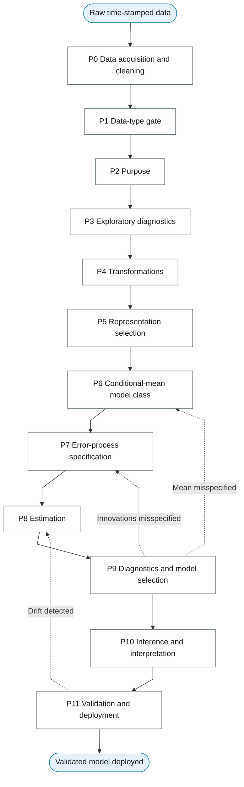

# General Flowchart

The general flowchart is the spine of this book. The master diagram below shows the twelve phases of the workflow; each phase box opens the chapter that holds that phase's sub-diagram, and every leaf node in a sub-diagram opens the section that teaches it.

## Master diagram

## How to read the diagrams

Shapes follow the decision-flowchart notation in the design system: stadiums start and end a chart, diamonds ask a question, rectangles are steps or outcomes, dashed subroutine boxes point to another chapter, and dotted edges are feedback or optional flow. Every rectangle is a section of this book; click it.
