# P0: Data acquisition and cleaning

**Question this phase answers:** Is the series fit to analyse?

Sampling rate and resolution; timestamp alignment, time zones, daylight-saving transitions, duplicate stamps; missing-value imputation; the time-series outlier taxonomy (additive, innovation, level shift, temporary change); robust filtering; unit and metadata consistency; cumulative-to-flow conversion; anti-aliasing when downsampling; calendar effects; temporal disaggregation; data revisions and vintages.

## Sub-diagram

```mermaid
%%{init: {"flowchart": {"curve": "linear"}}}%%
graph TD
    P0_IN(["Raw time-stamped data"]) --> P0_INSPECT_SAMPLING["Inspect sampling rate and resolution"]
    P0_INSPECT_SAMPLING --> P0_REGULAR{"Regular sampling?"}
    P0_REGULAR -->|"No"| P0_ALIGN_TIMESTAMPS["Align timestamps<br/>time zones, daylight-saving transitions"]
    P0_REGULAR -->|"Yes"| P0_DEDUPLICATE
    P0_ALIGN_TIMESTAMPS --> P0_DEDUPLICATE["Remove duplicate and out-of-order stamps"]
    P0_DEDUPLICATE --> P0_RESAMPLE["Resample and anti-alias"]
    P0_RESAMPLE --> P0_HAS_MISSING{"Missing values?"}
    P0_HAS_MISSING -->|"Short gaps"| P0_MISSING_IMPUTE["Impute missing values<br/>interpolation, Kalman smoother, multiple imputation"]
    P0_HAS_MISSING -->|"Long gaps"| P0_MISSING_SEGMENT["Segment around long gaps"]
    P0_HAS_MISSING -->|"None"| P0_HAS_OUTLIERS
    P0_MISSING_IMPUTE & P0_MISSING_SEGMENT --> P0_HAS_OUTLIERS{"Outliers?"}
    P0_HAS_OUTLIERS -->|"Yes"| P0_OUTLIER_TAXONOMY["Classify outliers<br/>additive, innovation, level shift, temporary change"]
    P0_HAS_OUTLIERS -->|"No"| P0_UNITS_METADATA
    P0_OUTLIER_TAXONOMY --> P0_ROBUST_FILTER["Robust filtering<br/>median and Hampel filters"]
    P0_ROBUST_FILTER --> P0_UNITS_METADATA["Check units and metadata"]
    P0_UNITS_METADATA --> P0_CUMULATIVE{"Cumulative measure?"}
    P0_CUMULATIVE -->|"Yes"| P0_CUMULATIVE_TO_FLOW["Convert cumulative series to flows"]
    P0_CUMULATIVE -->|"No"| P0_CALENDAR_EFFECTS
    P0_CUMULATIVE_TO_FLOW --> P0_CALENDAR_EFFECTS["Mark calendar effects<br/>trading days, holidays, leap years"]
    P0_CALENDAR_EFFECTS --> P0_FREQUENCY{"Frequency conversion?"}
    P0_FREQUENCY -->|"Yes"| P0_DISAGGREGATION["Temporal disaggregation and benchmarking<br/>Chow-Lin, Denton"]
    P0_FREQUENCY -->|"No"| P0_VINTAGES
    P0_DISAGGREGATION --> P0_VINTAGES["Track revisions and real-time vintages"]
    P0_VINTAGES --> P1[["P1: Data-type gate"]]
    class P0_IN terminator
    class P0_REGULAR,P0_HAS_MISSING,P0_HAS_OUTLIERS,P0_CUMULATIVE,P0_FREQUENCY decision
    class P0_INSPECT_SAMPLING,P0_ALIGN_TIMESTAMPS,P0_DEDUPLICATE,P0_RESAMPLE,P0_MISSING_IMPUTE,P0_MISSING_SEGMENT,P0_OUTLIER_TAXONOMY,P0_ROBUST_FILTER,P0_UNITS_METADATA,P0_CUMULATIVE_TO_FLOW,P0_CALENDAR_EFFECTS,P0_DISAGGREGATION,P0_VINTAGES process
    class P1 ref
    classDef terminator fill:#E6F2F7,stroke:#007BA7,color:#1A1A1A;
    classDef process fill:#FFFFFF,stroke:#5A6B73,color:#1A1A1A;
    classDef decision fill:#EFE7F0,stroke:#9B7FA7,color:#1A1A1A;
    classDef data fill:#FFF4E0,stroke:#C9A55E,color:#1A1A1A;
    classDef good fill:#DCEFD8,stroke:#4A7A3F,color:#1A1A1A;
    classDef escalate fill:#FFE9C2,stroke:#C9A55E,color:#1A1A1A;
    classDef problem fill:#F2D9DE,stroke:#800020,color:#1A1A1A;
    classDef ref fill:#F7F7F7,stroke:#5A6B73,color:#1A1A1A,stroke-dasharray:4 3;
```

## Phase guide

!!! note "Section pending"
    To-do item created from the flowchart inventory (node `P0`). Write this section following the content rules in `.claude/rules/writing.md`.

## Inspect sampling rate and resolution

!!! note "Section pending"
    To-do item created from the flowchart inventory (node `P0_INSPECT_SAMPLING`). Write this section following the content rules in `.claude/rules/writing.md`.

## Align timestamps

!!! note "Section pending"
    To-do item created from the flowchart inventory (node `P0_ALIGN_TIMESTAMPS`). Write this section following the content rules in `.claude/rules/writing.md`.

## Remove duplicate and out-of-order stamps

!!! note "Section pending"
    To-do item created from the flowchart inventory (node `P0_DEDUPLICATE`). Write this section following the content rules in `.claude/rules/writing.md`.

## Resample and anti-alias

!!! note "Section pending"
    To-do item created from the flowchart inventory (node `P0_RESAMPLE`). Write this section following the content rules in `.claude/rules/writing.md`.

## Impute missing values

!!! note "Section pending"
    To-do item created from the flowchart inventory (node `P0_MISSING_IMPUTE`). Write this section following the content rules in `.claude/rules/writing.md`.

## Segment around long gaps

!!! note "Section pending"
    To-do item created from the flowchart inventory (node `P0_MISSING_SEGMENT`). Write this section following the content rules in `.claude/rules/writing.md`.

## Classify outliers

!!! note "Section pending"
    To-do item created from the flowchart inventory (node `P0_OUTLIER_TAXONOMY`). Write this section following the content rules in `.claude/rules/writing.md`.

## Robust filtering

!!! note "Section pending"
    To-do item created from the flowchart inventory (node `P0_ROBUST_FILTER`). Write this section following the content rules in `.claude/rules/writing.md`.

## Check units and metadata

!!! note "Section pending"
    To-do item created from the flowchart inventory (node `P0_UNITS_METADATA`). Write this section following the content rules in `.claude/rules/writing.md`.

## Convert cumulative series to flows

!!! note "Section pending"
    To-do item created from the flowchart inventory (node `P0_CUMULATIVE_TO_FLOW`). Write this section following the content rules in `.claude/rules/writing.md`.

## Mark calendar effects

!!! note "Section pending"
    To-do item created from the flowchart inventory (node `P0_CALENDAR_EFFECTS`). Write this section following the content rules in `.claude/rules/writing.md`.

## Temporal disaggregation and benchmarking

!!! note "Section pending"
    To-do item created from the flowchart inventory (node `P0_DISAGGREGATION`). Write this section following the content rules in `.claude/rules/writing.md`.

## Track revisions and real-time vintages

!!! note "Section pending"
    To-do item created from the flowchart inventory (node `P0_VINTAGES`). Write this section following the content rules in `.claude/rules/writing.md`.
