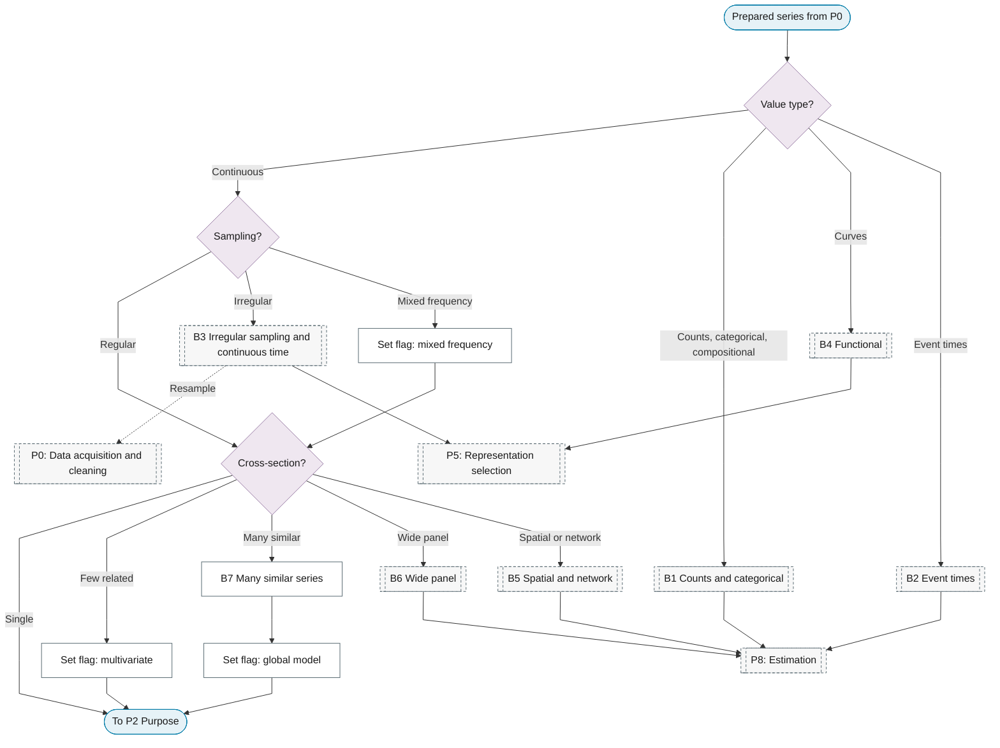

# P1: Data-type gate

**Question this phase answers:** What kind of object is this?

Three routing questions (value type, sampling, cross-sectional structure) send the series down the standard path or into one of seven branches, and set flags that later phases read.

## Sub-diagram

## Routing variables

| Variable | Values | Effect |
|---|---|---|
| Value type | continuous / counts / categorical or ordinal / compositional / curves / event times | Continuous stays on the spine; counts, categorical and compositional enter B1; curves enter B4; event times enter B2 |
| Sampling | regular / irregular / mixed frequency | Irregular enters B3; mixed frequency sets a flag read by P6 and P10 |
| Cross-sectional structure | single / few related / many similar / wide panel / spatial or network | Few related sets the multivariate flag; many similar enters B7; wide panel enters B6; spatial enters B5 |

## Branches

| Branch | Chapter | Rejoins |
|---|---|---|
| B1 Counts and categorical | [Count and Categorical](../reference/16-count-categorical/index.md) | P8 |
| B2 Event times | [Point Processes](../reference/17-point-processes/index.md) | P8 |
| B3 Irregular sampling and continuous time | [Continuous-Time Models](../reference/15-continuous-time/index.md) | P5 or P8; may resample back to P0 |
| B4 Functional | [Functional and High-Frequency](../reference/14-functional-high-frequency/index.md) | P5 |
| B5 Spatial and network | [Spatio-Temporal Models](../reference/20-spatio-temporal/index.md) | P8 |
| B6 Wide panel | [Panel Time Series](../reference/32-panel-time-series/index.md) | P8, P10 |
| B7 Many similar series | this page | Stays on the spine with the global flag set |

## B7 Many similar series

!!! note "Section pending"
    To-do item created from the flowchart inventory (node `B7`). Write this section following the content rules in `.claude/rules/writing.md`.
