# Purpose 1: Forecasting

**Goal:** Predict future values with quantified uncertainty.

## Sub-chart

```mermaid
%%{init: {"flowchart": {"curve": "linear"}}}%%
graph TD
    P2_FC_IN(["Forecasting question"]) --> P2_FC_HORIZON_Q{"Horizon?"}
    P2_FC_HORIZON_Q -->|"Short or medium"| P2_FC_MANY
    P2_FC_HORIZON_Q -->|"Long"| P2_FC_LONG_FLAG["Set flag: multi-step horizon"]
    P2_FC_LONG_FLAG --> P2_FC_MANY{"Global or hierarchy flag?"}
    P2_FC_MANY -->|"Yes"| B7[["B7 Many similar series"]]
    P2_FC_MANY -->|"No"| P2_FC_EXOG
    B7 --> P2_FC_EXOG{"Future covariates known?"}
    P2_FC_EXOG -->|"Yes"| P6_ARIMAX[["ARIMAX and SARIMAX"]]
    P2_FC_EXOG -->|"No"| P3[["P3: Exploratory diagnostics"]]
    P6_ARIMAX --> P3
    P3 --> P4[["P4: Transformations"]]
    P4 --> P6_ARIMA_SARIMA[["ARIMA and SARIMA"]]
    P4 --> P6_ETS[["Exponential smoothing and ETS"]]
    P4 --> P6_GLOBAL_MODELS[["Global models across many series"]]
    P6_ARIMA_SARIMA & P6_ETS & P6_GLOBAL_MODELS --> P7[["P7: Error-process specification"]]
    P7 --> P8[["P8: Estimation"]]
    P8 --> P9_FORECAST_COMPARISON[["Forecast comparison tests"]]
    P9_FORECAST_COMPARISON --> P2_FC_BASELINES["Naive and seasonal-naive baselines"]
    P2_FC_BASELINES --> P2_FC_DOMAIN{"Epidemic counts?"}
    P2_FC_DOMAIN -->|"Yes"| P2_FC_EPIDEMIC["Epidemic nowcasting<br/>reproduction-number estimation, SIR fitting"]
    P2_FC_DOMAIN -->|"No"| P10_POINT_FORECASTS
    P2_FC_EPIDEMIC --> P10_POINT_FORECASTS[["Point forecasts and horizons"]]
    P10_POINT_FORECASTS --> P10_INTERVALS[["Prediction intervals"]]
    P10_INTERVALS --> P2_FC_STEPS{"Multi-step flag?"}
    P2_FC_STEPS -->|"Yes"| P10_MULTISTEP[["Multi-step strategies"]]
    P2_FC_STEPS -->|"No"| P10_RECONCILIATION
    P10_MULTISTEP --> P10_RECONCILIATION[["Hierarchical and temporal reconciliation"]]
    P10_RECONCILIATION --> P10_COMBINATION[["Forecast combination and model averaging"]]
    P10_COMBINATION --> P11_ROLLING_ORIGIN[["Rolling-origin backtesting"]]
    P11_ROLLING_ORIGIN --> P11_POINT_METRICS[["Point-forecast metrics"]]
    P11_POINT_METRICS --> P11_PROBABILISTIC_METRICS[["Probabilistic metrics"]]
    P11_PROBABILISTIC_METRICS --> P2_FC_OUT(["Validated forecasts"])
    class P2_FC_IN,P2_FC_OUT terminator
    class P2_FC_HORIZON_Q,P2_FC_MANY,P2_FC_EXOG,P2_FC_DOMAIN,P2_FC_STEPS decision
    class P2_FC_LONG_FLAG,P2_FC_BASELINES,P2_FC_EPIDEMIC process
    class B7,P6_ARIMAX,P3,P4,P6_ARIMA_SARIMA,P6_ETS,P6_GLOBAL_MODELS,P7,P8,P9_FORECAST_COMPARISON,P10_POINT_FORECASTS,P10_INTERVALS,P10_MULTISTEP,P10_RECONCILIATION,P10_COMBINATION,P11_ROLLING_ORIGIN,P11_POINT_METRICS,P11_PROBABILISTIC_METRICS ref
    classDef terminator fill:#E6F2F7,stroke:#007BA7,color:#1A1A1A;
    classDef process fill:#FFFFFF,stroke:#5A6B73,color:#1A1A1A;
    classDef decision fill:#EFE7F0,stroke:#9B7FA7,color:#1A1A1A;
    classDef data fill:#FFF4E0,stroke:#C9A55E,color:#1A1A1A;
    classDef good fill:#DCEFD8,stroke:#4A7A3F,color:#1A1A1A;
    classDef escalate fill:#FFE9C2,stroke:#C9A55E,color:#1A1A1A;
    classDef problem fill:#F2D9DE,stroke:#800020,color:#1A1A1A;
    classDef ref fill:#F7F7F7,stroke:#5A6B73,color:#1A1A1A,stroke-dasharray:4 3;
```

## P10 inference for this purpose

Point and interval forecasts, multi-step strategies, combination, reconciliation.

## P11 metrics for this purpose

Rolling-origin cross-validation, RMSE / MAE / MASE, interval coverage, CRPS.
