# Purpose 2: Causal and structural inference

**Goal:** Determine whether and how one series drives another, and quantify the effect.

## Sub-chart

```mermaid
%%{init: {"flowchart": {"curve": "linear"}}}%%
graph TD
    P2_CA_IN(["Causal question"]) --> P2_CA_DESIGN{"Experimental data?"}
    P2_CA_DESIGN -->|"Randomised or natural experiment"| P2_CA_IDENTIFICATION["Identification strategy and exogeneity"]
    P2_CA_DESIGN -->|"Observational"| P2_CA_IDENTIFICATION
    P2_CA_IDENTIFICATION --> P2_CA_SYSTEM{"Several series?"}
    P2_CA_SYSTEM -->|"Yes"| P6_VAR[["VAR"]]
    P2_CA_SYSTEM -->|"Yes, cointegrated"| P6_VECM[["VECM"]]
    P2_CA_SYSTEM -->|"One series or an experiment"| P10_COUNTERFACTUALS[["Counterfactual designs"]]
    P6_VAR & P6_VECM --> P10_COINTEGRATION[["Cointegration inference"]]
    P10_COINTEGRATION --> P10_GRANGER[["Granger, Sims and Toda-Yamamoto causality"]]
    P10_GRANGER --> P10_NONLINEAR_CAUSALITY[["Nonlinear causal discovery"]]
    P10_NONLINEAR_CAUSALITY --> P10_SVAR_IDENTIFICATION[["SVAR identification"]]
    P10_SVAR_IDENTIFICATION --> P10_IRF_FEVD[["Impulse responses and variance decompositions"]]
    P10_IRF_FEVD --> P10_LOCAL_PROJECTIONS[["Local projections"]]
    P10_LOCAL_PROJECTIONS & P10_COUNTERFACTUALS --> P10_COEFFICIENT_TESTS[["Coefficient and restriction tests"]]
    P10_COEFFICIENT_TESTS --> P10_HAC[["HAC inference"]]
    P10_HAC --> P2_CA_PLACEBO["Placebo and falsification tests"]
    P2_CA_PLACEBO --> P2_CA_SENSITIVITY["Sensitivity analysis across specifications"]
    P2_CA_SENSITIVITY --> P2_CA_VERDICT{"Identification holds?"}
    P2_CA_VERDICT -->|"Yes"| P2_CA_OUT(["Report a causal effect"])
    P2_CA_VERDICT -->|"No"| P2_CA_ASSOC(["Report an association only"])
    class P2_CA_IN,P2_CA_OUT,P2_CA_ASSOC terminator
    class P2_CA_DESIGN,P2_CA_SYSTEM,P2_CA_VERDICT decision
    class P2_CA_IDENTIFICATION,P2_CA_PLACEBO,P2_CA_SENSITIVITY process
    class P6_VAR,P6_VECM,P10_COUNTERFACTUALS,P10_COINTEGRATION,P10_GRANGER,P10_NONLINEAR_CAUSALITY,P10_SVAR_IDENTIFICATION,P10_IRF_FEVD,P10_LOCAL_PROJECTIONS,P10_COEFFICIENT_TESTS,P10_HAC ref
    classDef terminator fill:#E6F2F7,stroke:#007BA7,color:#1A1A1A;
    classDef process fill:#FFFFFF,stroke:#5A6B73,color:#1A1A1A;
    classDef decision fill:#EFE7F0,stroke:#9B7FA7,color:#1A1A1A;
    classDef data fill:#FFF4E0,stroke:#C9A55E,color:#1A1A1A;
    classDef good fill:#DCEFD8,stroke:#4A7A3F,color:#1A1A1A;
    classDef escalate fill:#FFE9C2,stroke:#C9A55E,color:#1A1A1A;
    classDef problem fill:#F2D9DE,stroke:#800020,color:#1A1A1A;
    classDef ref fill:#F7F7F7,stroke:#5A6B73,color:#1A1A1A,stroke-dasharray:4 3;
```

## P10 inference for this purpose

Identification, impulse responses and variance decompositions, local projections, counterfactuals, placebo tests.

## P11 metrics for this purpose

Robustness across specifications, pre-trend checks.
