# Purpose 2: Causal and structural inference

**Goal:** Determine whether and how one series drives another, and quantify the effect.

## Sub-chart

```mermaid
%%{init: {"flowchart": {"curve": "linear"}}}%%
graph TD
    P2_CA_IN(["Causal question"]) --> P2_CA_DESIGN{"Experimental data?"}
    P2_CA_DESIGN -->|"Randomised or natural experiment"| P10_COUNTERFACTUALS[["Counterfactual designs"]]
    P2_CA_DESIGN -->|"Observational"| P2_CA_IDENTIFICATION["Identification strategy and exogeneity"]
    P2_CA_IDENTIFICATION --> P3[["P3: Exploratory diagnostics"]]
    P3 --> P4[["P4: Transformations"]]
    P4 --> P2_CA_SYSTEM{"Several series?"}
    P2_CA_SYSTEM -->|"Yes"| P3_COINTEGRATION_PRECHECK[["Cointegration pre-check"]]
    P2_CA_SYSTEM -->|"No"| P6_TRANSFER_FUNCTION[["Transfer-function and intervention models"]]
    P3_COINTEGRATION_PRECHECK --> P2_CA_COINT{"Cointegrated?"}
    P2_CA_COINT -->|"Yes"| P6_VECM[["VECM"]]
    P2_CA_COINT -->|"No"| P6_VAR[["VAR"]]
    P6_VECM & P6_VAR & P6_TRANSFER_FUNCTION --> P7[["P7: Error-process specification"]]
    P7 --> P8[["P8: Estimation"]]
    P8 --> P9[["P9: Diagnostics and model selection"]]
    P9 --> P2_CA_MULTI{"Multivariate flag?"}
    P2_CA_MULTI -->|"Yes"| P10_COINTEGRATION[["Cointegration inference"]]
    P2_CA_MULTI -->|"No"| P10_COUNTERFACTUALS
    P10_COINTEGRATION --> P10_GRANGER[["Granger, Sims and Toda-Yamamoto causality"]]
    P10_GRANGER --> P10_NONLINEAR_CAUSALITY[["Nonlinear causal discovery"]]
    P10_NONLINEAR_CAUSALITY --> P10_SVAR_IDENTIFICATION[["SVAR identification"]]
    P10_SVAR_IDENTIFICATION --> P10_IRF_FEVD[["Impulse responses and variance decompositions"]]
    P10_IRF_FEVD --> P10_LOCAL_PROJECTIONS[["Local projections"]]
    P10_LOCAL_PROJECTIONS & P10_COUNTERFACTUALS --> P10_COEFFICIENT_TESTS[["Coefficient and restriction tests"]]
    P10_COEFFICIENT_TESTS --> P10_HAC[["HAC inference"]]
    P10_HAC --> P2_CA_PLACEBO["Placebo and falsification tests"]
    P2_CA_PLACEBO --> P2_CA_SENSITIVITY["Sensitivity analysis across specifications"]
    P2_CA_SENSITIVITY --> P2_CA_VERDICT{"Identification holds?"}
    P2_CA_VERDICT -->|"Yes: report a causal effect"| P11[["P11: Validation and deployment"]]
    P2_CA_VERDICT -->|"No: report an association only"| P11
    class P2_CA_IN terminator
    class P2_CA_DESIGN,P2_CA_SYSTEM,P2_CA_COINT,P2_CA_MULTI,P2_CA_VERDICT decision
    class P2_CA_IDENTIFICATION,P2_CA_PLACEBO,P2_CA_SENSITIVITY process
    class P10_COUNTERFACTUALS,P3,P4,P3_COINTEGRATION_PRECHECK,P6_TRANSFER_FUNCTION,P6_VECM,P6_VAR,P7,P8,P9,P10_COINTEGRATION,P10_GRANGER,P10_NONLINEAR_CAUSALITY,P10_SVAR_IDENTIFICATION,P10_IRF_FEVD,P10_LOCAL_PROJECTIONS,P10_COEFFICIENT_TESTS,P10_HAC,P11 ref
    classDef terminator fill:#E6F2F7,stroke:#007BA7,color:#1A1A1A;
    classDef process fill:#FFFFFF,stroke:#5A6B73,color:#1A1A1A;
    classDef decision fill:#EFE7F0,stroke:#9B7FA7,color:#1A1A1A;
    classDef data fill:#FFF4E0,stroke:#C9A55E,color:#1A1A1A;
    classDef good fill:#DCEFD8,stroke:#4A7A3F,color:#1A1A1A;
    classDef escalate fill:#FFE9C2,stroke:#C9A55E,color:#1A1A1A;
    classDef problem fill:#F2D9DE,stroke:#800020,color:#1A1A1A;
    classDef ref fill:#F7F7F7,stroke:#5A6B73,color:#1A1A1A,stroke-dasharray:4 3;
```

## P10 inference for this purpose

[Counterfactual designs](../../reference/21-causal-inference/index.md#counterfactual-designs), [Cointegration inference](../../reference/28-nonstationarity-theory/index.md#cointegration-inference), [Granger, Sims and Toda-Yamamoto causality](../../reference/21-causal-inference/index.md#granger-sims-and-toda-yamamoto-causality), [Nonlinear causal discovery](../../reference/21-causal-inference/index.md#nonlinear-causal-discovery), [SVAR identification](../../reference/21-causal-inference/index.md#svar-identification), [Impulse responses and variance decompositions](../../reference/09-multivariate/index.md#impulse-responses-and-variance-decompositions), [Local projections](../../reference/21-causal-inference/index.md#local-projections), [Coefficient and restriction tests](../../reference/05-hypothesis-testing/index.md#coefficient-and-restriction-tests), [HAC inference](../../reference/27-regression-time-series/index.md#hac-inference).

## P11 metrics for this purpose

[Sensitivity analysis across specifications](../../reference/21-causal-inference/index.md#sensitivity-analysis-across-specifications).
