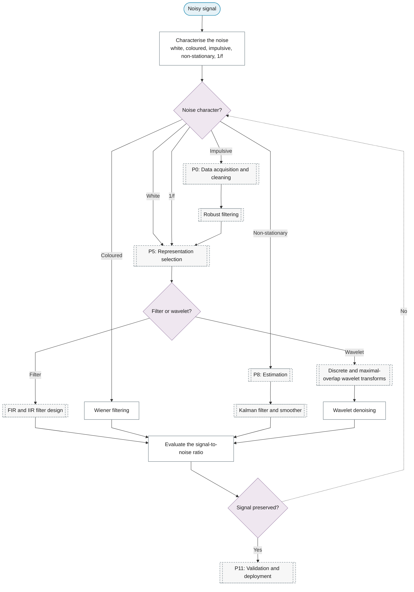

# Purpose 3: Signal extraction and denoising

**Goal:** Separate the signal of interest from noise.

## Sub-chart

## P10 inference for this purpose

[Evaluate the signal-to-noise ratio](../../reference/13-spectral-analysis/index.md#evaluate-the-signal-to-noise-ratio).

## P11 metrics for this purpose

[Evaluate the signal-to-noise ratio](../../reference/13-spectral-analysis/index.md#evaluate-the-signal-to-noise-ratio).
