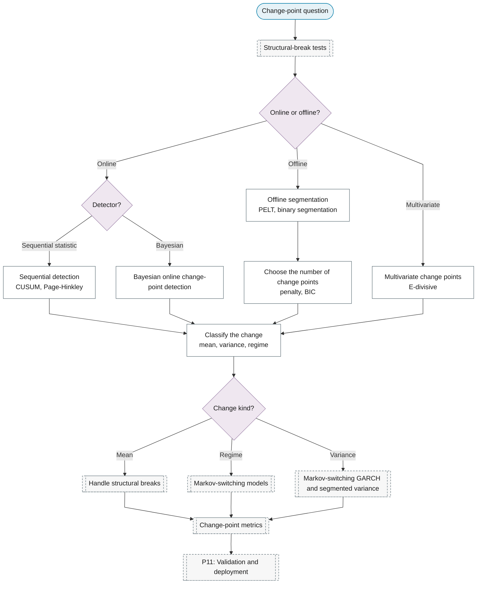

# Purpose 4: Change-point detection

**Goal:** Locate the times at which the statistical properties change.

## Sub-chart

## P10 inference for this purpose

[Classify the change](../../reference/30-structural-change/index.md#classify-the-change).

## P11 metrics for this purpose

[Change-point metrics](../../reference/19-classification-anomaly/index.md#change-point-metrics).
