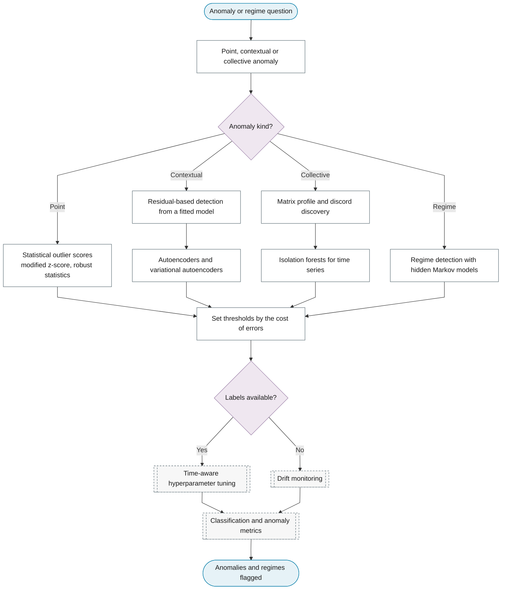

# Purpose 5: Anomaly and regime detection

**Goal:** Flag unusual observations or periods and identify state switches.

## Sub-chart

## P10 inference for this purpose

Thresholds and regime probabilities.

## P11 metrics for this purpose

Event-level precision and recall, NAB score.
