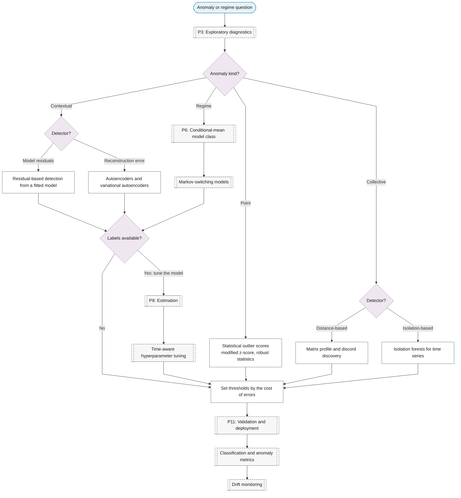

# Purpose 5: Anomaly and regime detection

**Goal:** Flag unusual observations or periods and identify state switches.

## Sub-chart

## P10 inference for this purpose

[Set thresholds by the cost of errors](../../reference/19-classification-anomaly/index.md#set-thresholds-by-the-cost-of-errors).

## P11 metrics for this purpose

[Classification and anomaly metrics](../../reference/19-classification-anomaly/index.md#classification-and-anomaly-metrics), [Drift monitoring](../../reference/23-online-adaptive/index.md#drift-monitoring).
