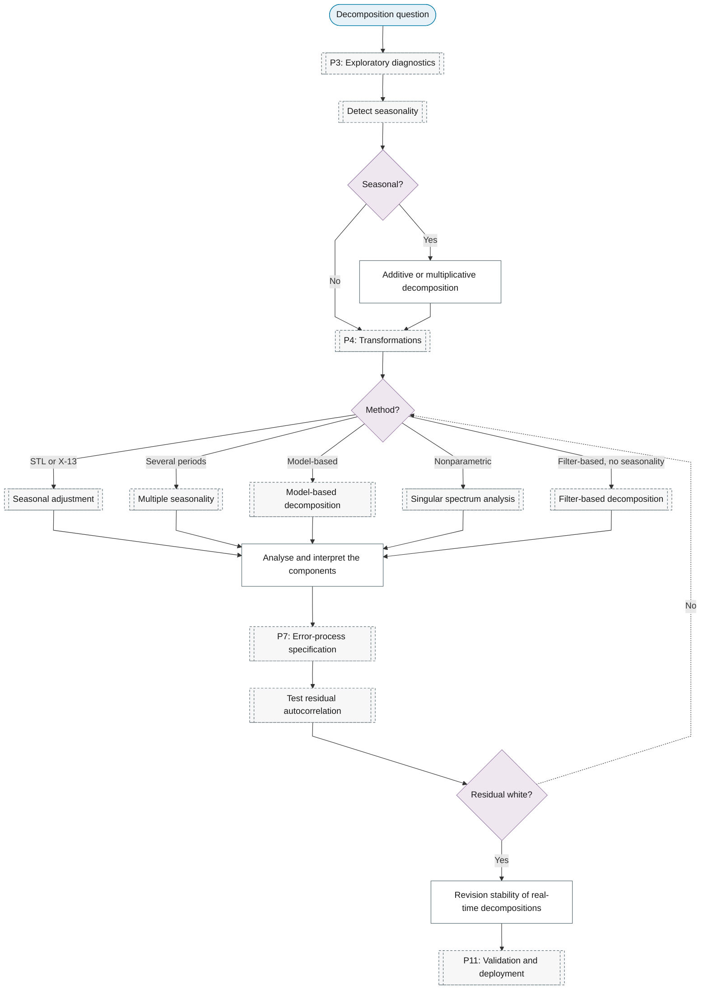

# Purpose 6: Decomposition

**Goal:** Split the series into interpretable components.

## Sub-chart

## P10 inference for this purpose

[Analyse and interpret the components](../../reference/03-classical/index.md#analyse-and-interpret-the-components).

## P11 metrics for this purpose

[Test residual autocorrelation](../p07-error-process.md#test-residual-autocorrelation).
