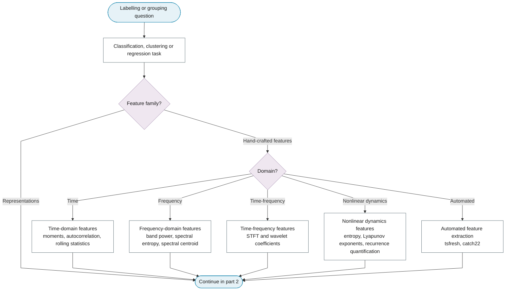
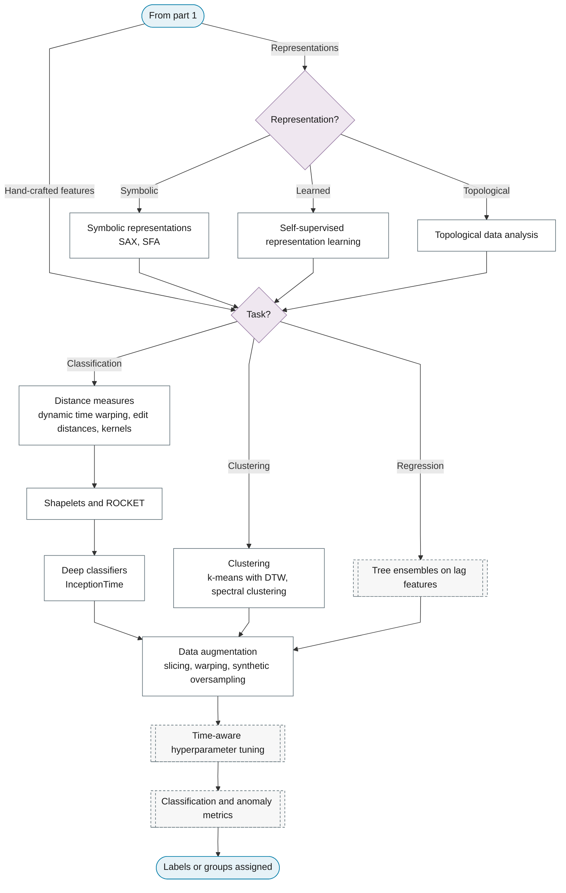

# Purpose 7: Feature extraction, classification and clustering

**Goal:** Turn series into feature vectors and learn labels or groups.

## Sub-chart

**Part 1: task and hand-crafted features.**

**Part 2: representations, learners and evaluation.**

## P10 inference for this purpose

Feature importance, prototypes.

## P11 metrics for this purpose

Downstream cross-validation, F1, silhouette.
