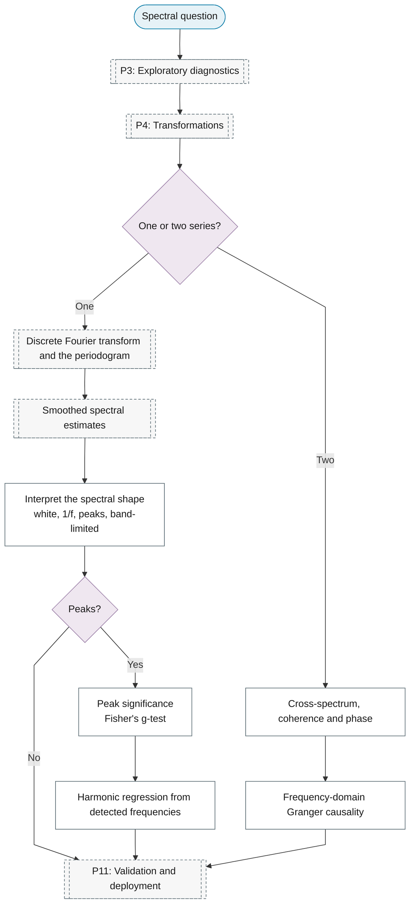

# Purpose 8: Spectral analysis

**Goal:** Describe the distribution of variance across frequencies.

## Sub-chart

## P10 inference for this purpose

[Peak significance](../../reference/13-spectral-analysis/index.md#peak-significance).

## P11 metrics for this purpose

[Peak significance](../../reference/13-spectral-analysis/index.md#peak-significance).
