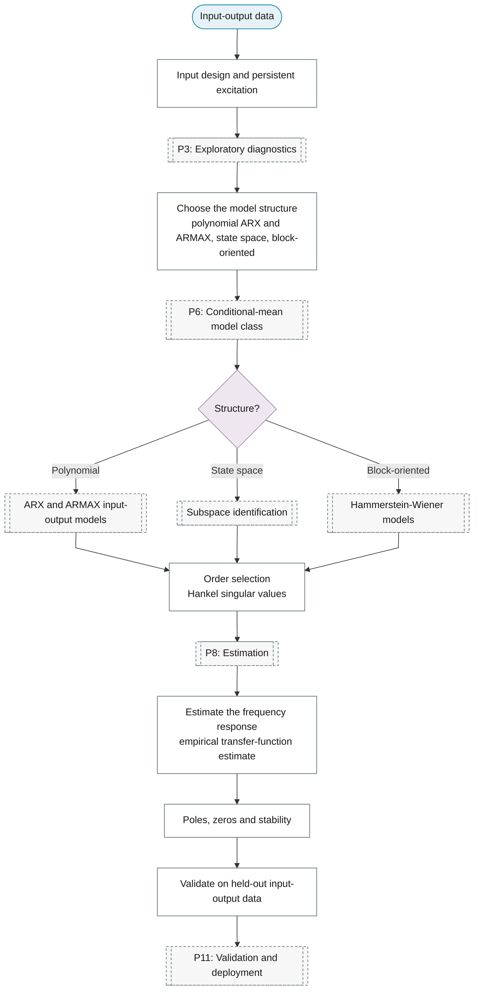

# Purpose 9: System identification

**Goal:** Identify a dynamic input-output model of a system.

## Sub-chart

## P10 inference for this purpose

[Estimate the frequency response](../../reference/33-system-identification/index.md#estimate-the-frequency-response), [Poles, zeros and stability](../../reference/33-system-identification/index.md#poles-zeros-and-stability).

## P11 metrics for this purpose

[Validate on held-out input-output data](../../reference/33-system-identification/index.md#validate-on-held-out-input-output-data).
