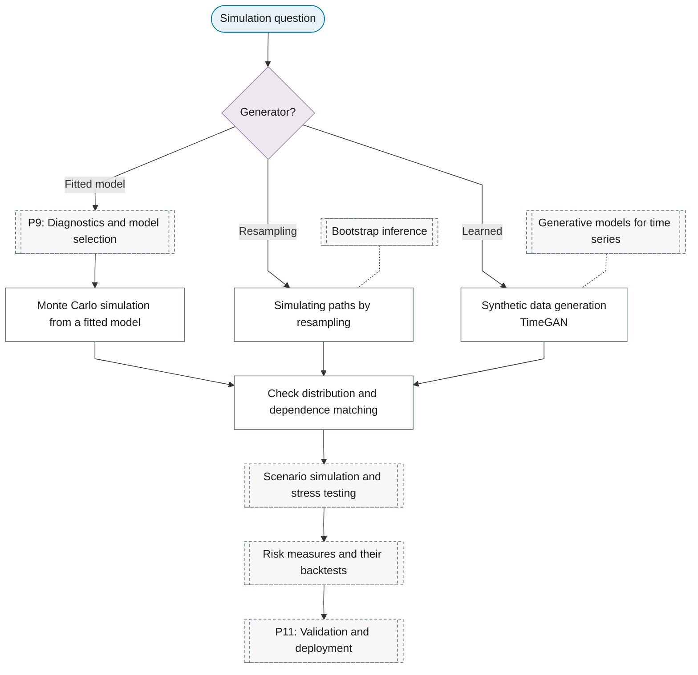

# Purpose 10: Simulation and scenario generation

**Goal:** Generate paths from a fitted model for stress tests, scenarios or synthetic data.

## Sub-chart

## P10 inference for this purpose

[Scenario simulation and stress testing](../../reference/25-simulation/index.md#scenario-simulation-and-stress-testing), [Risk measures and their backtests](../../reference/10-volatility/index.md#risk-measures-and-their-backtests).

## P11 metrics for this purpose

[Check distribution and dependence matching](../../reference/25-simulation/index.md#check-distribution-and-dependence-matching).
