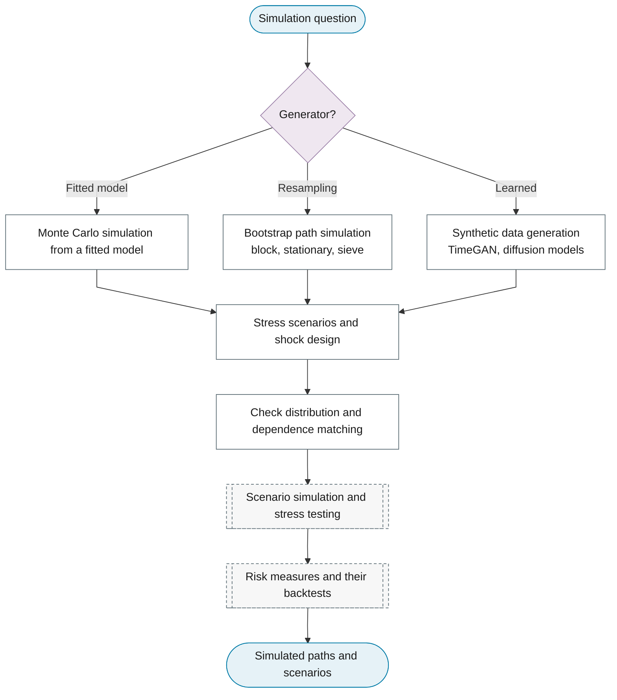

# Purpose 10: Simulation and scenario generation

**Goal:** Generate paths from a fitted model for stress tests, scenarios or synthetic data.

## Sub-chart

## P10 inference for this purpose

Path simulation, stress testing, synthetic data.

## P11 metrics for this purpose

Distribution matching, bootstrap coverage.
