# P2: Purpose

**Question this phase answers:** What is the question?

The purpose decides which later phases matter most and which inference and metrics apply at the end. Ten purposes are distinguished. Methods that belong to a purpose rather than to the standard pipeline (change-point algorithms, anomaly methods, decomposition methods, feature extraction, classification, clustering, simulation) are leaves of this phase.

## Purpose selector

```mermaid
%%{init: {"flowchart": {"curve": "linear"}}}%%
graph TD
    P2_IN(["Series and flags from P1"]) --> P2_PURPOSE{"Purpose?"}
    P2_PURPOSE -->|"Predict"| P2_FORECASTING["1 Forecasting"]
    P2_PURPOSE -->|"Explain"| P2_CAUSAL["2 Causal and structural inference"]
    P2_PURPOSE -->|"Clean"| P2_SIGNAL["3 Signal extraction and denoising"]
    P2_PURPOSE -->|"Locate changes"| P2_CHANGE_POINT["4 Change-point detection"]
    P2_PURPOSE -->|"Flag unusual"| P2_ANOMALY["5 Anomaly and regime detection"]
    P2_PURPOSE -->|"Split"| P2_DECOMPOSITION["6 Decomposition"]
    P2_PURPOSE -->|"Label or group"| P2_FEATURES["7 Feature extraction, classification and clustering"]
    P2_PURPOSE -->|"Describe cycles"| P2_SPECTRAL["8 Spectral analysis"]
    P2_PURPOSE -->|"Identify a system"| P2_SYSTEM_ID["9 System identification"]
    P2_PURPOSE -->|"Generate paths"| P2_SIMULATION["10 Simulation and scenario generation"]
    P2_FORECASTING & P2_CAUSAL & P2_SIGNAL & P2_CHANGE_POINT & P2_ANOMALY --> P3[["P3 Exploratory diagnostics"]]
    P2_DECOMPOSITION & P2_FEATURES & P2_SPECTRAL & P2_SYSTEM_ID & P2_SIMULATION --> P3
    class P2_IN terminator
    class P2_PURPOSE decision
    class P2_FORECASTING,P2_CAUSAL,P2_SIGNAL,P2_CHANGE_POINT,P2_ANOMALY,P2_DECOMPOSITION,P2_FEATURES,P2_SPECTRAL,P2_SYSTEM_ID,P2_SIMULATION process
    class P3 ref
    classDef terminator fill:#E6F2F7,stroke:#007BA7,color:#1A1A1A;
    classDef process fill:#FFFFFF,stroke:#5A6B73,color:#1A1A1A;
    classDef decision fill:#EFE7F0,stroke:#9B7FA7,color:#1A1A1A;
    classDef data fill:#FFF4E0,stroke:#C9A55E,color:#1A1A1A;
    classDef good fill:#DCEFD8,stroke:#4A7A3F,color:#1A1A1A;
    classDef escalate fill:#FFE9C2,stroke:#C9A55E,color:#1A1A1A;
    classDef problem fill:#F2D9DE,stroke:#800020,color:#1A1A1A;
    classDef ref fill:#F7F7F7,stroke:#5A6B73,color:#1A1A1A,stroke-dasharray:4 3;
```

## Quick navigation

| Purpose | Emphasised phases | Key leaves |
|---|---|---|
| Pending | Pending | Filled in Plan B |
