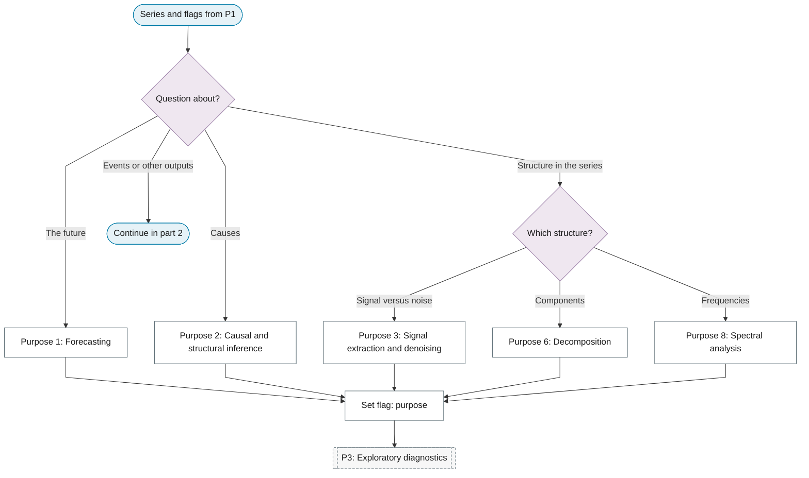
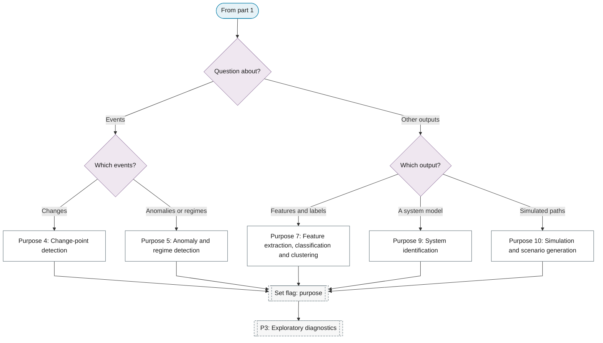

# P2: Purpose

**Question this phase answers:** What is the question?

The purpose decides which later phases matter most and which inference and metrics apply at the end. Ten purposes are distinguished. Methods that belong to a purpose rather than to the standard pipeline (change-point algorithms, anomaly methods, component analysis, feature extraction, classification, clustering, simulation) are leaves of this phase.

## Purpose selector

**Part 1: the future, causes and structure in the series.**

**Part 2: events and other outputs.**

## Quick navigation

Emphasised phases are the phases whose leaves the purpose's sub-chart references.

| Purpose | Emphasised phases | Key leaves |
|---|---|---|
| [1. Forecasting](01-forecasting.md) | P6, P9, P10, P11 | Naive and seasonal-naive baselines; Epidemic nowcasting |
| [2. Causal and structural inference](02-causal-inference.md) | P3, P6, P10 | Identification strategy and exogeneity; Placebo and falsification tests; Sensitivity analysis across specifications |
| [3. Signal extraction and denoising](03-signal-extraction.md) | P0, P5, P8 | Characterise the noise; Wavelet denoising; Evaluate the signal-to-noise ratio |
| [4. Change-point detection](04-change-point-detection.md) | P3, P4, P6, P7, P11 | Sequential detection; Bayesian online change-point detection; Offline segmentation |
| [5. Anomaly and regime detection](05-anomaly-regime-detection.md) | P6, P8, P11 | Statistical outlier scores; Matrix profile and discord discovery; Set thresholds by the cost of errors |
| [6. Decomposition](06-decomposition.md) | P3, P4, P7 | Analyse and interpret the components; Additive or multiplicative decomposition; Revision stability of real-time decompositions |
| [7. Feature extraction, classification and clustering](07-feature-extraction-classification.md) | P6, P8, P10, P11 | Time-domain features; Shapelets and ROCKET; Clustering |
| [8. Spectral analysis](08-spectral-analysis.md) | P5 | Interpret the spectral shape; Peak significance; Cross-spectrum, coherence and phase |
| [9. System identification](09-system-identification.md) | P6 | Input design and persistent excitation; Order selection; Poles, zeros and stability |
| [10. Simulation and scenario generation](10-simulation.md) | P6, P9, P10 | Monte Carlo simulation from a fitted model; Simulating paths by resampling; Check distribution and dependence matching |
