# P3: Exploratory diagnostics

**Question this phase answers:** What structure is present?

Distribution, variance stability, trend-stationary versus difference-stationary behaviour, unit roots and seasonal unit roots, explosive roots, structural breaks, seasonality, autocorrelation, long-memory indicators, nonlinearity tests, nonparametric trend tests, and the multivariate checks (cross-correlation, lead-lag, cointegration pre-check).

## Sub-diagram

```mermaid
%%{init: {"flowchart": {"curve": "linear"}}}%%
graph TD
    P3_IN(["Series and flags from P2"]) --> P3_PLOT["Plot the series"]
    P3_PLOT --> P3_DISTRIBUTION["Test the distribution<br/>Shapiro-Wilk, Jarque-Bera, skewness, tail index"]
    P3_DISTRIBUTION --> P3_VARIANCE_STABILITY["Check variance stability<br/>rolling variance, ARCH-LM on levels"]
    P3_VARIANCE_STABILITY --> P3_HETERO{"Variance behaviour?"}
    P3_HETERO -->|"Grows with level"| P3_VARIANCE_FLAG["Set flag: transform variance"]
    P3_HETERO -->|"Conditional heteroskedasticity: tested in P7"| P3_TREND_TYPE
    P3_HETERO -->|"Stable"| P3_TREND_TYPE
    P3_VARIANCE_FLAG --> P3_TREND_TYPE["Trend-stationary or difference-stationary"]
    P3_TREND_TYPE --> P3_UNIT_ROOT["Unit-root tests<br/>ADF, KPSS, PP, DF-GLS"]
    P3_UNIT_ROOT --> P3_BREAK_SUSPECTED
    P3_UNIT_ROOT --> P3_VARIANCE_RATIO["Variance-ratio test<br/>Lo-MacKinlay"]
    P3_VARIANCE_RATIO --> P3_BREAK_SUSPECTED{"Break suspected?"}
    P3_BREAK_SUSPECTED -->|"Yes"| P3_UNIT_ROOT_BREAKS["Unit-root tests with breaks<br/>Zivot-Andrews"]
    P3_BREAK_SUSPECTED -->|"No"| P3_UR_VERDICT
    P3_UNIT_ROOT_BREAKS --> P3_STRUCTURAL_BREAKS["Structural-break tests<br/>Chow, CUSUM, Bai-Perron"]
    P3_STRUCTURAL_BREAKS --> P3_BREAK_VERDICT{"Breaks found?"}
    P3_BREAK_VERDICT -->|"Yes"| P3_BREAK_FLAG["Set flag: break handling"]
    P3_BREAK_VERDICT -->|"No"| P3_UR_VERDICT
    P3_BREAK_FLAG --> P3_UR_VERDICT{"Unit root?"}
    P3_UR_VERDICT -->|"Yes"| P3_DIFF_FLAG["Set flag: difference"]
    P3_UR_VERDICT -->|"No"| P3_TREND_TS{"Deterministic trend?"}
    P3_UR_VERDICT -->|"Explosive"| P3_EXPLOSIVE["Explosive-root and bubble tests<br/>PSY, GSADF"]
    P3_TREND_TS -->|"Yes: trend-stationary"| P3_TREND_FLAG["Set flag: deterministic trend"]
    P3_TREND_TS -->|"No"| P3_SEASONALITY
    P3_DIFF_FLAG & P3_EXPLOSIVE & P3_TREND_FLAG --> P3_SEASONALITY["Detect seasonality<br/>seasonal subseries, periodogram peaks"]
    P3_SEASONALITY --> P3_SEASONAL{"Seasonal?"}
    P3_SEASONAL -->|"Single period"| P3_SEASONAL_UNIT_ROOT["Seasonal unit-root tests<br/>HEGY, Canova-Hansen, OCSB"]
    P3_SEASONAL -->|"Multiple periods"| P3_MULTI_SEASON_FLAG["Set flag: multiple seasonality"]
    P3_SEASONAL -->|"No"| P3_ACF_PACF
    P3_SEASONAL_UNIT_ROOT --> P3_SUR_VERDICT{"Seasonal unit root?"}
    P3_SUR_VERDICT -->|"Yes"| P3_SDIFF_FLAG["Set flag: seasonal difference"]
    P3_SUR_VERDICT -->|"No"| P3_SADJ_FLAG["Set flag: seasonal adjustment"]
    P3_SDIFF_FLAG & P3_SADJ_FLAG & P3_MULTI_SEASON_FLAG --> P3_ACF_PACF["Read the ACF and PACF"]
    P3_ACF_PACF --> P3_DECAY{"ACF decay?"}
    P3_DECAY -->|"Hyperbolic (on the differenced series if the difference flag is set)"| P3_LONG_MEMORY["Long-memory indicators<br/>Hurst exponent, GPH"]
    P3_DECAY -->|"Geometric or cut-off"| P3_NONLINEARITY
    P3_LONG_MEMORY --> P3_LM_VERDICT{"Long memory?"}
    P3_LM_VERDICT -->|"Yes"| P3_LONG_MEMORY_FLAG["Set flag: long memory"]
    P3_LM_VERDICT -->|"No"| P3_NONLINEARITY
    P3_LONG_MEMORY_FLAG --> P3_NONLINEARITY["Nonlinearity tests<br/>BDS, Terasvirta, Tsay, Keenan; chaos indicators (Lyapunov exponents, correlation dimension)"]
    P3_NONLINEARITY --> P3_NONLINEAR{"Nonlinear?"}
    P3_NONLINEAR -->|"Yes"| P3_NONLINEAR_FLAG["Set flag: nonlinear"]
    P3_NONLINEAR -->|"No"| P3_NONPARAMETRIC_TREND
    P3_NONLINEAR_FLAG --> P3_NONPARAMETRIC_TREND["Nonparametric trend tests<br/>Mann-Kendall, Sen slope, prewhitening"]
    P3_NONPARAMETRIC_TREND --> P3_MULTI{"Multivariate flag?"}
    P3_MULTI -->|"Yes"| P3_CROSS_CORRELATION["Cross-correlation and lead-lag"]
    P3_MULTI -->|"No"| P3_OUT
    P3_CROSS_CORRELATION --> P3_COINTEGRATION_PRECHECK["Cointegration pre-check<br/>spurious-regression warning"]
    P3_COINTEGRATION_PRECHECK --> P3_OUT(["To P4 Transformations"])
    F_ERGODICITY[["Ergodicity and mixing"]] -.- P3_PLOT
    F_STATIONARITY[["Strict and weak stationarity"]] -.- P3_TREND_TYPE
    F_UNIT_ROOT_ASYMPTOTICS[["Random walks and unit-root asymptotics<br/>near-unit-root asymptotics"]] -.- P3_UNIT_ROOT
    class P3_IN,P3_OUT terminator
    class P3_HETERO,P3_BREAK_SUSPECTED,P3_BREAK_VERDICT,P3_UR_VERDICT,P3_TREND_TS,P3_SEASONAL,P3_SUR_VERDICT,P3_DECAY,P3_LM_VERDICT,P3_NONLINEAR,P3_MULTI decision
    class P3_PLOT,P3_DISTRIBUTION,P3_VARIANCE_STABILITY,P3_VARIANCE_FLAG,P3_TREND_TYPE,P3_UNIT_ROOT,P3_VARIANCE_RATIO,P3_UNIT_ROOT_BREAKS,P3_STRUCTURAL_BREAKS,P3_BREAK_FLAG,P3_DIFF_FLAG,P3_EXPLOSIVE,P3_TREND_FLAG,P3_SEASONALITY,P3_SEASONAL_UNIT_ROOT,P3_MULTI_SEASON_FLAG,P3_SDIFF_FLAG,P3_SADJ_FLAG,P3_ACF_PACF,P3_LONG_MEMORY,P3_LONG_MEMORY_FLAG,P3_NONLINEARITY,P3_NONLINEAR_FLAG,P3_NONPARAMETRIC_TREND,P3_CROSS_CORRELATION,P3_COINTEGRATION_PRECHECK process
    class F_ERGODICITY,F_STATIONARITY,F_UNIT_ROOT_ASYMPTOTICS ref
    classDef terminator fill:#E6F2F7,stroke:#007BA7,color:#1A1A1A;
    classDef process fill:#FFFFFF,stroke:#5A6B73,color:#1A1A1A;
    classDef decision fill:#EFE7F0,stroke:#9B7FA7,color:#1A1A1A;
    classDef data fill:#FFF4E0,stroke:#C9A55E,color:#1A1A1A;
    classDef good fill:#DCEFD8,stroke:#4A7A3F,color:#1A1A1A;
    classDef escalate fill:#FFE9C2,stroke:#C9A55E,color:#1A1A1A;
    classDef problem fill:#F2D9DE,stroke:#800020,color:#1A1A1A;
    classDef ref fill:#F7F7F7,stroke:#5A6B73,color:#1A1A1A,stroke-dasharray:4 3;
```

## Phase guide

!!! note "Section pending"
    To-do item created from the flowchart inventory (node `P3`). Write this section following the content rules in `.claude/rules/writing.md`.

## Plot the series

!!! note "Section pending"
    To-do item created from the flowchart inventory (node `P3_PLOT`). Write this section following the content rules in `.claude/rules/writing.md`.

## Test the distribution

!!! note "Section pending"
    To-do item created from the flowchart inventory (node `P3_DISTRIBUTION`). Write this section following the content rules in `.claude/rules/writing.md`.

## Check variance stability

!!! note "Section pending"
    To-do item created from the flowchart inventory (node `P3_VARIANCE_STABILITY`). Write this section following the content rules in `.claude/rules/writing.md`.

## Trend-stationary or difference-stationary

!!! note "Section pending"
    To-do item created from the flowchart inventory (node `P3_TREND_TYPE`). Write this section following the content rules in `.claude/rules/writing.md`.

## Unit-root tests

!!! note "Section pending"
    To-do item created from the flowchart inventory (node `P3_UNIT_ROOT`). Write this section following the content rules in `.claude/rules/writing.md`.

## Variance-ratio test

!!! note "Section pending"
    To-do item created from the flowchart inventory (node `P3_VARIANCE_RATIO`). Write this section following the content rules in `.claude/rules/writing.md`.

## Unit-root tests with breaks

!!! note "Section pending"
    To-do item created from the flowchart inventory (node `P3_UNIT_ROOT_BREAKS`). Write this section following the content rules in `.claude/rules/writing.md`.

## Structural-break tests

!!! note "Section pending"
    To-do item created from the flowchart inventory (node `P3_STRUCTURAL_BREAKS`). Write this section following the content rules in `.claude/rules/writing.md`.

## Explosive-root and bubble tests

!!! note "Section pending"
    To-do item created from the flowchart inventory (node `P3_EXPLOSIVE`). Write this section following the content rules in `.claude/rules/writing.md`.

## Detect seasonality

!!! note "Section pending"
    To-do item created from the flowchart inventory (node `P3_SEASONALITY`). Write this section following the content rules in `.claude/rules/writing.md`.

## Seasonal unit-root tests

!!! note "Section pending"
    To-do item created from the flowchart inventory (node `P3_SEASONAL_UNIT_ROOT`). Write this section following the content rules in `.claude/rules/writing.md`.

## Read the ACF and PACF

!!! note "Section pending"
    To-do item created from the flowchart inventory (node `P3_ACF_PACF`). Write this section following the content rules in `.claude/rules/writing.md`.

## Long-memory indicators

!!! note "Section pending"
    To-do item created from the flowchart inventory (node `P3_LONG_MEMORY`). Write this section following the content rules in `.claude/rules/writing.md`.

## Nonlinearity tests

!!! note "Section pending"
    To-do item created from the flowchart inventory (node `P3_NONLINEARITY`). Write this section following the content rules in `.claude/rules/writing.md`.

## Nonparametric trend tests

!!! note "Section pending"
    To-do item created from the flowchart inventory (node `P3_NONPARAMETRIC_TREND`). Write this section following the content rules in `.claude/rules/writing.md`.

## Cross-correlation and lead-lag

!!! note "Section pending"
    To-do item created from the flowchart inventory (node `P3_CROSS_CORRELATION`). Write this section following the content rules in `.claude/rules/writing.md`.

## Cointegration pre-check

!!! note "Section pending"
    To-do item created from the flowchart inventory (node `P3_COINTEGRATION_PRECHECK`). Write this section following the content rules in `.claude/rules/writing.md`.
