# P4: Transformations

**Question this phase answers:** What must change before modelling?

Variance-stabilising transforms, regular, seasonal and fractional differencing, detrending, seasonal adjustment, multiple seasonality, filter-based and model-based decomposition, break handling, and the retest loop.

## Sub-diagram

```mermaid
%%{init: {"flowchart": {"curve": "linear"}}}%%
graph TD
    P4_IN(["Flags from P3"]) --> P4_VARIANCE{"Variance flag?"}
    P4_VARIANCE -->|"Transform variance"| P4_LOG_BOXCOX["Variance-stabilising transforms<br/>log, Box-Cox"]
    P4_VARIANCE -->|"None"| P4_TREND
    P4_LOG_BOXCOX --> P4_TREND{"Trend flags (first match)?"}
    P4_TREND -->|"Cointegrated: keep levels"| P4_SEASON
    P4_TREND -->|"Difference, not cointegrated"| P4_DIFFERENCE["Regular differencing"]
    P4_TREND -->|"Deterministic trend"| P4_DETREND["Detrending by regression on time"]
    P4_TREND -->|"Long memory only"| P4_FRACTIONAL_DIFFERENCE["Fractional differencing"]
    P4_TREND -->|"None"| P4_SEASON
    P4_DETREND --> P4_DETREND_LM{"Long-memory flag too?"}
    P4_DETREND_LM -->|"Yes"| P4_FRACTIONAL_DIFFERENCE
    P4_DETREND_LM -->|"No"| P4_SEASON
    P4_DIFFERENCE --> P4_OVERDIFFERENCING["Check for over-differencing"]
    P4_OVERDIFFERENCING --> P4_DIFF_VERDICT{"After differencing?"}
    P4_DIFF_VERDICT -->|"Short memory"| P4_SEASON
    P4_DIFF_VERDICT -->|"Still hyperbolic: fractional, d between 1 and 1.5"| P4_FRACTIONAL_DIFFERENCE
    P4_DIFF_VERDICT -->|"Over-differenced: treat as trend-stationary"| P4_DETREND
    P4_FRACTIONAL_DIFFERENCE --> P4_SEASON{"Seasonal flag?"}
    P4_SEASON -->|"Seasonal difference"| P4_SEASONAL_DIFFERENCE["Seasonal differencing"]
    P4_SEASON -->|"Seasonal adjustment"| P4_SEASONAL_ADJUSTMENT["Seasonal adjustment<br/>classical decomposition, STL, X-13 and SEATS"]
    P4_SEASON -->|"Multiple seasonality"| P4_MULTIPLE_SEASONALITY["Multiple seasonality<br/>MSTL, TBATS, Fourier terms"]
    P4_SEASON -->|"None"| P4_BREAKS
    P4_SEASONAL_DIFFERENCE & P4_SEASONAL_ADJUSTMENT & P4_MULTIPLE_SEASONALITY --> P4_BREAKS{"Break flag?"}
    P4_BREAKS -->|"Yes"| P4_BREAK_HANDLING["Handle structural breaks<br/>segmenting, regime dummies, time-varying parameters, forecasting under breaks"]
    P4_BREAKS -->|"No"| P4_DECOMP
    P4_BREAK_HANDLING --> P4_DECOMP{"Decomposition wanted?"}
    P4_DECOMP -->|"Filter-based"| P4_FILTER_DECOMPOSITION["Filter-based decomposition<br/>HP, Baxter-King, Christiano-Fitzgerald, Hamilton"]
    P4_DECOMP -->|"Model-based"| P4_MODEL_DECOMPOSITION["Model-based decomposition<br/>Beveridge-Nelson, unobserved components"]
    P4_DECOMP -->|"Nonparametric"| P4_SSA["Singular spectrum analysis"]
    P4_DECOMP -->|"No"| P4_RETEST
    P4_FILTER_DECOMPOSITION & P4_MODEL_DECOMPOSITION & P4_SSA --> P4_RETEST["Retest stationarity after transforming"]
    P4_RETEST --> P4_STATIONARY{"Stationary now?"}
    P4_STATIONARY -->|"Yes"| P4_OUT(["To P5 Representation"])
    P4_STATIONARY -->|"No: cointegrated levels kept"| P4_OUT
    P4_STATIONARY -.->|"No, not cointegrated: re-diagnose"| P3[["P3: Exploratory diagnostics"]]
    class P4_IN,P4_OUT terminator
    class P4_VARIANCE,P4_TREND,P4_DETREND_LM,P4_DIFF_VERDICT,P4_SEASON,P4_BREAKS,P4_DECOMP,P4_STATIONARY decision
    class P4_LOG_BOXCOX,P4_DIFFERENCE,P4_DETREND,P4_FRACTIONAL_DIFFERENCE,P4_OVERDIFFERENCING,P4_SEASONAL_DIFFERENCE,P4_SEASONAL_ADJUSTMENT,P4_MULTIPLE_SEASONALITY,P4_BREAK_HANDLING,P4_FILTER_DECOMPOSITION,P4_MODEL_DECOMPOSITION,P4_SSA,P4_RETEST process
    class P3 ref
    classDef terminator fill:#E6F2F7,stroke:#007BA7,color:#1A1A1A;
    classDef process fill:#FFFFFF,stroke:#5A6B73,color:#1A1A1A;
    classDef decision fill:#EFE7F0,stroke:#9B7FA7,color:#1A1A1A;
    classDef data fill:#FFF4E0,stroke:#C9A55E,color:#1A1A1A;
    classDef good fill:#DCEFD8,stroke:#4A7A3F,color:#1A1A1A;
    classDef escalate fill:#FFE9C2,stroke:#C9A55E,color:#1A1A1A;
    classDef problem fill:#F2D9DE,stroke:#800020,color:#1A1A1A;
    classDef ref fill:#F7F7F7,stroke:#5A6B73,color:#1A1A1A,stroke-dasharray:4 3;
```

## Phase guide

!!! note "Section pending"
    To-do item created from the flowchart inventory (node `P4`). Write this section following the content rules in `.claude/rules/writing.md`.

## Variance-stabilising transforms

!!! note "Section pending"
    To-do item created from the flowchart inventory (node `P4_LOG_BOXCOX`). Write this section following the content rules in `.claude/rules/writing.md`.

## Regular differencing

!!! note "Section pending"
    To-do item created from the flowchart inventory (node `P4_DIFFERENCE`). Write this section following the content rules in `.claude/rules/writing.md`.

## Check for over-differencing

!!! note "Section pending"
    To-do item created from the flowchart inventory (node `P4_OVERDIFFERENCING`). Write this section following the content rules in `.claude/rules/writing.md`.

## Fractional differencing

!!! note "Section pending"
    To-do item created from the flowchart inventory (node `P4_FRACTIONAL_DIFFERENCE`). Write this section following the content rules in `.claude/rules/writing.md`.

## Detrending by regression on time

!!! note "Section pending"
    To-do item created from the flowchart inventory (node `P4_DETREND`). Write this section following the content rules in `.claude/rules/writing.md`.

## Seasonal differencing

!!! note "Section pending"
    To-do item created from the flowchart inventory (node `P4_SEASONAL_DIFFERENCE`). Write this section following the content rules in `.claude/rules/writing.md`.

## Seasonal adjustment

!!! note "Section pending"
    To-do item created from the flowchart inventory (node `P4_SEASONAL_ADJUSTMENT`). Write this section following the content rules in `.claude/rules/writing.md`.

## Multiple seasonality

!!! note "Section pending"
    To-do item created from the flowchart inventory (node `P4_MULTIPLE_SEASONALITY`). Write this section following the content rules in `.claude/rules/writing.md`.

## Handle structural breaks

!!! note "Section pending"
    To-do item created from the flowchart inventory (node `P4_BREAK_HANDLING`). Write this section following the content rules in `.claude/rules/writing.md`.

## Filter-based decomposition

!!! note "Section pending"
    To-do item created from the flowchart inventory (node `P4_FILTER_DECOMPOSITION`). Write this section following the content rules in `.claude/rules/writing.md`.

## Model-based decomposition

!!! note "Section pending"
    To-do item created from the flowchart inventory (node `P4_MODEL_DECOMPOSITION`). Write this section following the content rules in `.claude/rules/writing.md`.

## Singular spectrum analysis

!!! note "Section pending"
    To-do item created from the flowchart inventory (node `P4_SSA`). Write this section following the content rules in `.claude/rules/writing.md`.

## Retest stationarity after transforming

!!! note "Section pending"
    To-do item created from the flowchart inventory (node `P4_RETEST`). Write this section following the content rules in `.claude/rules/writing.md`.
