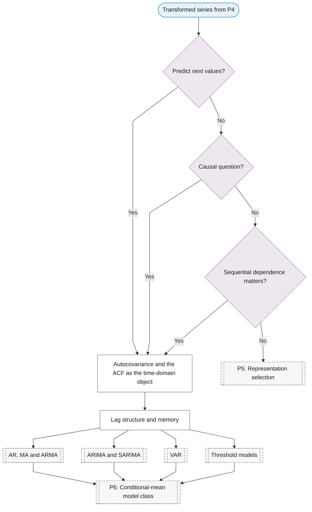

# Representation 1: Time domain

**Best for:** Prediction, causal inference and sequential dependence.

## Sub-chart

```mermaid
%%{init: {"flowchart": {"curve": "linear"}}}%%
graph TD
    P5_TD_IN(["Transformed series from P4"]) --> P5_TD_PREDICT{"Predict next values?"}
    P5_TD_PREDICT -->|"Yes"| P5_TD_AUTOCOVARIANCE["Autocovariance and the ACF as the time-domain object"]
    P5_TD_PREDICT -->|"No"| P5_TD_CAUSAL{"Causal question?"}
    P5_TD_CAUSAL -->|"Yes"| P5_TD_AUTOCOVARIANCE
    P5_TD_CAUSAL -->|"No"| P5_TD_SEQUENTIAL{"Sequential dependence matters?"}
    P5_TD_SEQUENTIAL -->|"Yes"| P5_TD_AUTOCOVARIANCE
    P5_TD_SEQUENTIAL -->|"No"| P5[["P5: Representation selection"]]
    P5_TD_AUTOCOVARIANCE --> P5_TD_LAG_STRUCTURE["Lag structure and memory"]
    P5_TD_LAG_STRUCTURE --> P6_AR_MA_ARMA[["AR, MA and ARMA"]]
    P5_TD_LAG_STRUCTURE --> P6_ARIMA_SARIMA[["ARIMA and SARIMA"]]
    P5_TD_LAG_STRUCTURE --> P6_VAR[["VAR"]]
    P5_TD_LAG_STRUCTURE --> P6_THRESHOLD[["Threshold models"]]
    P6_AR_MA_ARMA & P6_ARIMA_SARIMA & P6_VAR & P6_THRESHOLD --> P6[["P6: Conditional-mean model class"]]
    class P5_TD_IN terminator
    class P5_TD_PREDICT,P5_TD_CAUSAL,P5_TD_SEQUENTIAL decision
    class P5_TD_AUTOCOVARIANCE,P5_TD_LAG_STRUCTURE process
    class P5,P6_AR_MA_ARMA,P6_ARIMA_SARIMA,P6_VAR,P6_THRESHOLD,P6 ref
    classDef terminator fill:#E6F2F7,stroke:#007BA7,color:#1A1A1A;
    classDef process fill:#FFFFFF,stroke:#5A6B73,color:#1A1A1A;
    classDef decision fill:#EFE7F0,stroke:#9B7FA7,color:#1A1A1A;
    classDef data fill:#FFF4E0,stroke:#C9A55E,color:#1A1A1A;
    classDef good fill:#DCEFD8,stroke:#4A7A3F,color:#1A1A1A;
    classDef escalate fill:#FFE9C2,stroke:#C9A55E,color:#1A1A1A;
    classDef problem fill:#F2D9DE,stroke:#800020,color:#1A1A1A;
    classDef ref fill:#F7F7F7,stroke:#5A6B73,color:#1A1A1A,stroke-dasharray:4 3;
```

