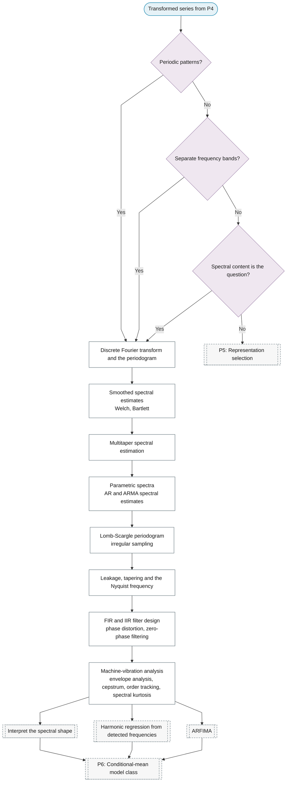

# Representation 2: Frequency domain

**Best for:** Periodicity, cycles, filtering and spectral content.

## Sub-chart

```mermaid
%%{init: {"flowchart": {"curve": "linear"}}}%%
graph TD
    P5_FD_IN(["Transformed series from P4"]) --> P5_FD_PERIODIC{"Periodic patterns?"}
    P5_FD_PERIODIC -->|"Yes"| P5_FD_DFT["Discrete Fourier transform and the periodogram"]
    P5_FD_PERIODIC -->|"No"| P5_FD_BANDS{"Separate frequency bands?"}
    P5_FD_BANDS -->|"Yes"| P5_FD_DFT
    P5_FD_BANDS -->|"No"| P5_FD_SPECTRAL{"Spectral content is the question?"}
    P5_FD_SPECTRAL -->|"Yes"| P5_FD_DFT
    P5_FD_SPECTRAL -->|"No"| P5[["P5: Representation selection"]]
    P5_FD_DFT --> P5_FD_SMOOTHED["Smoothed spectral estimates<br/>Welch, Bartlett"]
    P5_FD_SMOOTHED --> P5_FD_MULTITAPER["Multitaper spectral estimation"]
    P5_FD_MULTITAPER --> P5_FD_PARAMETRIC["Parametric spectra<br/>AR and ARMA spectral estimates"]
    P5_FD_PARAMETRIC --> P5_FD_LOMB_SCARGLE["Lomb-Scargle periodogram<br/>irregular sampling"]
    P5_FD_LOMB_SCARGLE --> P5_FD_LEAKAGE["Leakage, tapering and the Nyquist frequency"]
    P5_FD_LEAKAGE --> P5_FD_FILTERS["FIR and IIR filter design<br/>phase distortion, zero-phase filtering"]
    P5_FD_FILTERS --> P5_FD_ENVELOPE["Machine-vibration analysis<br/>envelope analysis, cepstrum, order tracking, spectral kurtosis"]
    P5_FD_ENVELOPE --> P2_SP_SPECTRAL_SHAPE[["Interpret the spectral shape"]]
    P5_FD_ENVELOPE --> P2_SP_HARMONIC_REGRESSION[["Harmonic regression from detected frequencies"]]
    P5_FD_ENVELOPE --> P6_ARFIMA[["ARFIMA"]]
    P2_SP_SPECTRAL_SHAPE & P2_SP_HARMONIC_REGRESSION & P6_ARFIMA --> P6[["P6: Conditional-mean model class"]]
    class P5_FD_IN terminator
    class P5_FD_PERIODIC,P5_FD_BANDS,P5_FD_SPECTRAL decision
    class P5_FD_DFT,P5_FD_SMOOTHED,P5_FD_MULTITAPER,P5_FD_PARAMETRIC,P5_FD_LOMB_SCARGLE,P5_FD_LEAKAGE,P5_FD_FILTERS,P5_FD_ENVELOPE process
    class P5,P2_SP_SPECTRAL_SHAPE,P2_SP_HARMONIC_REGRESSION,P6_ARFIMA,P6 ref
    classDef terminator fill:#E6F2F7,stroke:#007BA7,color:#1A1A1A;
    classDef process fill:#FFFFFF,stroke:#5A6B73,color:#1A1A1A;
    classDef decision fill:#EFE7F0,stroke:#9B7FA7,color:#1A1A1A;
    classDef data fill:#FFF4E0,stroke:#C9A55E,color:#1A1A1A;
    classDef good fill:#DCEFD8,stroke:#4A7A3F,color:#1A1A1A;
    classDef escalate fill:#FFE9C2,stroke:#C9A55E,color:#1A1A1A;
    classDef problem fill:#F2D9DE,stroke:#800020,color:#1A1A1A;
    classDef ref fill:#F7F7F7,stroke:#5A6B73,color:#1A1A1A,stroke-dasharray:4 3;
```

