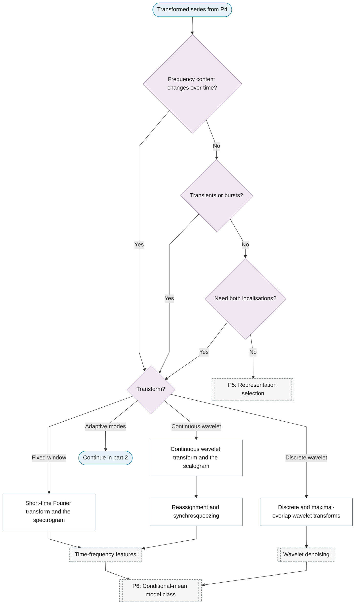
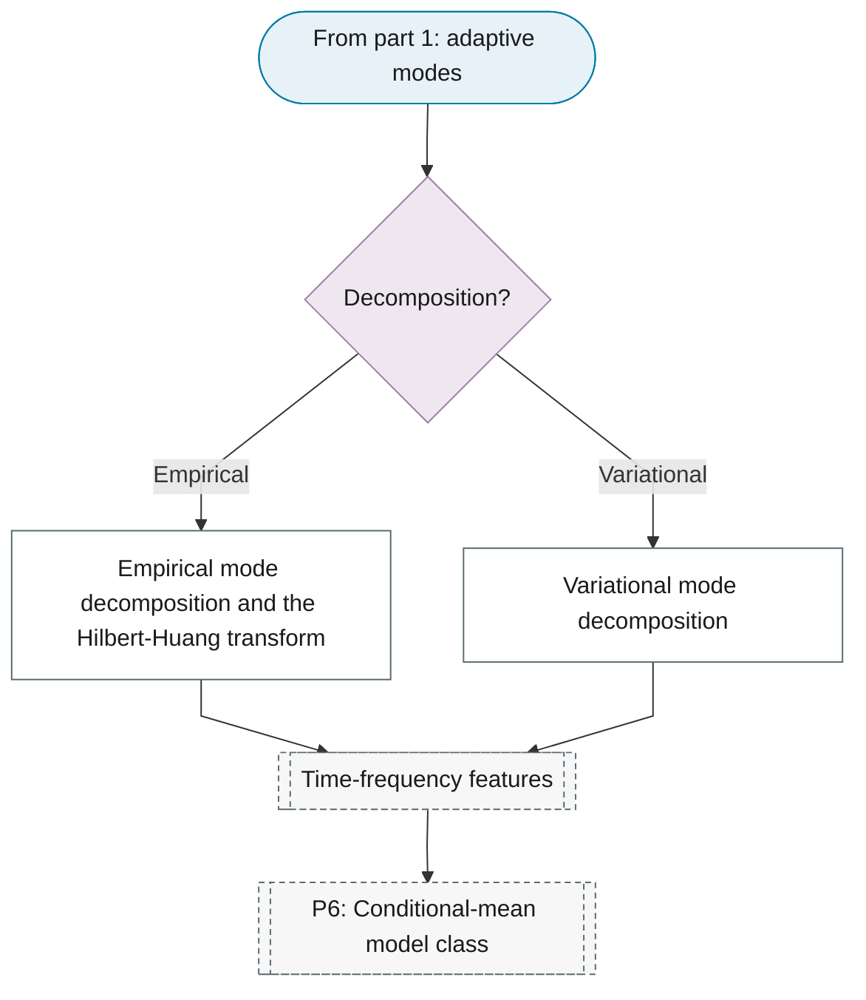

# Representation 3: Time-frequency

**Best for:** Non-stationary signals, transients and evolving spectra.

## Sub-chart

**Part 1: when to choose it, and Fourier and wavelet transforms.**

**Part 2: adaptive mode decompositions.**

