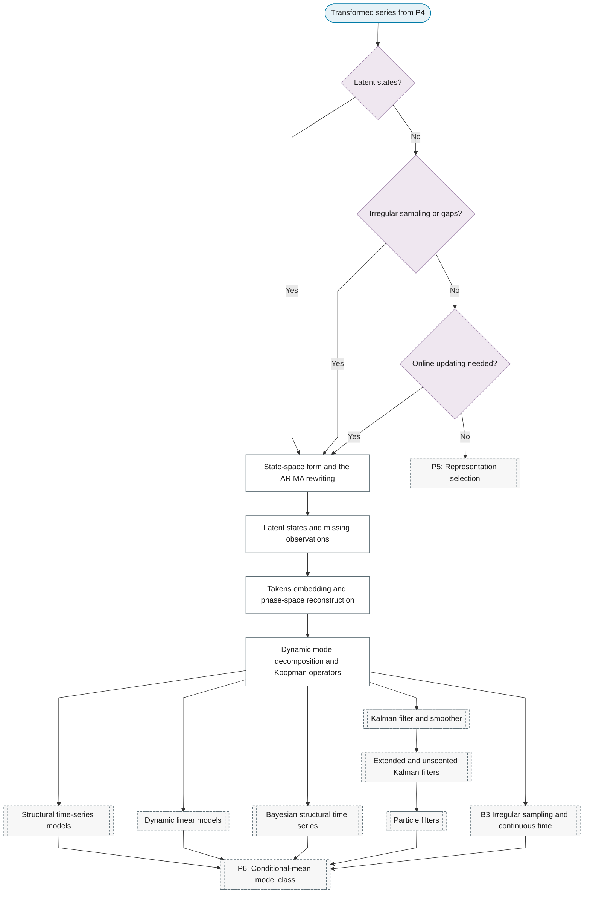

# Representation 4: State space

**Best for:** Latent states, irregular sampling, missing observations and online updating.

## Sub-chart

```mermaid
%%{init: {"flowchart": {"curve": "linear"}}}%%
graph TD
    P5_SS_IN(["Transformed series from P4"]) --> P5_SS_LATENT_STATES{"Latent states?"}
    P5_SS_LATENT_STATES -->|"Yes"| P5_SS_FORM["State-space form and the ARIMA rewriting"]
    P5_SS_LATENT_STATES -->|"No"| P5_SS_IRREGULAR{"Irregular sampling or gaps?"}
    P5_SS_IRREGULAR -->|"Yes"| P5_SS_FORM
    P5_SS_IRREGULAR -->|"No"| P5_SS_ONLINE{"Online updating needed?"}
    P5_SS_ONLINE -->|"Yes"| P5_SS_FORM
    P5_SS_ONLINE -->|"No"| P5[["P5: Representation selection"]]
    P5_SS_FORM --> P5_SS_LATENT["Latent states and missing observations"]
    P5_SS_LATENT --> P5_SS_TAKENS["Takens embedding and phase-space reconstruction"]
    P5_SS_TAKENS --> P5_SS_DMD["Dynamic mode decomposition and Koopman operators"]
    P5_SS_DMD --> P6_STRUCTURAL_TS[["Structural time-series models"]]
    P5_SS_DMD --> P6_DLM[["Dynamic linear models"]]
    P5_SS_DMD --> P6_BSTS[["Bayesian structural time series"]]
    P5_SS_DMD --> P8_KALMAN[["Kalman filter and smoother"]]
    P5_SS_DMD --> B3[["B3 Irregular sampling and continuous time"]]
    P8_KALMAN --> P8_NONLINEAR_FILTERS[["Extended and unscented Kalman filters"]]
    P8_NONLINEAR_FILTERS --> P8_PARTICLE_FILTERS[["Particle filters"]]
    P6_STRUCTURAL_TS & P6_DLM & P6_BSTS & P8_PARTICLE_FILTERS & B3 --> P6[["P6: Conditional-mean model class"]]
    class P5_SS_IN terminator
    class P5_SS_LATENT_STATES,P5_SS_IRREGULAR,P5_SS_ONLINE decision
    class P5_SS_FORM,P5_SS_LATENT,P5_SS_TAKENS,P5_SS_DMD process
    class P5,P6_STRUCTURAL_TS,P6_DLM,P6_BSTS,P8_KALMAN,B3,P8_NONLINEAR_FILTERS,P8_PARTICLE_FILTERS,P6 ref
    classDef terminator fill:#E6F2F7,stroke:#007BA7,color:#1A1A1A;
    classDef process fill:#FFFFFF,stroke:#5A6B73,color:#1A1A1A;
    classDef decision fill:#EFE7F0,stroke:#9B7FA7,color:#1A1A1A;
    classDef data fill:#FFF4E0,stroke:#C9A55E,color:#1A1A1A;
    classDef good fill:#DCEFD8,stroke:#4A7A3F,color:#1A1A1A;
    classDef escalate fill:#FFE9C2,stroke:#C9A55E,color:#1A1A1A;
    classDef problem fill:#F2D9DE,stroke:#800020,color:#1A1A1A;
    classDef ref fill:#F7F7F7,stroke:#5A6B73,color:#1A1A1A,stroke-dasharray:4 3;
```

