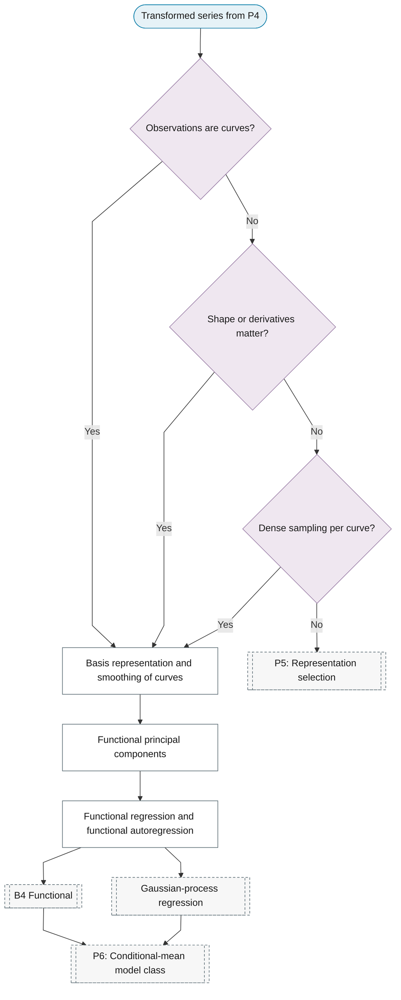

# Representation 5: Functional

**Best for:** Series that are curves, shape analysis and derivative information.

## Sub-chart

```mermaid
%%{init: {"flowchart": {"curve": "linear"}}}%%
graph TD
    P5_FN_IN(["Transformed series from P4"]) --> P5_FN_CURVES{"Observations are curves?"}
    P5_FN_CURVES -->|"Yes"| P5_FN_BASIS["Basis representation and smoothing of curves"]
    P5_FN_CURVES -->|"No"| P5_FN_SHAPE{"Shape or derivatives matter?"}
    P5_FN_SHAPE -->|"Yes"| P5_FN_BASIS
    P5_FN_SHAPE -->|"No"| P5_FN_DENSE{"Dense sampling per curve?"}
    P5_FN_DENSE -->|"Yes"| P5_FN_BASIS
    P5_FN_DENSE -->|"No"| P5[["P5: Representation selection"]]
    P5_FN_BASIS --> P5_FN_FPCA["Functional principal components"]
    P5_FN_FPCA --> P5_FN_REGRESSION["Functional regression and functional autoregression"]
    P5_FN_REGRESSION --> B4[["B4 Functional"]]
    P5_FN_REGRESSION --> P6_GAUSSIAN_PROCESS[["Gaussian-process regression"]]
    B4 & P6_GAUSSIAN_PROCESS --> P6[["P6: Conditional-mean model class"]]
    class P5_FN_IN terminator
    class P5_FN_CURVES,P5_FN_SHAPE,P5_FN_DENSE decision
    class P5_FN_BASIS,P5_FN_FPCA,P5_FN_REGRESSION process
    class P5,B4,P6_GAUSSIAN_PROCESS,P6 ref
    classDef terminator fill:#E6F2F7,stroke:#007BA7,color:#1A1A1A;
    classDef process fill:#FFFFFF,stroke:#5A6B73,color:#1A1A1A;
    classDef decision fill:#EFE7F0,stroke:#9B7FA7,color:#1A1A1A;
    classDef data fill:#FFF4E0,stroke:#C9A55E,color:#1A1A1A;
    classDef good fill:#DCEFD8,stroke:#4A7A3F,color:#1A1A1A;
    classDef escalate fill:#FFE9C2,stroke:#C9A55E,color:#1A1A1A;
    classDef problem fill:#F2D9DE,stroke:#800020,color:#1A1A1A;
    classDef ref fill:#F7F7F7,stroke:#5A6B73,color:#1A1A1A,stroke-dasharray:4 3;
```

