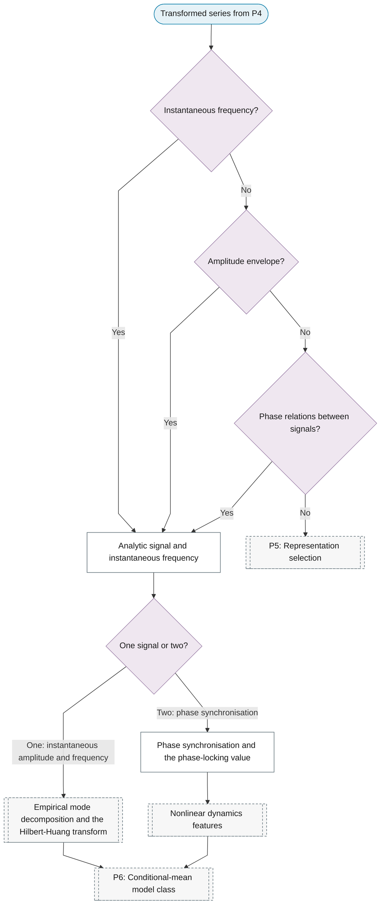

# Representation 6: Hilbert and phase

**Best for:** Instantaneous frequency, amplitude envelopes and phase synchronisation.

## Sub-chart

```mermaid
%%{init: {"flowchart": {"curve": "linear"}}}%%
graph TD
    P5_HP_IN(["Transformed series from P4"]) --> P5_HP_INSTANTANEOUS{"Instantaneous frequency?"}
    P5_HP_INSTANTANEOUS -->|"Yes"| P5_HP_ANALYTIC_SIGNAL["Analytic signal and instantaneous frequency"]
    P5_HP_INSTANTANEOUS -->|"No"| P5_HP_AMPLITUDE{"Amplitude envelope?"}
    P5_HP_AMPLITUDE -->|"Yes"| P5_HP_ANALYTIC_SIGNAL
    P5_HP_AMPLITUDE -->|"No"| P5_HP_PHASE_RELATIONS{"Phase relations between signals?"}
    P5_HP_PHASE_RELATIONS -->|"Yes"| P5_HP_ANALYTIC_SIGNAL
    P5_HP_PHASE_RELATIONS -->|"No"| P5[["P5: Representation selection"]]
    P5_HP_ANALYTIC_SIGNAL --> P5_HP_SIGNALS{"One signal or two?"}
    P5_HP_SIGNALS -->|"One: instantaneous amplitude and frequency"| P5_TF_EMD[["Empirical mode decomposition and the Hilbert-Huang transform"]]
    P5_HP_SIGNALS -->|"Two: phase synchronisation"| P5_HP_PHASE_SYNC["Phase synchronisation and the phase-locking value"]
    P5_HP_PHASE_SYNC --> P2_FE_NONLINEAR_FEATURES[["Nonlinear dynamics features"]]
    P5_TF_EMD & P2_FE_NONLINEAR_FEATURES --> P6[["P6: Conditional-mean model class"]]
    class P5_HP_IN terminator
    class P5_HP_INSTANTANEOUS,P5_HP_AMPLITUDE,P5_HP_PHASE_RELATIONS,P5_HP_SIGNALS decision
    class P5_HP_ANALYTIC_SIGNAL,P5_HP_PHASE_SYNC process
    class P5,P5_TF_EMD,P2_FE_NONLINEAR_FEATURES,P6 ref
    classDef terminator fill:#E6F2F7,stroke:#007BA7,color:#1A1A1A;
    classDef process fill:#FFFFFF,stroke:#5A6B73,color:#1A1A1A;
    classDef decision fill:#EFE7F0,stroke:#9B7FA7,color:#1A1A1A;
    classDef data fill:#FFF4E0,stroke:#C9A55E,color:#1A1A1A;
    classDef good fill:#DCEFD8,stroke:#4A7A3F,color:#1A1A1A;
    classDef escalate fill:#FFE9C2,stroke:#C9A55E,color:#1A1A1A;
    classDef problem fill:#F2D9DE,stroke:#800020,color:#1A1A1A;
    classDef ref fill:#F7F7F7,stroke:#5A6B73,color:#1A1A1A,stroke-dasharray:4 3;
```

