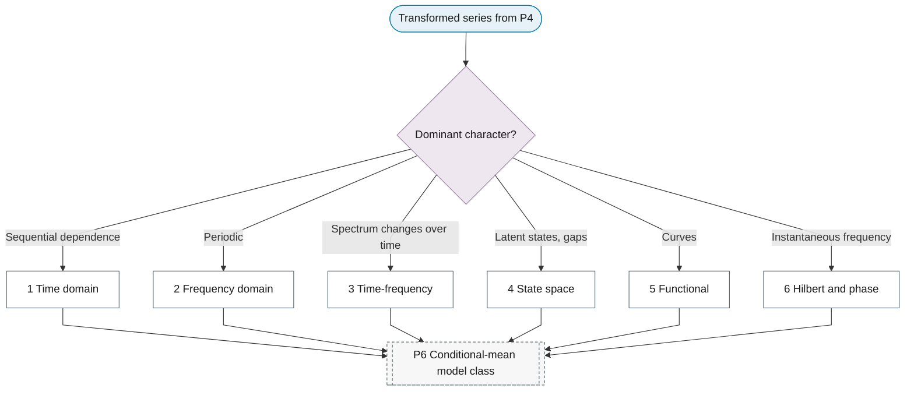

# P5: Representation selection

**Question this phase answers:** Which mathematical object is modelled?

Six representations are distinguished. Transforms and estimators that belong to a representation (spectral estimators, filters, wavelets, the analytic signal, embeddings, functional bases) are leaves of this phase; model families remain in P6.

## Representation selector

## Quick navigation

| Representation | Choose when | Key leaves |
|---|---|---|
| Pending | Pending | Filled in Plan B |

### Topics carried over from the previous outline

- Fourier theory
- Power spectral density
- Periodicity detection
- Spectral analysis
- Filtering techniques
