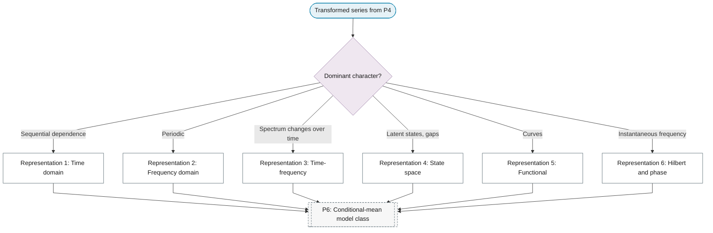

# P5: Representation selection

**Question this phase answers:** Which mathematical object is modelled?

Six representations are distinguished. Transforms and estimators that belong to a representation (spectral estimators, filters, wavelets, the analytic signal, embeddings, functional bases) are leaves of this phase; model families remain in P6.

## Representation selector

## Quick navigation

| Representation | Choose when | Key leaves |
|---|---|---|
| [1. Time domain](01-time-domain.md) | Predicting next values, a causal question, or sequential dependence | Autocovariance and the ACF as the time-domain object; Lag structure and memory |
| [2. Frequency domain](02-frequency-domain.md) | Periodic patterns, separate frequency bands, or spectral content as the question | Discrete Fourier transform and the periodogram; Multitaper spectral estimation; FIR and IIR filter design |
| [3. Time-frequency](03-time-frequency.md) | Frequency content that changes over time, transients or bursts, or both localisations | Short-time Fourier transform and the spectrogram; Continuous wavelet transform and the scalogram; Empirical mode decomposition and the Hilbert-Huang transform |
| [4. State space](04-state-space.md) | Latent states, irregular sampling or gaps, or online updating | State-space form and the ARIMA rewriting; Latent states, irregular sampling and missing observations; Takens embedding and phase-space reconstruction |
| [5. Functional](05-functional.md) | Observations that are curves, shape or derivatives that matter, or dense sampling per curve | Basis representation and smoothing of curves; Functional principal components; Functional regression and functional autoregression |
| [6. Hilbert and phase](06-hilbert-phase.md) | Instantaneous frequency, amplitude envelope, or phase relations between signals | Analytic signal and instantaneous frequency; Phase synchronisation and the phase-locking value |
