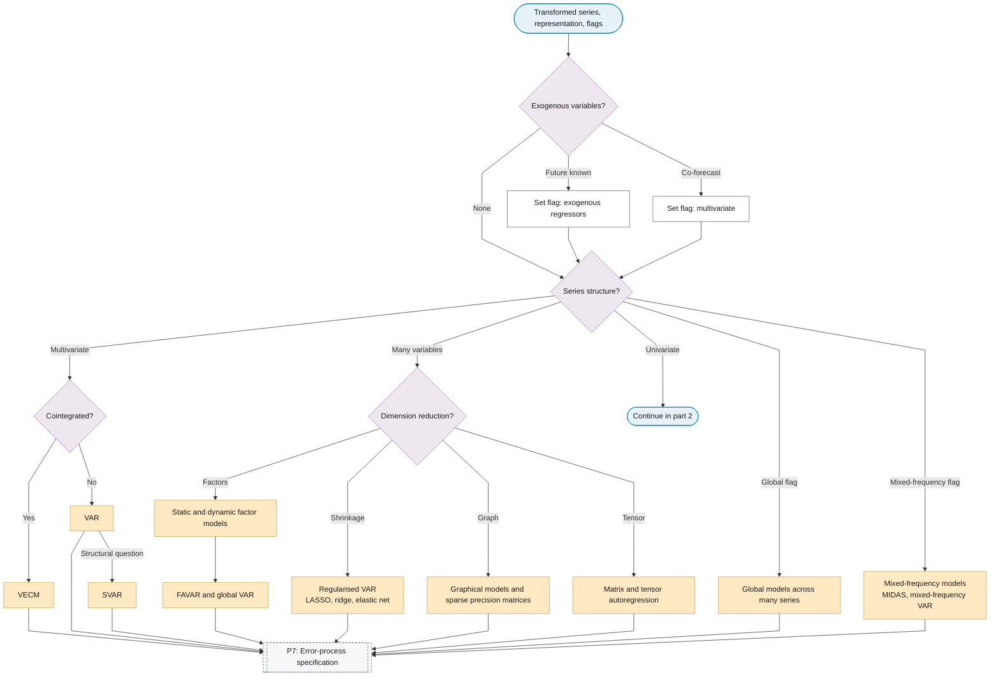
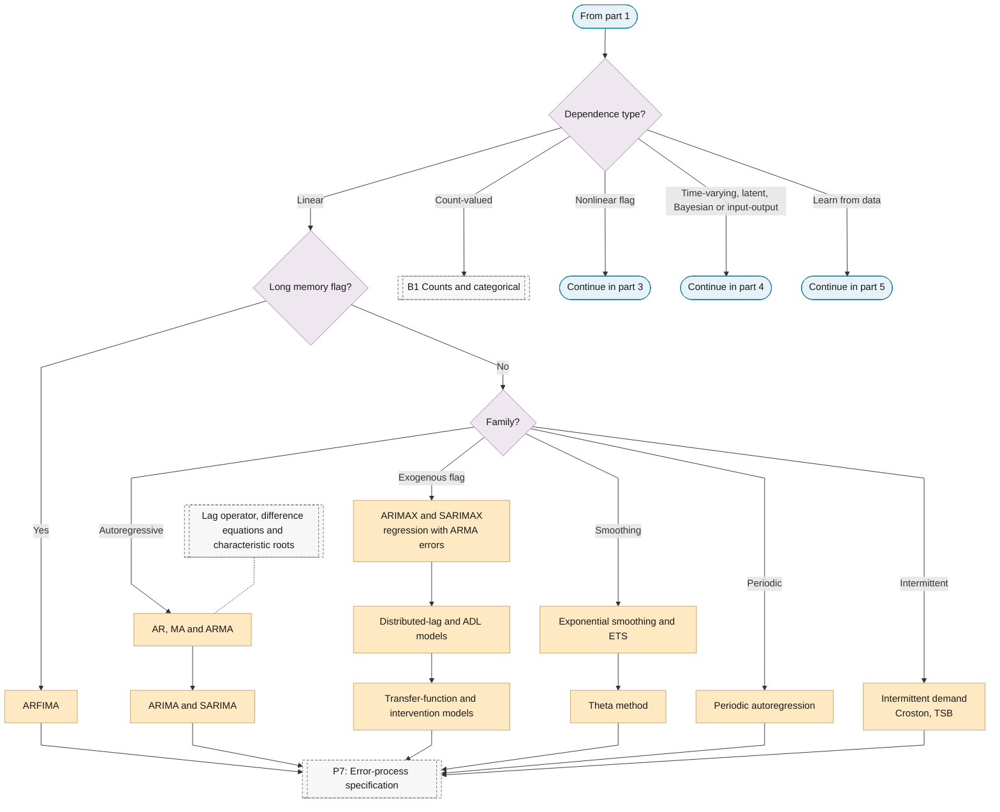
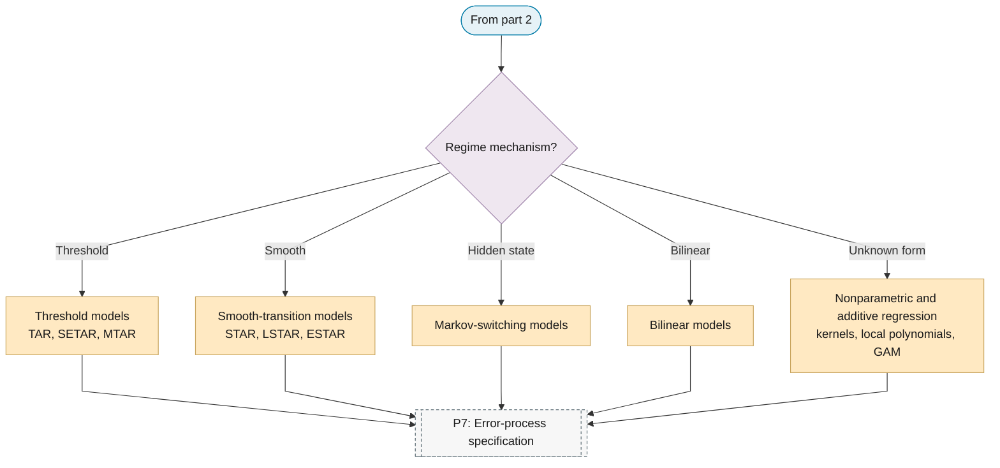
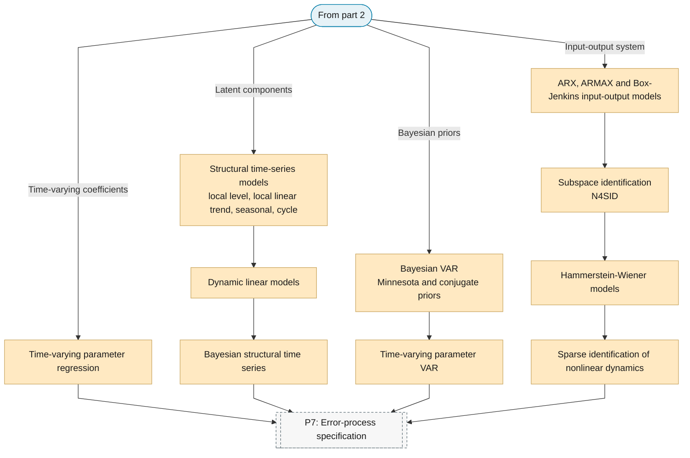
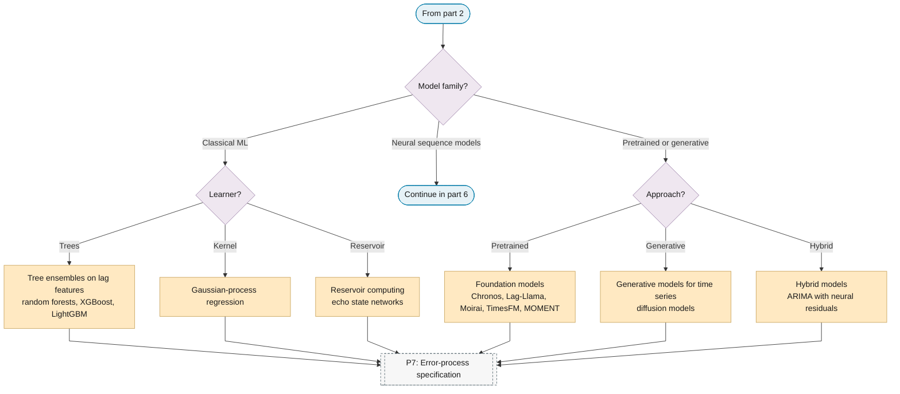
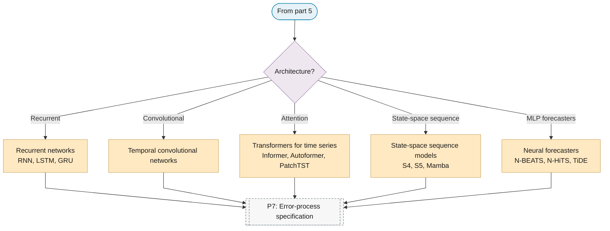

# P6: Conditional-mean model class

**Question this phase answers:** Which family describes the mean?

Routing on the multivariate, global and exogenous-variable flags, then the model families: univariate linear, periodic and intermittent, long memory, nonlinear, time-varying parameter, multivariate, structural state-space, system identification, count and categorical, machine learning and deep learning, and global models.

## Sub-diagram

**Part 1: routing and multivariate families.**

**Part 2: dependence type and univariate linear families.**

**Part 3: nonlinear families.**

**Part 4: time-varying, state-space, Bayesian and input-output families.**

**Part 5: machine-learning families, classical and pretrained.**

**Part 6: neural sequence models.**

## Phase guide

!!! note "Section pending"
    To-do item created from the flowchart inventory (node `P6`). Write this section following the content rules in `.claude/rules/writing.md`.
