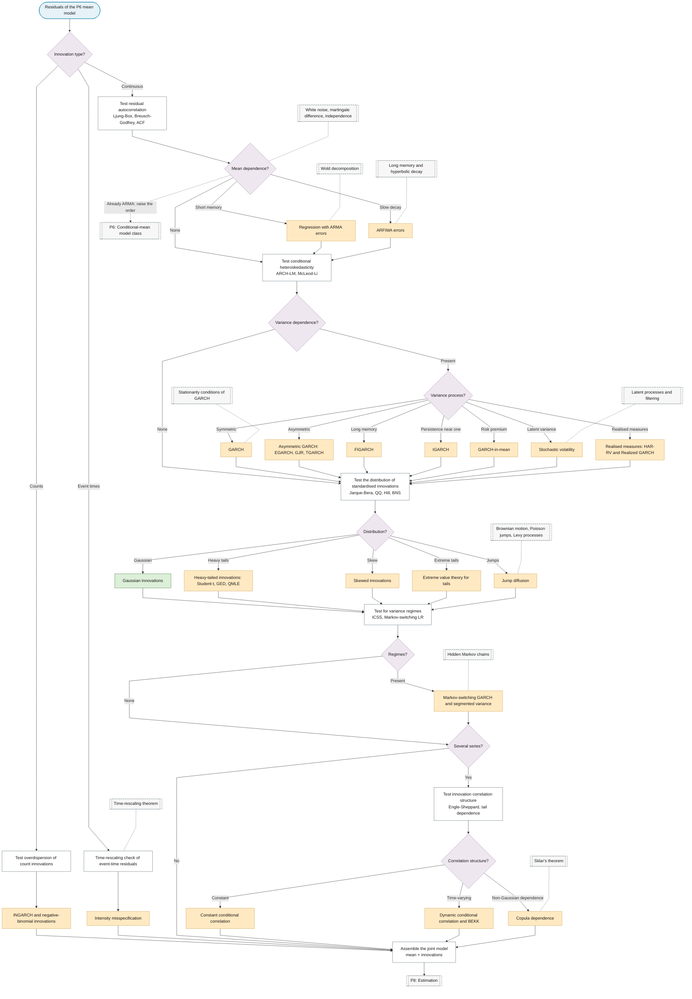

# P7: Error-process specification

**Question this phase answers:** What process do the innovations follow?

Given the residuals of the P6 mean model, decide the innovation process: remaining mean dependence, conditional heteroskedasticity, distribution, variance regimes, cross-series dependence, and the count and event-time variants. The output is a joint model handed to P8 for joint estimation, which is where Cochrane-Orcutt two-step estimation is replaced by joint maximum likelihood.

## Sub-diagram

The order of the questions is itself a derivation chain: each step's test assumes the previous step's structure has been removed. ARCH-LM assumes no serial correlation; distribution tests run on standardised residuals and assume the variance model is fixed; correlation tests run on each series' standardised residuals.

## Question order

| Step | Question | Tests | Branches |
|---|---|---|---|
| 1 | Mean dependence left? | Ljung-Box, Breusch-Godfrey, residual ACF | None: step 2. Short memory: ARMA errors. Slow decay: ARFIMA errors. Already ARMA and still dependent: back to P6 |
| 2 | Second-moment dependence? | ARCH-LM, McLeod-Li, squared-residual ACF | None: step 3. Present: step 2a |
| 2a | Which variance process? | Sign-bias test, squared-residual ACF decay, availability of high-frequency data | GARCH; EGARCH / GJR / TGARCH; FIGARCH; IGARCH; GARCH-in-mean; stochastic volatility; HAR-RV / Realized GARCH |
| 3 | Distribution of standardised innovations? | Jarque-Bera, QQ, Hill tail index, BNS jump test | Gaussian; Student-t / GED or QMLE; skewed-t; EVT; jump diffusion |
| 4 | Regimes in variance? | ICSS, Markov-switching LR | None: step 5. Present: MS-GARCH or segmented variance |
| 5 | Several series? | Engle-Sheppard constant-correlation test, tail dependence | CCC; DCC / BEKK; copula |
| 6 | Branch data types | Overdispersion tests; time-rescaling KS test | Counts: INGARCH / negative binomial. Event times: intensity misspecification |

Terminals name **model → estimator → inference**; for example, regression + ARMA errors + GARCH-t → joint MLE → asymptotic-normal standard errors.

## Part 0 hooks

| Branch | Stochastic-process concept | Chain link |
|---|---|---|
| White noise terminal | White noise, martingale difference, independence | Ljung-Box tests only uncorrelatedness and cannot detect ARCH, because ARCH is a martingale difference but not independent |
| ARMA errors | Wold decomposition | Any covariance-stationary process is MA(∞); ARMA is its rational approximation |
| ARFIMA errors | Long memory, hyperbolic decay | Why no finite-order ARMA reproduces it |
| GARCH | Weak stationarity α + β < 1; strict stationarity E[log(α z² + β)] < 0 | IGARCH is strictly stationary with infinite unconditional variance |
| Stochastic volatility | Latent process, filtering | Why the likelihood has no closed form |
| Jump diffusion | Brownian motion, Poisson jumps, Levy processes | Quadratic variation splits into continuous and jump parts |
| Markov switching | Hidden Markov chain | Hamilton filter |
| Event times | Conditional intensity, time-rescaling theorem | Under the true intensity, rescaled event times form a unit Poisson process |
| Copula | Sklar's theorem | Marginals and dependence separate |

## Relation to P9

P7 is specified once. After joint estimation in P8, P9 re-runs steps 1 to 5 on the complete model and loops back to P6 or P7 on failure.

## Test residual autocorrelation

!!! note "Section pending"
    To-do item created from the flowchart inventory (node `P7_MEAN_TESTS`). Write this section following the content rules in `.claude/rules/writing.md`.

## Test conditional heteroskedasticity

!!! note "Section pending"
    To-do item created from the flowchart inventory (node `P7_VAR_TESTS`). Write this section following the content rules in `.claude/rules/writing.md`.

## Test the distribution of standardised innovations

!!! note "Section pending"
    To-do item created from the flowchart inventory (node `P7_DIST_TESTS`). Write this section following the content rules in `.claude/rules/writing.md`.

## Test for variance regimes

!!! note "Section pending"
    To-do item created from the flowchart inventory (node `P7_REGIME_TESTS`). Write this section following the content rules in `.claude/rules/writing.md`.

## Test innovation correlation structure

!!! note "Section pending"
    To-do item created from the flowchart inventory (node `P7_CORR_TESTS`). Write this section following the content rules in `.claude/rules/writing.md`.

## Test overdispersion of count innovations

!!! note "Section pending"
    To-do item created from the flowchart inventory (node `P7_COUNT_TESTS`). Write this section following the content rules in `.claude/rules/writing.md`.

## Time-rescaling check of event-time residuals

!!! note "Section pending"
    To-do item created from the flowchart inventory (node `P7_RESCALING`). Write this section following the content rules in `.claude/rules/writing.md`.

## Assemble the joint model

!!! note "Section pending"
    To-do item created from the flowchart inventory (node `P7_OUT`). Write this section following the content rules in `.claude/rules/writing.md`.
