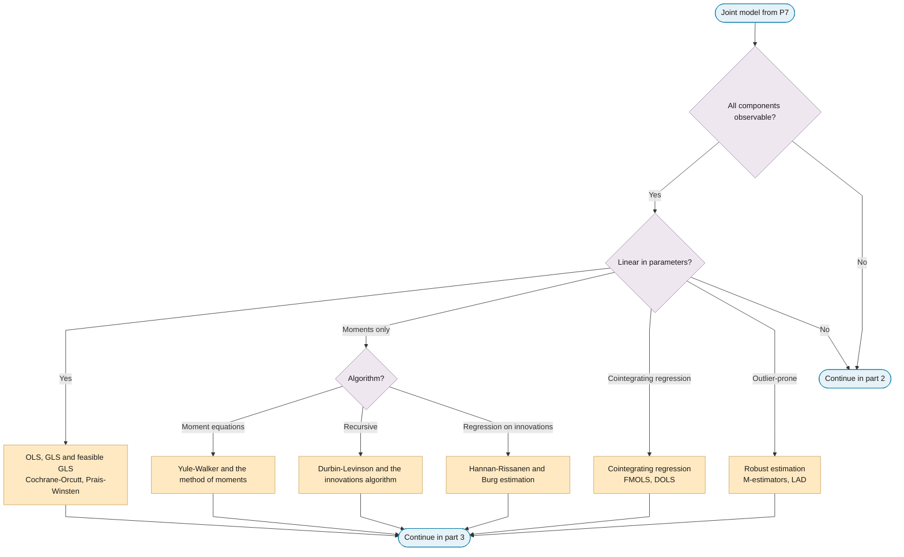
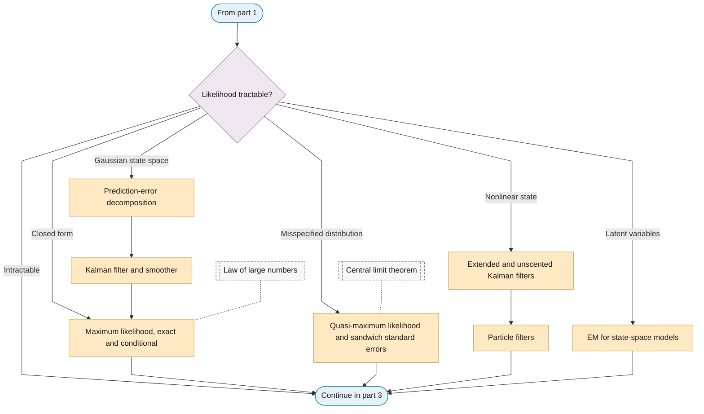
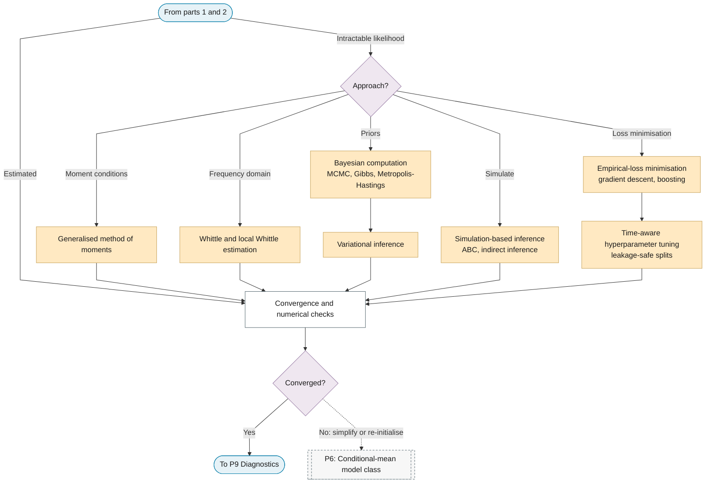

# P8: Estimation

**Question this phase answers:** How are parameters obtained?

Least squares and its generalisations, moment methods, exact and conditional likelihood, quasi-likelihood, GMM, Whittle, cointegrating-regression estimators, robust estimators, Bayesian computation, EM and filtering, simulation-based inference, empirical-loss minimisation with time-aware tuning, and convergence checks.

## Sub-diagram

**Part 1: observable components.**

**Part 2: tractable likelihoods.**

**Part 3: intractable likelihoods and convergence.**

## Phase guide

!!! note "Section pending"
    To-do item created from the flowchart inventory (node `P8`). Write this section following the content rules in `.claude/rules/writing.md`.

## Convergence and numerical checks

!!! note "Section pending"
    To-do item created from the flowchart inventory (node `P8_CONVERGENCE`). Write this section following the content rules in `.claude/rules/writing.md`.
