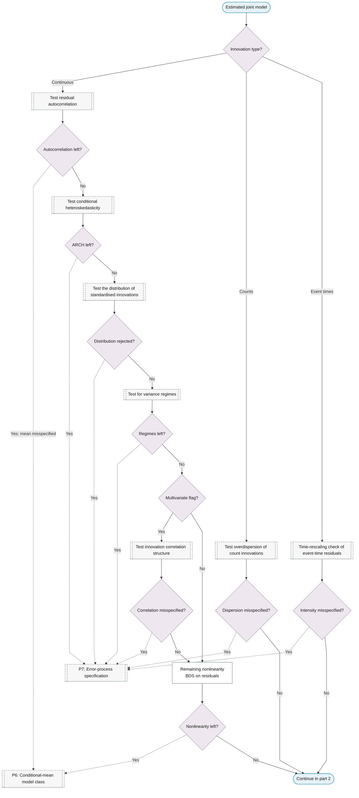
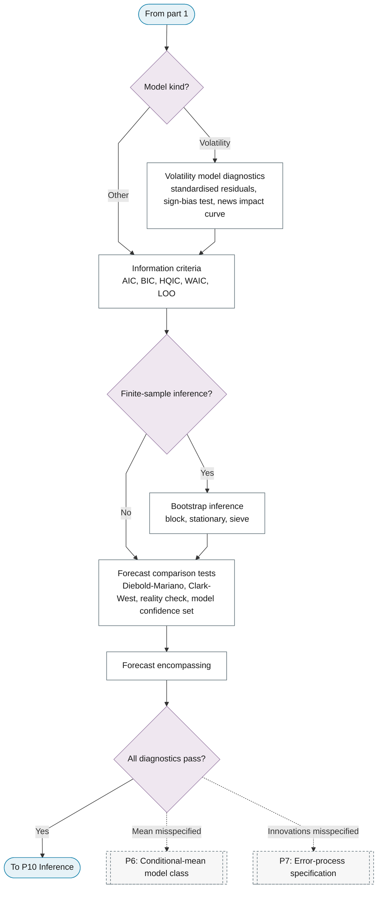

# P9: Diagnostics and model selection

**Question this phase answers:** Does the fitted model hold up?

Residual tests on the complete model, volatility and count diagnostics, information criteria, bootstrap inference, and forecast-comparison tests; failures loop back to P6 or P7.

## Sub-diagram

**Part 1: innovation tests re-run on the complete model.**

**Part 2: model-specific checks, selection and comparison.**

## Phase guide

!!! note "Section pending"
    To-do item created from the flowchart inventory (node `P9`). Write this section following the content rules in `.claude/rules/writing.md`.

## Remaining nonlinearity

!!! note "Section pending"
    To-do item created from the flowchart inventory (node `P9_RESIDUAL_NONLINEARITY`). Write this section following the content rules in `.claude/rules/writing.md`.

## Volatility model diagnostics

!!! note "Section pending"
    To-do item created from the flowchart inventory (node `P9_VOLATILITY_DIAGNOSTICS`). Write this section following the content rules in `.claude/rules/writing.md`.

