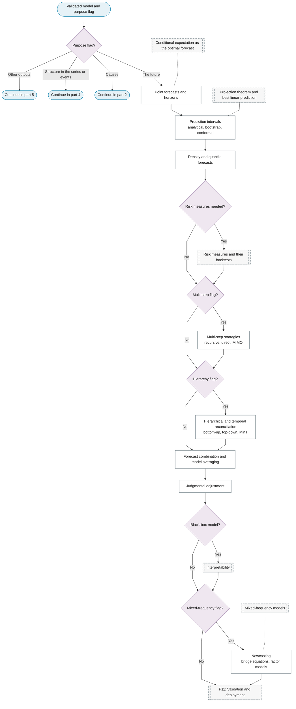
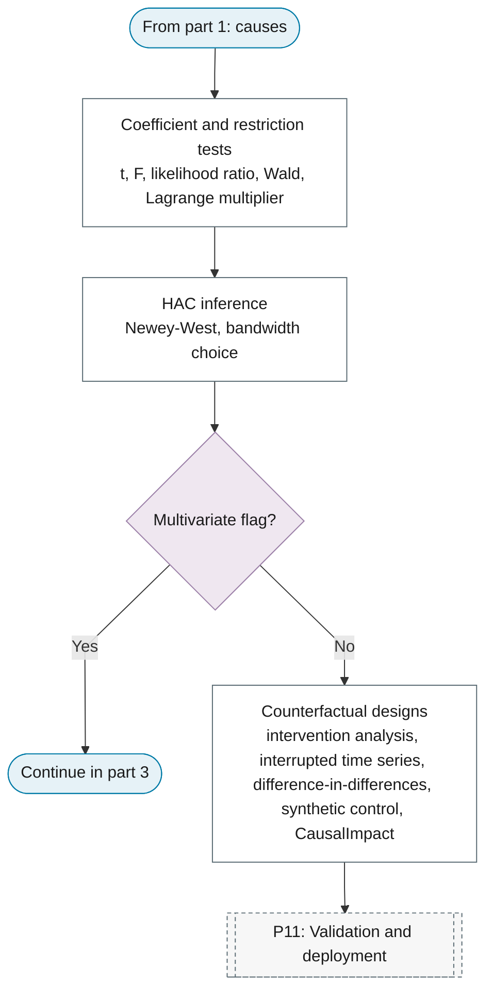
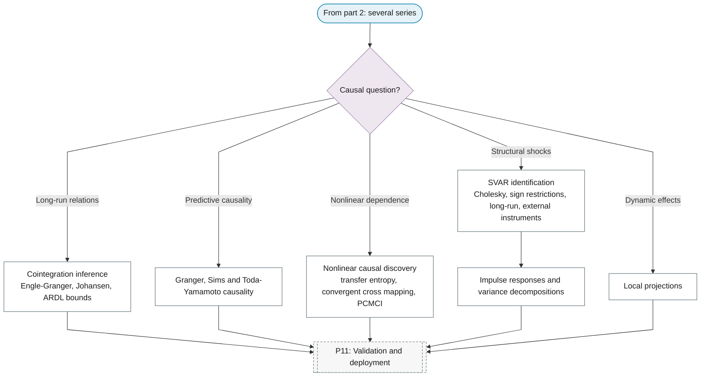
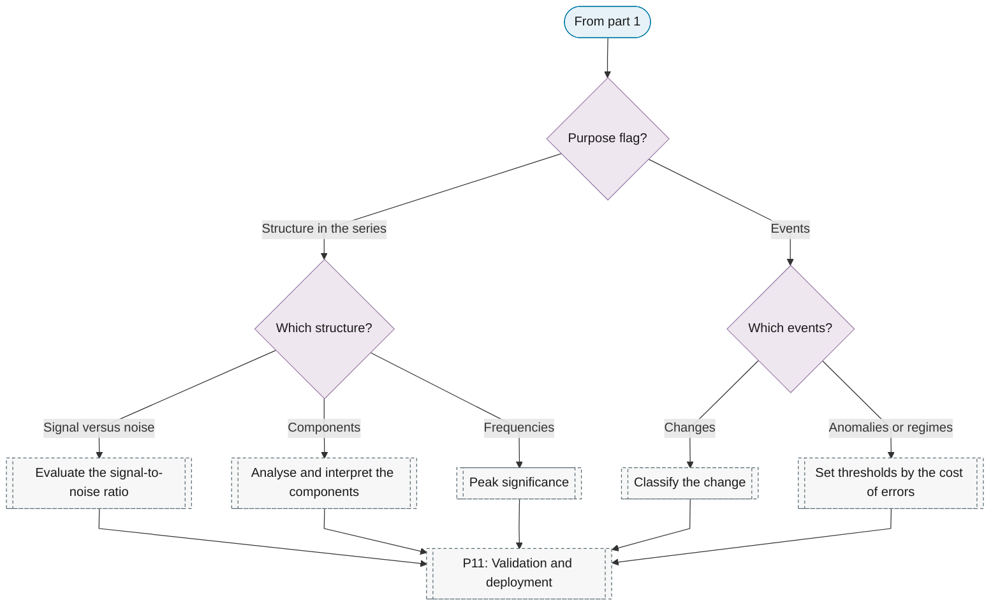
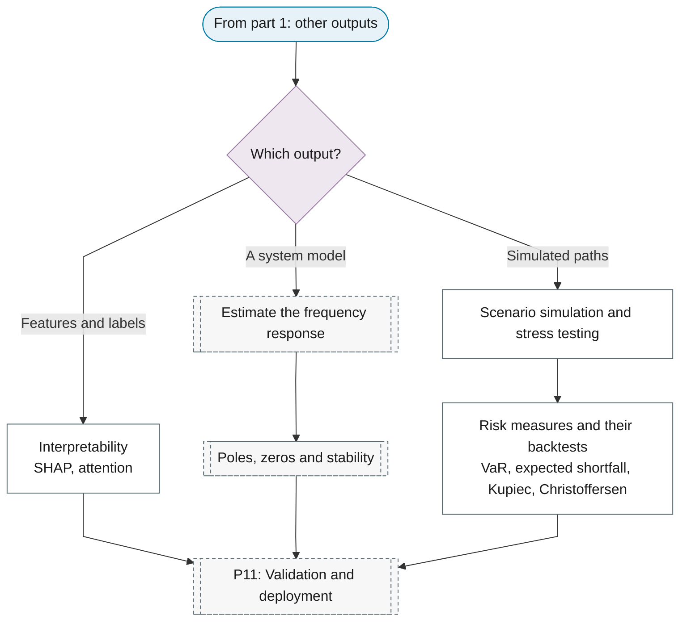

# P10: Inference and interpretation

**Question this phase answers:** What does the model say, for this purpose?

Coefficient and restriction tests, HAC inference, cointegration and causality inference, structural identification and impulse responses, counterfactuals, forecasting outputs, nowcasting, risk measures and their backtests, scenario simulation, and interpretability.

## Sub-diagram

**Part 1: dispatch on the purpose flag, and forecasting.**

**Part 2: causal and structural inference.**

**Part 3: causal questions for several series.**

**Part 4: structure in the series and events.**

**Part 5: other outputs.**

## Phase guide

!!! note "Section pending"
    To-do item created from the flowchart inventory (node `P10`). Write this section following the content rules in `.claude/rules/writing.md`.
