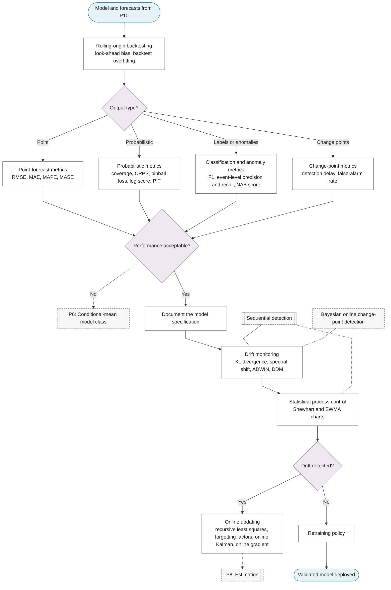

# P11: Validation and deployment

**Question this phase answers:** Does it work out of sample and keep working?

Rolling-origin validation and backtesting, purpose-specific metrics, documentation, drift monitoring, statistical process control, online updating, and the retraining policy.

## Sub-diagram

## Phase guide

!!! note "Section pending"
    To-do item created from the flowchart inventory (node `P11`). Write this section following the content rules in `.claude/rules/writing.md`.

## Document the model specification

!!! note "Section pending"
    To-do item created from the flowchart inventory (node `P11_DOCUMENTATION`). Write this section following the content rules in `.claude/rules/writing.md`.

## Retraining policy

!!! note "Section pending"
    To-do item created from the flowchart inventory (node `P11_RETRAINING`). Write this section following the content rules in `.claude/rules/writing.md`.

## Rolling-origin backtesting

!!! note "Section pending"
    To-do item created from the flowchart inventory (node `P11_ROLLING_ORIGIN`). Write this section following the content rules in `.claude/rules/writing.md`.
