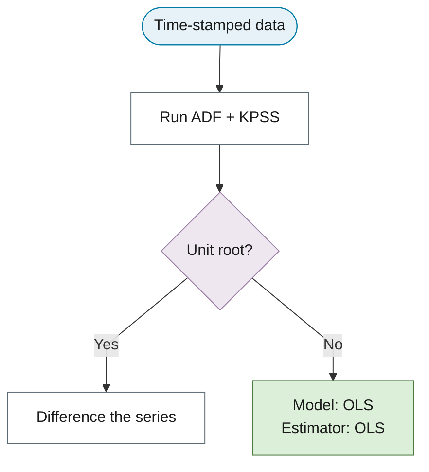
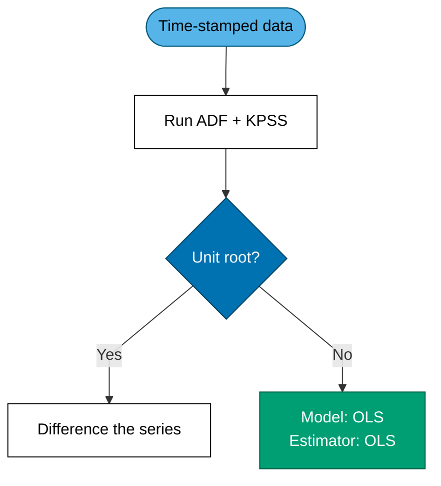
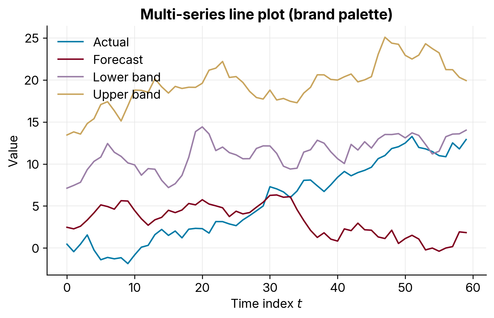
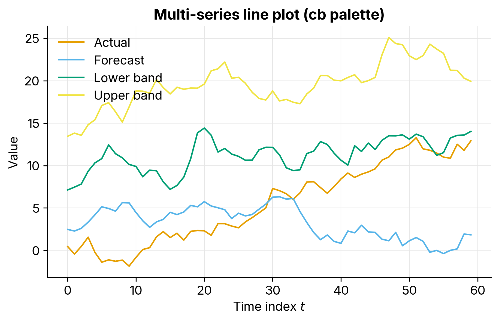
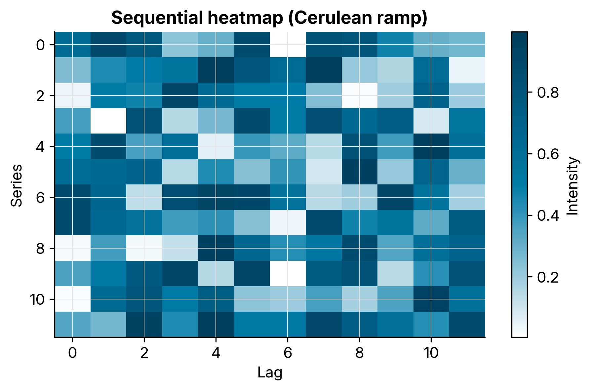

# Design System Showcase

This page renders every component, pattern, and figure style defined in the book's
design system, so the current settings can be checked visually in one place. It is a
living reference: if a component changes, this page should change with it. The
authoritative catalog is `DESIGN-SYSTEM.md` at the repository root.

Toggle the light/dark switch in the header to confirm each element adapts.

## Foundations

### Colour tokens

The brand palette and the semantic outcome tints, with live swatches.

<table markdown>
<tr><th>Swatch</th><th>Token</th><th>Hex</th><th>Role</th></tr>
<tr><td></td><td><code>--color-cerulean</code></td><td><code>#007BA7</code></td><td>Primary; body links</td></tr>
<tr><td></td><td><code>--color-burgundy</code></td><td><code>#800020</code></td><td>Accent; theorem</td></tr>
<tr><td></td><td><code>--color-thistle-dark</code></td><td><code>#9B7FA7</code></td><td>Definition; blockquote</td></tr>
<tr><td></td><td><code>--color-navajo-dark</code></td><td><code>#C9A55E</code></td><td>Abstract accent</td></tr>
<tr><td></td><td><code>--color-sunset</code></td><td><code>#B87D6C</code></td><td>Header</td></tr>
<tr><td></td><td><code>--color-good</code></td><td><code>#DCEFD8</code></td><td>Outcome — sufficient</td></tr>
<tr><td></td><td><code>--color-escalate</code></td><td><code>#FFE9C2</code></td><td>Outcome — escalate</td></tr>
<tr><td></td><td><code>--color-problem</code></td><td><code>#F2D9DE</code></td><td>Outcome — problem</td></tr>
</table>

### Typography

Content headings H1–H3 use Source Serif 4; H4 and below use Inter. This page's own
headings demonstrate the scale: the H1 above, the H2 section headers, and the H3/H4
below.

#### This is an H4 subsection

Body prose uses a 1.75 line-height for readability. A run of running text shows the
body register, with an inline highlighted phrase
using the `highlight-text` utility.

## Admonitions

!!! theorem "Theorem (Gauss–Markov)"
    Under the classical assumptions, the OLS estimator is the best linear unbiased
    estimator (BLUE).

!!! definition "Definition: Stationarity"
    A series is weakly stationary if its mean and autocovariances do not change over time.

!!! note "Remark"
    Notes and remarks use the Cerulean note admonition for informational asides.

!!! abstract "Chapter summary"
    The abstract admonition, in Navajo, is used for chapter and section overviews.

## Custom boxes

<h4>Augmented Dickey–Fuller Test</h4>

The series has a unit root (non-stationary): \( \gamma = 0 \).

The series is stationary: \( \gamma < 0 \).

**Decision rule:** reject \( H_0 \) when the p-value falls below \( \alpha = 0.05 \).

## Annotations and pronunciation guides

The "common alternative forms" pattern parks equivalent notation in a numbered note.

!!! theorem "Assumption: Strict Exogeneity"
    $$\EE[\epsilon_t \mid \mathbf{X}] = 0$$

    (Read: the expected value of epsilon-sub-t given X equals zero.)

The error is uncorrelated with the regressors at all leads and lags. (1)

1.  **Common alternative forms:**
    - \( \text{Cov}(\mathbf{x}_t, \epsilon_t) = 0 \) — the covariance form
    - \( \EE[\epsilon_t \mid \mathbf{x}_t] = 0 \) — contemporaneous exogeneity (weaker)

Every display equation is followed by a pronunciation guide, as above. Acronyms such as
ACF expand on hover via the abbreviation tooltip.

*[ACF]: Autocorrelation Function

## Tables

A plain comparison table:

| Estimator | Closed form | Handles unobservable errors |
|---|---|---|
| OLS | Yes | No |
| MLE | No | Yes |
| GMM | No | Partial |

A colour-coded decision matrix (each cell states its verdict as text, so colour is never
the sole signal):

<table class="decision-matrix" markdown>
<tr><th>ADF</th><th>KPSS</th><th>Verdict</th></tr>
<tr><td>Reject</td><td>Fail to reject</td><td class="good">Stationary</td></tr>
<tr><td>Fail to reject</td><td>Reject</td><td class="problem">Unit root — difference</td></tr>
<tr><td>Reject</td><td>Reject</td><td class="escalate">Inconclusive — inspect</td></tr>
</table>

## Decision-flowchart notation

Brand palette:

Colorblind-safe palette (same diagram):

## Static figures

Generated via `brand.py` and the `brand.mplstyle` style. Regenerate with
`python scripts/generate_showcase_figures.py`.

*Figure: multi-series line plot, brand palette.*

*Figure: the same plot in the colorblind-safe palette.*

*Figure: sequential heatmap, single-hue Cerulean ramp.*

## Interactive components

The glossary drawer highlights defined terms across the book and opens a right-slide
panel on click; it requires no per-page markup. Tabbed sets group parallel content:

=== "OLS"
    Closed-form estimator; valid under i.i.d. errors.

=== "MLE"
    Required when the model contains unobservable error components.

=== "GMM"
    Matches sample moments to their theoretical counterparts.
