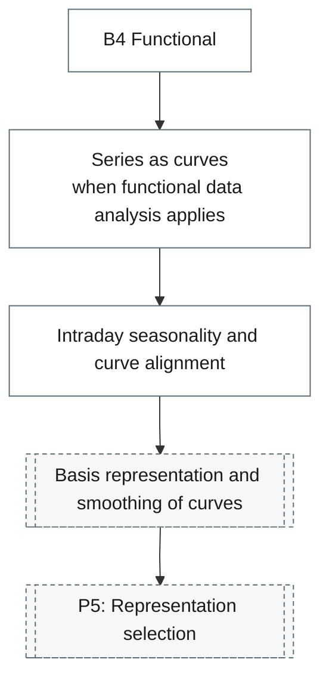

# 14. Functional and High-Frequency

Functional time series, durations, ultra-high-frequency data and survival models.

## Branch sub-diagram

## B4 Functional

!!! note "Section pending"
    To-do item created from the flowchart inventory (node `B4`). Write this section following the content rules in `.claude/rules/writing.md`.

## Basis representation and smoothing of curves

!!! note "Section pending"
    To-do item created from the flowchart inventory (node `P5_FN_BASIS`). Write this section following the content rules in `.claude/rules/writing.md`.

## Functional principal components

!!! note "Section pending"
    To-do item created from the flowchart inventory (node `P5_FN_FPCA`). Write this section following the content rules in `.claude/rules/writing.md`.

## Functional regression and functional autoregression

!!! note "Section pending"
    To-do item created from the flowchart inventory (node `P5_FN_REGRESSION`). Write this section following the content rules in `.claude/rules/writing.md`.

## Autoregressive conditional duration

!!! note "Section pending"
    To-do item created from the flowchart inventory (node `B2_ACD`). Write this section following the content rules in `.claude/rules/writing.md`.

## Survival and hazard models

!!! note "Section pending"
    To-do item created from the flowchart inventory (node `B2_SURVIVAL`). Write this section following the content rules in `.claude/rules/writing.md`.

## Series as curves

!!! note "Section pending"
    To-do item created from the flowchart inventory (node `B4_CURVES`). Write this section following the content rules in `.claude/rules/writing.md`.

## Intraday seasonality and curve alignment

!!! note "Section pending"
    To-do item created from the flowchart inventory (node `B4_INTRADAY`). Write this section following the content rules in `.claude/rules/writing.md`.
