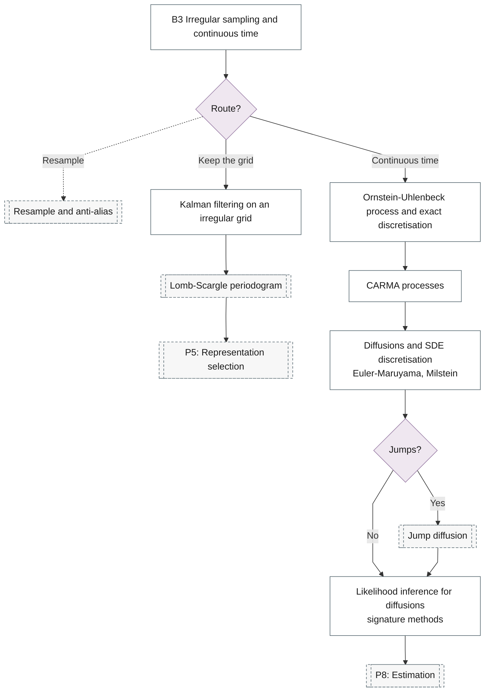

# 15. Continuous-Time Models

Diffusions, CARMA, Levy processes, jump diffusions and numerical methods for SDEs.

## Branch sub-diagram

## B3 Irregular sampling and continuous time

!!! note "Section pending"
    To-do item created from the flowchart inventory (node `B3`). Write this section following the content rules in `.claude/rules/writing.md`.

## Jump diffusion

!!! note "Section pending"
    To-do item created from the flowchart inventory (node `P7_JUMPS`). Write this section following the content rules in `.claude/rules/writing.md`.

## Kalman filtering on an irregular grid

!!! note "Section pending"
    To-do item created from the flowchart inventory (node `B3_IRREGULAR_KALMAN`). Write this section following the content rules in `.claude/rules/writing.md`.

## Ornstein-Uhlenbeck process and exact discretisation

!!! note "Section pending"
    To-do item created from the flowchart inventory (node `B3_OU`). Write this section following the content rules in `.claude/rules/writing.md`.

## CARMA processes

!!! note "Section pending"
    To-do item created from the flowchart inventory (node `B3_CARMA`). Write this section following the content rules in `.claude/rules/writing.md`.

## Diffusions and SDE discretisation

!!! note "Section pending"
    To-do item created from the flowchart inventory (node `B3_SDE`). Write this section following the content rules in `.claude/rules/writing.md`.

## Likelihood inference for diffusions

!!! note "Section pending"
    To-do item created from the flowchart inventory (node `B3_SDE_INFERENCE`). Write this section following the content rules in `.claude/rules/writing.md`.
