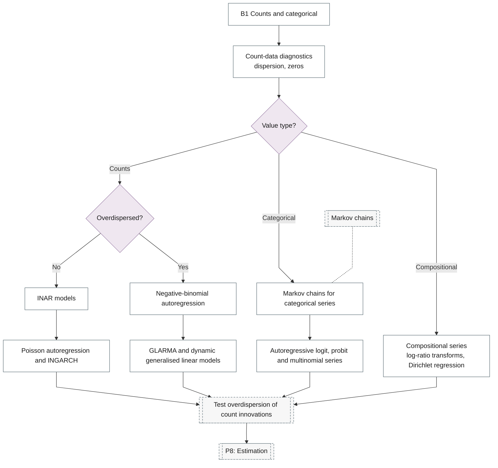

# 16. Count and Categorical

Integer-valued, categorical and compositional time series.

## Branch sub-diagram

## B1 Counts and categorical

!!! note "Section pending"
    To-do item created from the flowchart inventory (node `B1`). Write this section following the content rules in `.claude/rules/writing.md`.

## INGARCH and negative-binomial innovations

!!! note "Section pending"
    To-do item created from the flowchart inventory (node `P7_INGARCH`). Write this section following the content rules in `.claude/rules/writing.md`.

## Count-data diagnostics

!!! note "Section pending"
    To-do item created from the flowchart inventory (node `B1_COUNT_EDA`). Write this section following the content rules in `.claude/rules/writing.md`.

## INAR models

!!! note "Section pending"
    To-do item created from the flowchart inventory (node `B1_INAR`). Write this section following the content rules in `.claude/rules/writing.md`.

## Poisson autoregression and INGARCH

!!! note "Section pending"
    To-do item created from the flowchart inventory (node `B1_POISSON_AR`). Write this section following the content rules in `.claude/rules/writing.md`.

## Negative-binomial autoregression

!!! note "Section pending"
    To-do item created from the flowchart inventory (node `B1_NEGATIVE_BINOMIAL`). Write this section following the content rules in `.claude/rules/writing.md`.

## GLARMA and dynamic generalised linear models

!!! note "Section pending"
    To-do item created from the flowchart inventory (node `B1_GLARMA`). Write this section following the content rules in `.claude/rules/writing.md`.

## Markov chains for categorical series

!!! note "Section pending"
    To-do item created from the flowchart inventory (node `B1_MARKOV_CHAIN`). Write this section following the content rules in `.claude/rules/writing.md`.

## Autoregressive logit, probit and multinomial series

!!! note "Section pending"
    To-do item created from the flowchart inventory (node `B1_AR_LOGIT`). Write this section following the content rules in `.claude/rules/writing.md`.

## Compositional series

!!! note "Section pending"
    To-do item created from the flowchart inventory (node `B1_COMPOSITIONAL`). Write this section following the content rules in `.claude/rules/writing.md`.
