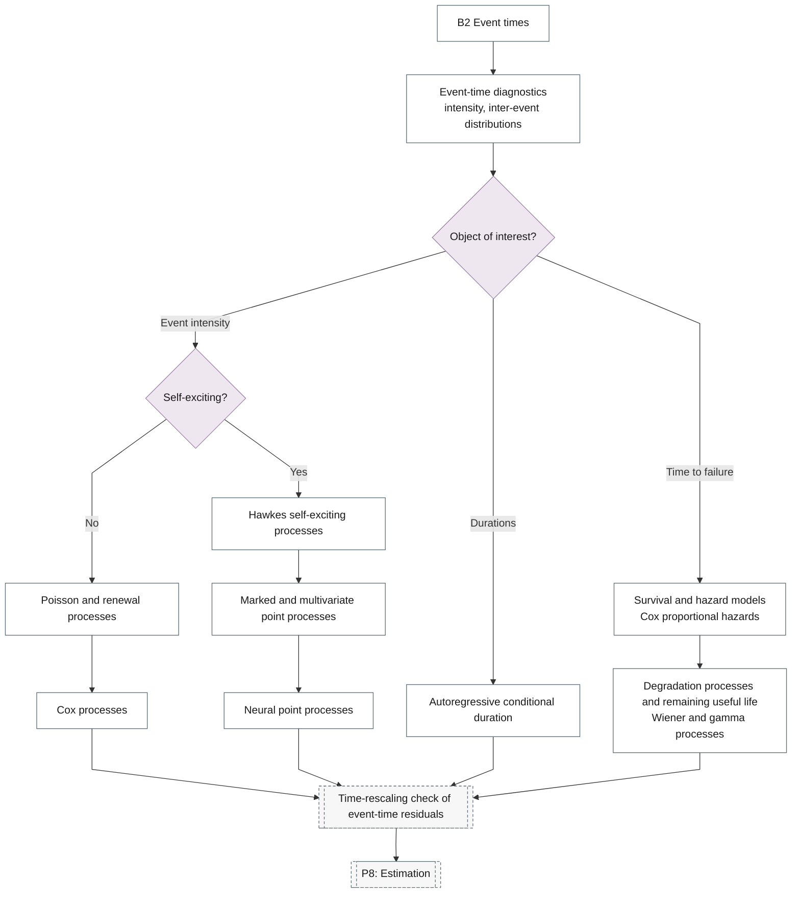

# 17. Point Processes

Poisson, renewal, Cox and Hawkes processes; marked and neural point processes.

## Branch sub-diagram

## B2 Event times

!!! note "Section pending"
    To-do item created from the flowchart inventory (node `B2`). Write this section following the content rules in `.claude/rules/writing.md`.

## Intensity misspecification

!!! note "Section pending"
    To-do item created from the flowchart inventory (node `P7_INTENSITY`). Write this section following the content rules in `.claude/rules/writing.md`.

## Event-time diagnostics

!!! note "Section pending"
    To-do item created from the flowchart inventory (node `B2_EVENT_EDA`). Write this section following the content rules in `.claude/rules/writing.md`.

## Poisson and renewal processes

!!! note "Section pending"
    To-do item created from the flowchart inventory (node `B2_POISSON`). Write this section following the content rules in `.claude/rules/writing.md`.

## Cox processes

!!! note "Section pending"
    To-do item created from the flowchart inventory (node `B2_COX`). Write this section following the content rules in `.claude/rules/writing.md`.

## Hawkes self-exciting processes

!!! note "Section pending"
    To-do item created from the flowchart inventory (node `B2_HAWKES`). Write this section following the content rules in `.claude/rules/writing.md`.

## Marked and multivariate point processes

!!! note "Section pending"
    To-do item created from the flowchart inventory (node `B2_MARKED`). Write this section following the content rules in `.claude/rules/writing.md`.

## Neural point processes

!!! note "Section pending"
    To-do item created from the flowchart inventory (node `B2_NEURAL_PP`). Write this section following the content rules in `.claude/rules/writing.md`.
