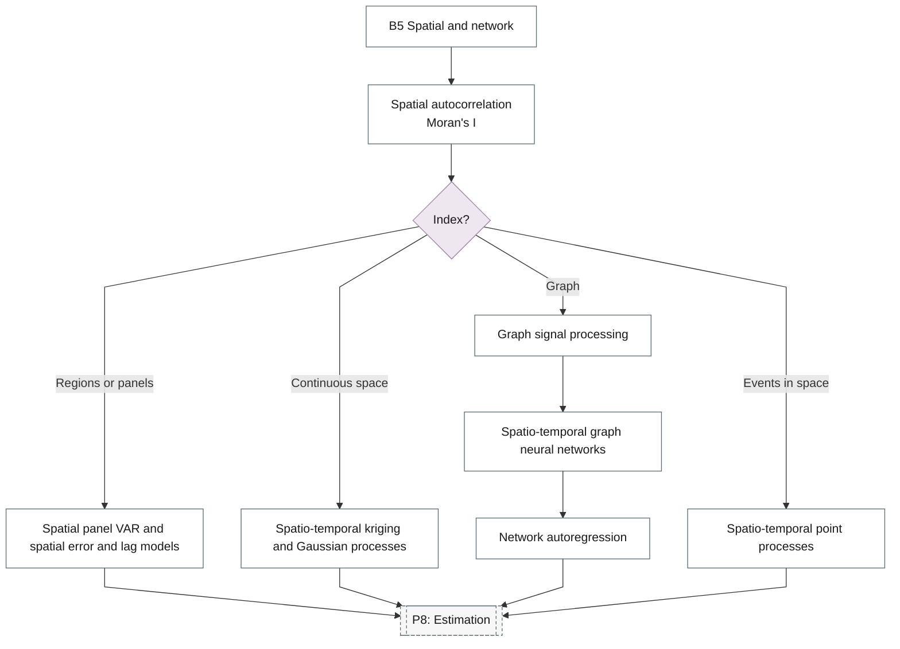

# 20. Spatio-Temporal Models

Spatial econometrics with time, geostatistics, graph-based and network time series.

## Branch sub-diagram

## B5 Spatial and network

!!! note "Section pending"
    To-do item created from the flowchart inventory (node `B5`). Write this section following the content rules in `.claude/rules/writing.md`.

## Spatial autocorrelation

!!! note "Section pending"
    To-do item created from the flowchart inventory (node `B5_SPATIAL_AUTOCORRELATION`). Write this section following the content rules in `.claude/rules/writing.md`.

## Spatial panel VAR and spatial error and lag models

!!! note "Section pending"
    To-do item created from the flowchart inventory (node `B5_SPATIAL_PANEL_VAR`). Write this section following the content rules in `.claude/rules/writing.md`.

## Spatio-temporal kriging and Gaussian processes

!!! note "Section pending"
    To-do item created from the flowchart inventory (node `B5_KRIGING`). Write this section following the content rules in `.claude/rules/writing.md`.

## Graph signal processing

!!! note "Section pending"
    To-do item created from the flowchart inventory (node `B5_GRAPH_SIGNAL`). Write this section following the content rules in `.claude/rules/writing.md`.

## Spatio-temporal graph neural networks

!!! note "Section pending"
    To-do item created from the flowchart inventory (node `B5_STGNN`). Write this section following the content rules in `.claude/rules/writing.md`.

## Network autoregression

!!! note "Section pending"
    To-do item created from the flowchart inventory (node `B5_NETWORK_AR`). Write this section following the content rules in `.claude/rules/writing.md`.

## Spatio-temporal point processes

!!! note "Section pending"
    To-do item created from the flowchart inventory (node `B5_ST_POINT_PROCESS`). Write this section following the content rules in `.claude/rules/writing.md`.
