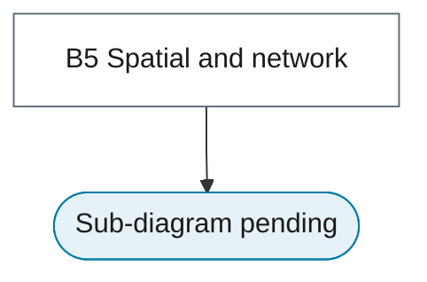

# 20. Spatio-Temporal Models

Spatial econometrics with time, geostatistics, graph-based and network time series.

## Branch sub-diagram

## B5 Spatial and network

!!! note "Section pending"
    To-do item created from the flowchart inventory (node `B5`). Write this section following the content rules in `DESIGN-SYSTEM.md`.
