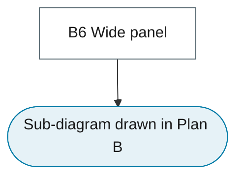

# 32. Panel Time Series

Panel unit roots and cointegration, dynamic panel GMM, heterogeneous panels and cross-sectional dependence.

Landing-page tab: *Core Models*. Sections below are created from the flowchart inventory; each is a leaf node of some sub-diagram and is written following the content rules in `DESIGN-SYSTEM.md`.

## Branch sub-diagram

## B6 Wide panel

!!! note "Section pending"
    To-do item created from the flowchart inventory (node `B6`). Write this section following the content rules in `DESIGN-SYSTEM.md`.
