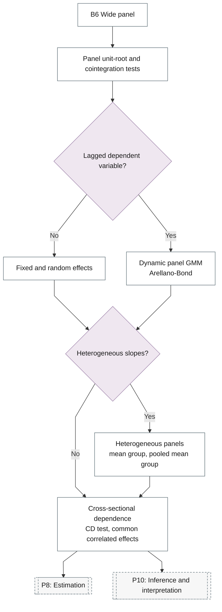

# 32. Panel Time Series

Panel unit roots and cointegration, dynamic panel GMM, heterogeneous panels and cross-sectional dependence.

## Branch sub-diagram

## B6 Wide panel

!!! note "Section pending"
    To-do item created from the flowchart inventory (node `B6`). Write this section following the content rules in `.claude/rules/writing.md`.

## Panel unit-root and cointegration tests

!!! note "Section pending"
    To-do item created from the flowchart inventory (node `B6_PANEL_UNIT_ROOT`). Write this section following the content rules in `.claude/rules/writing.md`.

## Fixed and random effects

!!! note "Section pending"
    To-do item created from the flowchart inventory (node `B6_STATIC_PANEL`). Write this section following the content rules in `.claude/rules/writing.md`.

## Dynamic panel GMM

!!! note "Section pending"
    To-do item created from the flowchart inventory (node `B6_DYNAMIC_PANEL`). Write this section following the content rules in `.claude/rules/writing.md`.

## Heterogeneous panels

!!! note "Section pending"
    To-do item created from the flowchart inventory (node `B6_HETEROGENEOUS`). Write this section following the content rules in `.claude/rules/writing.md`.

## Cross-sectional dependence

!!! note "Section pending"
    To-do item created from the flowchart inventory (node `B6_CROSS_SECTION_DEPENDENCE`). Write this section following the content rules in `.claude/rules/writing.md`.
